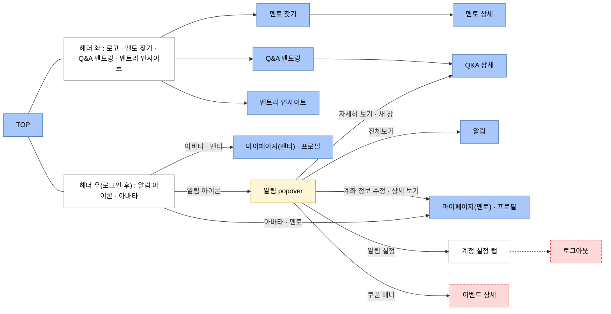
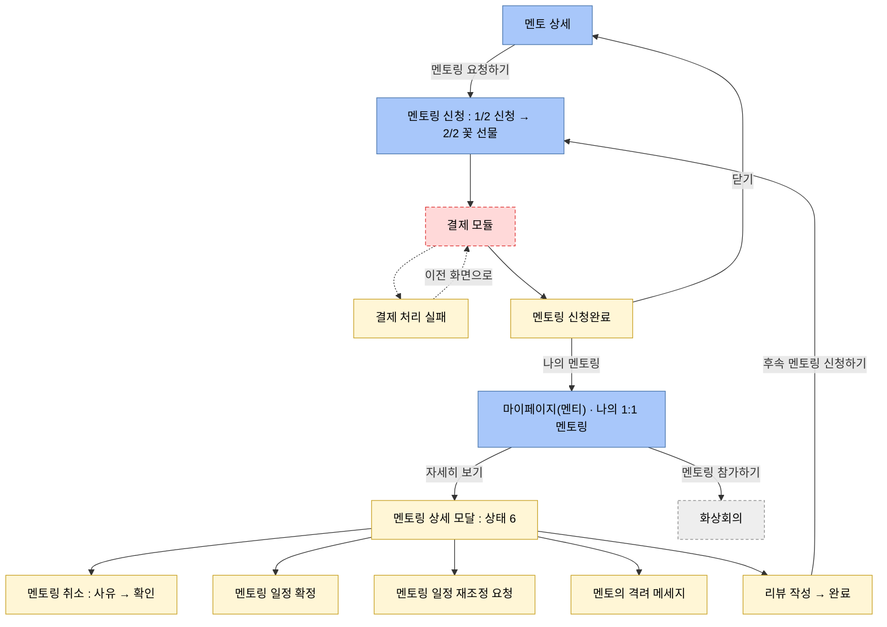
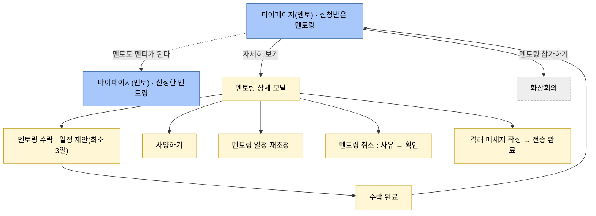
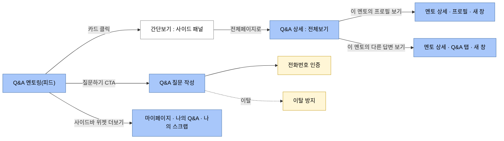

# 화면 전이도

> 이 문서가 답하는 것: **어느 화면에서 어느 화면으로 가는가.**
> 각 화면의 `UI-SPEC.md` **§9(화면 전이)** 가 여기를 가리킨다. 화면의 목록과 무게는 [screen-inventory](screen-inventory.md), 요소의 규칙은 [DESIGN.md](../DESIGN.md) 가 갖는다.

- 상태: 기안
- 기안일: 2026-09-10
- 출처: Figma 「Mentree 2.0 (Claude)」 — **천이도 (비로그인)** `1065:80793` ＋ 각 화면의 주석·레이어 구조

## 두 장으로 나뉜다

| 무엇 | 정본은 어디 |
|---|---|
| **비로그인** | **Figma `1065:80793` 이다.** 여기에 복제하지 않는다 |
| **로그인 후** | **이 문서다.** 아래 4장 |

**비로그인을 여기에 옮겨 그리지 않는다.** 옮기면 Figma 쪽이 갱신됐을 때 두 장이 갈린다.

## 읽는 방법

**비로그인 천이도와 같은 문법이다** — 파랑이 화면, 흰색이 블록. 여기에 2종을 더했다.

| 표시 | 무엇 | 어디에 쓰나 |
|---|---|---|
| **파랑** | **화면.** 전이의 목적지이고 `UI-SPEC.md` 1본을 갖는다 | `top` · `mypage-mentee` |
| **흰색** | **블록.** 화면의 일부다 | 헤더 · 계정 설정 탭 |
| **노랑** | **모달.** 부모 화면의 §6 에 쓴다 | `MentoringDetailModal` |
| **회색 점선** | **외부.** 이 리포 밖으로 나간다 | 화상회의 · Biz사이트 |
| **빨강 점선** | **목적지가 없다.** 아래 「미결」에 이유가 있다 | 로그아웃 |

| 판정 조건 | 아크션 |
|---|---|
| 화면을 착수한다 | **그 화면이 나오는 장을 먼저 읽는다.** §9 를 여기서 옮겨 적는다 |
| 그리려는 전이의 목적지가 여기에 없다 | **발명하지 않는다.** 「미결」에 행을 더하고 디자이너에게 낸다 |
| 전이가 늘거나 줄었다 | **이 문서를 고친다.** 화면의 §9 만 고치면 전체가 안 맞는다 |
| **모달인가 화면인가**를 판정한다 | [screen-inventory](screen-inventory.md) 「무엇을 1화면으로 세는가」가 정본이다 |

---

## 1. 전역 셸

**로그인으로 바뀌는 것은 헤더 우측뿐이다.** 좌측 3메뉴와 로고는 그대로다.

| 판정 조건 | 아크션 |
|---|---|
| 로그인 상태다 | 헤더 우측을 **알림 아이콘 ＋ 아바타** 2개로 한다. 로그인·회원가입·기업 서비스는 **넣지 않는다** |
| 아바타를 누른다 | **메뉴를 열지 않는다. 마이페이지로 간다.** 착지는 **「프로필」 탭**이다(LNB 의 첫 항목) |
| 로그인 유저가 멘토다 | `mypage-mentor` 로 간다. 멘티면 `mypage-mentee` 다 |
| 로그아웃을 놓는다 | **「계정 설정」 탭 안에, 다른 항목보다 위계를 한 단 낮춰서** 놓는다 |
| 알림 아이콘을 누른다 | **popover 를 연다.** 사양은 `notification` 의 UI-SPEC 이 갖는다(popover ＋ 페이지 2형태) |
| 기업 서비스로 가고 싶다 | 헤더에 없다. **TOP 의 「기업 서비스」 섹션과 푸터**가 진입점이다 |

**근거**: 알림 popover 의 실화면(`1059:40256`)에 헤더 우측이 아이콘 2개로 그려져 있다. 로그아웃의 자리는 와이어에 없어 디자이너가 정했다(2026-09-10).

---

## 2. 1:1 멘토링 — 멘티

**신청은 화면, 상세는 모달이다.** 가르는 이유는 결제와 호흡이다(「무엇을 1화면으로 세는가」).

| 판정 조건 | 아크션 |
|---|---|
| 신청 중에 맥락을 유지하고 싶다 | **모달로 되돌리지 않는다.** 페이지 상단에 **멘토 미니 카드를 고정**한다 |
| 상세 모달 안에서 비가역 조작이 필요하다 | **모달을 겹치지 않는다.** 같은 모달의 화면을 갈아끼운다(취소는 `사유 → 확인` 2스텝) |
| 신청완료 뒤 어디로 보내나 | **「나의 멘토링」이면 `mypage-mentee`, 「닫기」면 멘토 상세로 되돌린다.** 둘 다 와이어에 있다 |
| 「멘토링 참가하기」를 누른다 | **외부 화상회의로 나간다.** 링크는 확정된 멘토링에만 있다 |

**근거**: 취소·확정·재조정·리뷰·격려가 전부 「1:1 멘토링 신청 내용」 모달의 액션으로 그려져 있다(`1059:33087` 계열). 신청은 결제가 걸려 페이지로 되돌렸다(2026-09-10).

---

## 3. 1:1 멘토링 — 멘토

**멘토도 멘티가 된다.** LNB 의 「나의 1:1 멘토링」이 **신청받은 / 신청한** 둘로 갈린다.

| 판정 조건 | 아크션 |
|---|---|
| 멘토가 자기 멘토링을 신청한다 | **`mypage-mentor` 의 「신청한 멘토링」**으로 간다. 멘티판과 같은 모달을 쓴다 |
| 멘토가 취소했다 | **격려 메세지를 보낼 수 있게 남긴다.** 와이어의 주석이 「재구매 유도 동선을 확보」로 이유를 적는다 |
| 메세지를 이미 보냈다 | **「멘티에게 메세지 보내기」 버튼을 지운다.** 와이어의 주석대로다 |

**근거**: LNB 의 「나의 1:1 멘토링」이 접히는 항목이고 하위가 2개다(`1059:44700`).

---

## 4. Q&A

| 판정 조건 | 아크션 |
|---|---|
| 「이 멘토의 다른 답변 보기」를 누른다 | **멘토 상세의 「Q&A」 탭으로 보낸다. 새 창이다.** 전용 화면을 만들지 않는다. 탭은 URL(`?tab=`)에 담는다([mentor-detail §5](../screens/mentor-detail/UI-SPEC.md)) |
| 답변이 0건이다 | 그 탭이 숨겨진다. **이 전이는 답변이 1건 이상일 때만 생긴다** |
| 질문 작성으로 들어간다 | **페이지 이동과 동시에 전화번호 인증 모달**을 띄운다. 와이어의 주석대로다 |
| 비로그인이 도움돼요·스크랩을 누른다 | 로그인으로 유도한다. **돌아오는 자리는 미결이다**(아래 4번) |

**근거**: 「이 멘토의 다른 답변 보기 → 이 멘토의 답변만 모은 페이지 / 둘 다 새 창으로」가 Q&A 상세의 주석이고, 그 목적지를 멘토 상세의 기존 탭으로 정했다(2026-09-10).

---

## 미결 — 이 전이도가 못 그리는 것

**빨강 점선 노드의 이유가 여기 있다.** 정해지면 이 표에서 지우고 위 그림을 고친다.

| # | 무엇 | 왜 못 그리나 | 누가 | 언제 걸리나 |
|---|---|---|---|---|
| 1 | **결제 모듈 UI** | PG 사가 미정이라 와이어가 빈 상자다. **UI 형태를 PG 가 강제할 수 있다** | 사업·엔지니어 | `mentoring-apply` |
| 2 | **이벤트 상세** | 진입로가 3개(TOP 특설 버튼 · 알림 쿠폰 배너 · 비로그인 천이도)인데 **와이어가 없다.** 아티클 상세로 **흡수하지 않는다**(2026-09-16 결정) — 따로 만든다 | 디자이너 | 마지막 차례 |
| 3 | **로그아웃의 자리** | 아바타가 마이페이지 직행이 되면서 메뉴가 없어졌다. 「계정 설정」 안에 놓기로 했으나 **와이어에 실물이 없다** | 디자이너 | `mypage-*` |
| 4 | **로그인 후 착지점** | 「특정 액션 중에 가입했으면 그 액션으로 돌려보낼지」를 **와이어가 물음표로 끝낸다** | 디자이너 | `login` · `signup` · `onboarding-survey` |
| 5 | **모달에 URL 이 붙는가** | 알림·공유에서 멘토링 상세로 직접 들어올 수 있어야 하는지 미정. **지금 알림 5건에 멘토링 알림이 없어 당장은 안 막힌다** | 디자이너 | `mypage-*` |

**전부 [screen-inventory](screen-inventory.md) 「착수 전 준비」와 [PRODUCT.md](../../docs/PRODUCT.md) 「미결」에도 적혀 있다.** 그 화면을 시작할 때 읽힌다.
