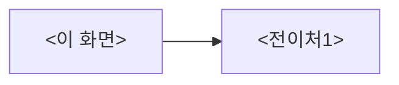

# <ScreenId>: <화면 이름>

<!-- 이 파일을 복사해서 design/screens/<screen-id>/UI-SPEC.md 를 만든다.
     <> 부분을 채우고, 다 채우면 주석은 지운다.
     절 구성은 UX설계의도 5절 → 구조 6절. 순서를 바꾸지 않는다.
     §1~5 를 먼저 승인받고, 그 다음 §6~11 로 진행한다(2단 승인). -->

- 상태: 기안 | **UX승인**(§1~5) | **확정**(§6~11) | 구현인계
- 화면 구분: 허브 | 작업 | 열람
- 템플릿: `template/` (있으면 링크. 출처는 `template/SOURCE.md`)

---

# 1부 — UX 설계 의도 (§1~5)

> **이 5절을 먼저 승인받는다.** 여기가 요건 그 자체다. 승인 전에 §6 이하로 내려가지 않는다.

## 1. 화면의 사명

<이 화면이 3초 안에 답하는 유일한 물음. 1~2문>

## 2. 대상 사용자와 상황

- 대상 사용자: <이 화면을 조작하는 사람>
- 상황: <언제·무엇을 하러 오는가>
- 이용 패턴: 상주 | 정기 확인 | 필요할 때만

## 3. 액션 방침

- 주 액션: <이 화면의 최우선 하나>
- 부 액션: <있으면>
- **이 화면에서 하지 않는 것**: <두지 않는 조작·기능과 그 이유>

## 4. 구성과 하이어라키

<블록의 상하 배치와 「아래로 갈수록 ○○」의 원칙. 왜 그 순서인가>

## 5. 적용 패턴 (P-nn)

<!-- 반복되는 UX 판단은 design/UX-PATTERNS.md 를 참조한다.
     미승격이면 여기에 쓰고, 2화면째에 승격시킨다 -->

| 패턴 | 이 화면에서의 적용 |
|---|---|
| <P-nn 패턴 이름 또는 미승격 판단> | <적용값·적용 위치> |

버튼의 variant 계층, 그림자, 카드 내 액션 구성 같은 **컴포넌트 레벨의 규칙은 디자인 시스템을 따른다**(`design/DESIGN.md`·DS 구현). 이 문서에 중복해서 쓰지 않는다.

---

# 2부 — 구조 (§6~11)

## 6. 블록별 규칙 (구성 요소 포함)

<!-- 구성 요소의 열거(요소명은 English·PascalCase. 화면 위에서부터 순서대로)와
     블록마다 「그 화면에서만 성립하는」 규칙을 쓴다 -->

| 요소명(English) | 종류 | 내용 | 이 화면에서의 규칙 |
|---|---|---|---|
| <SessionList> | <목록 테이블> | <표시 항목·정렬> | <이 화면 고유의 판단> |

**이 절의 성격**:

- 쓰는 것은 「**그 화면에서만 성립하는 것**」뿐이다.
- ① 패턴의 이 화면에서의 적용값(높이·임계값 등) ② 이 블록에 무엇이 오고 무엇이 오지 않는지의 정의 ③ 이 화면 고유의 배치
- **판정 조건**: 그 판단이 다른 화면에서도 성립한다 → **아크션**: `design/UX-PATTERNS.md` 로 뺀다. 여기서는 `P-nn` 참조만 하고 다시 쓰지 않는다
- **판정 조건**: 이 화면에서만 성립한다 → **아크션**: 여기에 쓴다

## 7. 상태 목록

<!-- 4상태 모두 필수. 해당 없으면 「없음」과 근거를 쓴다(멋대로 생략하지 않는다) -->

| 상태 | 표시 내용 | 비고 |
|---|---|---|
| 정상 | <데이터가 있을 때의 표시> | |
| 로딩 | <취득 중의 표시. 스켈레톤/스피너 등> | |
| 빈 상태 | <0건일 때의 표시. 다음 행동으로의 유도 문구> | |
| 에러 | <에러 시의 표시> | **거동과 대체 플로우 기재 필수**(아래) |

**에러 시의 거동·대체 플로우 (필수)**:

- <예: API 호출이 실패했다 → 에러 메시지와 재시도 버튼을 표시한다. 재시도로 같은 API를 다시 호출한다>
- <예: 권한이 없다(403) → 화면 전체를 「권한이 없습니다」 표시로 바꾸고 홈으로의 동선을 낸다>

## 8. 표시·활성 제어의 판정 조건과 아크션

<!-- 업무 규칙에 근거한 분기를 전부 열거한다. 구현자는 이 표만 보고 제어를 쓴다 -->

| 판정 조건 | 아크션 |
|---|---|
| <예: 구독이 만료되었다> | <예: 시작 버튼을 비활성으로 하고 만료 이유를 표시한다> |

## 9. 화면 전이

<!-- Mermaid와 글머리 기호를 반드시 병기한다(복잡한 도식의 대체) -->

- <이 화면> → <전이처1>: <전이의 계기(어느 요소의 조작인가)>

## 10. 의존 API

<!-- 계약이 미정의면 「계약 미정의」라고 명기하고, 구현 인계 전에 채운다.
     미정의인 채로 구현 인계하지 않는다. API 정의는 백엔드 담당과 합의한다 -->

| API (용도) | 계약 |
|---|---|
| <세션 목록 취득> | <계약 미정의 / 참조 링크> |

## 11. 미결 사항

- <답이 안 나온 점. 해소되면 추기한다>
