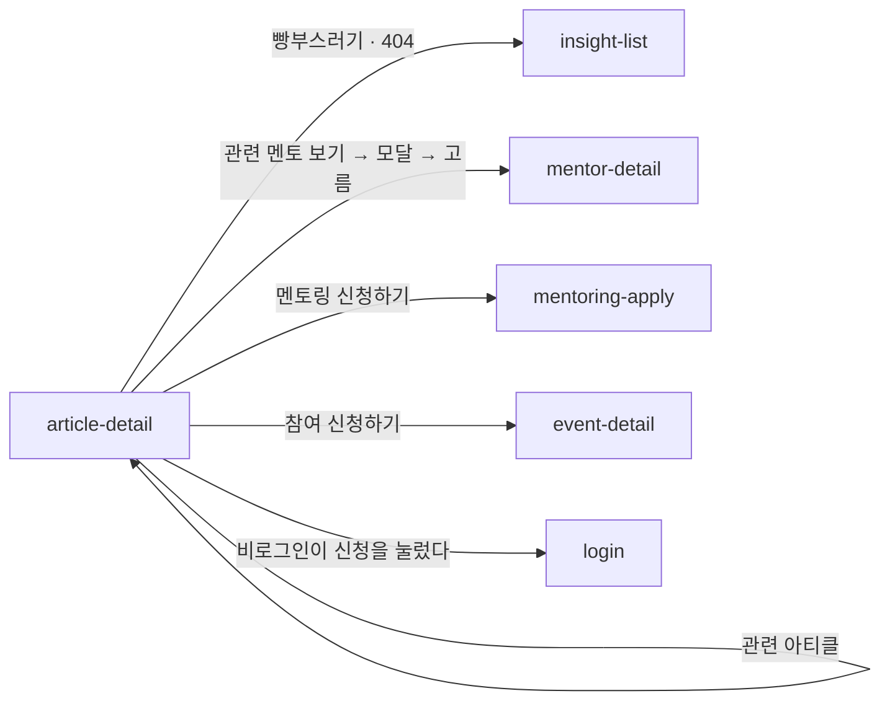

# article-detail: 아티클 상세

- 상태: 확정 (§1~5 UX승인 2026-09-17 → §6~11 작성 완료)
- 화면 구분: 열람
- 템플릿: [`template/`](template/) (출처는 [`template/SOURCE.md`](template/SOURCE.md))

---

# 1부 — UX 설계 의도 (§1~5)

> **이 5절을 먼저 승인받는다.** 승인 전에 §6 이하로 내려가지 않는다.

## 1. 화면의 사명

**글 하나를 끝까지 읽게 한다.** 그리고 다 읽은 사람에게 **다음 한 걸음**을 낸다 — 이 주제를 아는 멘토에게 가거나, 다음 글로 간다.

## 2. 대상 사용자와 상황

- 대상 사용자: 해외 취업·현지 생활의 **구체적인 물음**을 가진 멘티. **비로그인 방문자가 가장 많다**
- 상황: **검색 엔진에서 이 글로 바로 들어온다.** 목록을 거치지 않는 경우가 많다
- 이용 패턴: 필요할 때만

**이 화면은 제품의 정문이 될 수 있다.** 목록에서 온 사람보다 **검색에서 바로 온 사람**을 기준으로 설계한다 — 그래서 상단에 어디에 있는지(빵부스러기)를 두고, 하단에 제품 안으로 들어가는 길을 둔다.

## 3. 액션 방침

- 주 액션: **끝까지 읽는다**
- 부 액션: 관련 멘토 보기 · 멘토링 신청 · 이벤트 참여 신청 · 다음 글로 가기

**이 화면에서 하지 않는 것**:

| 하지 않는 것 | 이유 |
|---|---|
| **댓글을 두지 않는다** | 대화는 `qna-feed` 가 맡는다. 두 자리에 나누면 답이 흩어진다 |
| **읽는 중에 가로막지 않는다** | 팝업·구독 유도로 본문을 덮지 않는다. 읽는 것이 주 액션이다 |
| **읽기에 로그인을 요구하지 않는다** | 검색 유입이 첫 접점이다. 로그인은 **신청**에서만 요구한다 |
| **본문 안에 광고를 두지 않는다** | |

## 4. 구성과 하이어라키

**위에서 아래로 「어디에 있나 → 무엇을 읽나 → 다음에 무엇을 하나」다.**

| 순 | 블록 | 무엇을 하나 |
|---|---|---|
| 1 | `Breadcrumb` | **검색에서 바로 온 사람에게 여기가 어디인지 알린다** |
| 2 | 머리말 — 국가·키워드 배지 ＋ 제목 ＋ 날짜 | 무엇에 관한 글인지 |
| 3 | **본문** | 이 화면의 본체. **가장 넓고 가장 길다** |
| 4 | **배너 CTA** | 다 읽은 사람에게 내는 다음 한 걸음 |
| 5 | 관련 아티클 추천 | 다음 글 |

**CTA 를 본문 아래에 둔다.** 위나 옆에 두면 읽기를 방해한다. **다 읽은 사람이 가장 움직이기 쉽다.**

### 🔴 배너 CTA 가 글의 종류에 따라 갈린다

**이 화면의 핵심 판단이다.** 글이 세 종류이고, 다 읽은 사람이 할 다음 행동이 각각 다르다.

| 글의 종류 | 배너 CTA | 왜 |
|---|---|---|
| **멘토 인터뷰** | **이 글의 멘토** — 「이 멘토에게 상담을 받아보고 싶다면?」 ＋ 멘토링 신청 | 글에 **주인공이 있다.** 그 사람에게 바로 보낸다 |
| **멘트리 인사이트** | **이 주제와 관련된 멘토** — 「일본 · 취업 준비 키워드가 겹치는 멘토예요」 ＋ 관련 멘토 보기 | 주인공이 없다. **국가·키워드가 겹치는 멘토**로 잇는다 |
| **멘트리 이벤트** | **참여 신청하기** | 읽은 것이 **아직 열려 있는 자리**다 |

**주인공이 없으면 주제로 잇는다.** 이것이 세 갈래의 원칙이다.

**CTA 가 없는 글도 있다**(`plain`). 잇는 곳이 없으면 억지로 만들지 않는다.

## 5. 적용 패턴 (P-nn)

| 패턴 | 이 화면에서의 적용 |
|---|---|
| **[`P-02`](../../UX-PATTERNS.md)** 비로그인이 로그인이 필요한 조작을 눌렀다 | **읽기는 막지 않는다.** 멘토링 신청·이벤트 참여에서만 로그인으로 보낸다 |

**`P-01` 은 해당하지 않는다** — 목록이 아니다.

**승격 후보**: 「다 읽은 사람에게 다음 한 걸음을 낸다. 주인공이 있으면 사람으로, 없으면 주제로 잇는다」는 **2화면째에 나오면 `P-nn` 으로 올린다.**

컴포넌트 레벨의 규칙은 [DESIGN.md](../../DESIGN.md) 를 따르고 여기에 중복해서 쓰지 않는다.

---

# 2부 — 구조 (§6~11)

## 6. 블록별 규칙 (구성 요소 포함)

**화면 위에서부터의 순서다.**

| 요소명(English) | 종류 | 내용 | 이 화면에서의 규칙 |
|---|---|---|---|
| `Header` | 전역 셸 | — | 이 화면 고유의 규칙 없음 |
| `Breadcrumb` | 위치 | 멘트리 인사이트 › 상세 | **검색에서 바로 온 사람에게 여기가 어디인지 알린다**(§2) |
| `Badge` ×2 | 머리말 | **국가 ＋ 키워드** | 목록 카드와 같은 순서다 |
| — | 제목 | 1줄 또는 2줄 | `--text-display` |
| — | 날짜 | `YYYY.MM.DD` | 표시 전용 |
| — | **본문** | 소제목 ＋ 문단 ＋ 그림 ＋ 캡션 | **`--text-article` 17 / lh28.** 이 화면이 그 토큰의 주 사용처다 |
| — | **배너 CTA** | **글의 종류에 따라 갈린다**(§4·§8) | 본문 아래. 위나 옆에 두지 않는다 |
| — | 관련 아티클 추천 | 카드 3본 | |
| `Footer` | 전역 셸 | — | |

### 본문의 구성

| 무엇 | 규칙 |
|---|---|
| 소제목 | 문단 묶음의 머리. 본문보다 굵고 크다 |
| 문단 | **`--text-article`.** 말줄임을 걸지 않는다 — 끝까지 읽는 것이 주 액션이다 |
| 그림 | 본문 폭에 맞춘다 |
| 캡션 | 그림 아래. `--text-caption` muted |

**본문 폭을 화면 폭까지 늘리지 않는다.** 글줄이 길면 읽기 어렵다.

## 7. 상태 목록

| 상태 | 표시 내용 | 비고 |
|---|---|---|
| 정상 | 위 §6 그대로 | **글의 종류 3종 ＋ `plain` 이 각각의 파일이다** |
| 로딩 | `Skeleton` 으로 제목·본문 자리를 채운다 | `Breadcrumb` 은 남긴다 |
| **없음(404)** | **「글을 찾을 수 없어요」** ＋ 「주소가 바뀌었거나 글이 내려갔을 수 있어요.」 ＋ **「멘트리 인사이트로」** | **빈 상태가 아니라 404 다** |
| 에러 | **「글을 불러오지 못했어요」** ＋ 「잠시 뒤에 다시 시도해 주세요.」 ＋ **「다시 시도」** | |

**404 와 에러를 가른다.** 404 는 **글이 없는 것**이라 목록으로 돌려보내고, 에러는 **일시적인 것**이라 재시도를 낸다. **두 문구를 섞지 않는다.**

**`Breadcrumb` 은 404 에서도 남긴다.** 검색에서 바로 온 사람이 나갈 길이다.

## 8. 🔴 표시·활성 제어의 판정 조건과 아크션

### 배너 CTA 3갈래 — §4 의 원칙을 실행으로

| 판정 조건 | 아크션 |
|---|---|
| **글이 멘토 인터뷰다** | **「이 글의 멘토」** — 멘토 카드 ＋ 「이 멘토에게 상담을 받아보고 싶다면?」 ＋ **「멘토링 신청하기」** |
| **글이 멘트리 인사이트다** | **「이 주제와 관련된 멘토」** — 「<국가> · <키워드> 키워드가 겹치는 멘토예요」 ＋ **「관련 멘토 보기」** |
| **글이 멘트리 이벤트다** | **「참여 신청하기」** |
| **이을 곳이 없다** | **CTA 를 내지 않는다**(`plain`). 억지로 만들지 않는다 |

### 관련 멘토 모달

| 판정 조건 | 아크션 |
|---|---|
| 「관련 멘토 보기」를 눌렀다 | **모달을 연다.** 국가·키워드가 겹치는 멘토를 카드로 낸다 |
| 모달에서 멘토를 골랐다 | `mentor-detail` 로 간다 |
| **비로그인이 「멘토링 신청하기」·「참여 신청하기」를 눌렀다** | **로그인으로 보낸다**(`P-02`). **읽기는 막지 않는다** |

### 그 밖

| 판정 조건 | 아크션 |
|---|---|
| 글이 없다 | §7 의 404. **「멘트리 인사이트로」가 목록으로 보낸다** |
| 취득이 실패했다 | §7 의 에러 |
| 본문에 그림이 있다 | 캡션을 아래에 단다 |
| 제목이 길다 | **말줄임하지 않는다.** 줄을 늘린다 |

## 9. 화면 전이

**검색 엔진에서 이 화면으로 바로 들어온다**(§2). 그래서 나가는 길이 많다.

## 10. 수용 조건

- [x] 글의 종류 3종 ＋ `plain` 이 각각 선다
- [x] 배너 CTA 가 §8 표대로 갈린다
- [x] 404 와 에러가 다른 문구·다른 행동을 낸다
- [x] 관련 멘토 모달이 열린다
- [x] 1280 · 390 에서 가로 넘침 0건
- [ ] **모바일 레이아웃을 실측으로 확인한다** — `UI-REVIEW.md`

## 11. 미결

| 무엇 | 왜 남았나 |
|---|---|
| **「관련 멘토」를 무엇으로 고르는가** | 「국가·키워드가 겹치는」까지만 정했다. **몇 명을, 어떤 순서로** 낼지는 미정 |
| **관련 아티클 추천의 선정 규칙** | 같은 카테고리인지, 같은 키워드인지 정한 적이 없다 |
| **이벤트가 이미 끝났을 때** | 「참여 신청하기」를 어떻게 할지 미정. 지난 이벤트의 기록 글이 이미 있다 |
