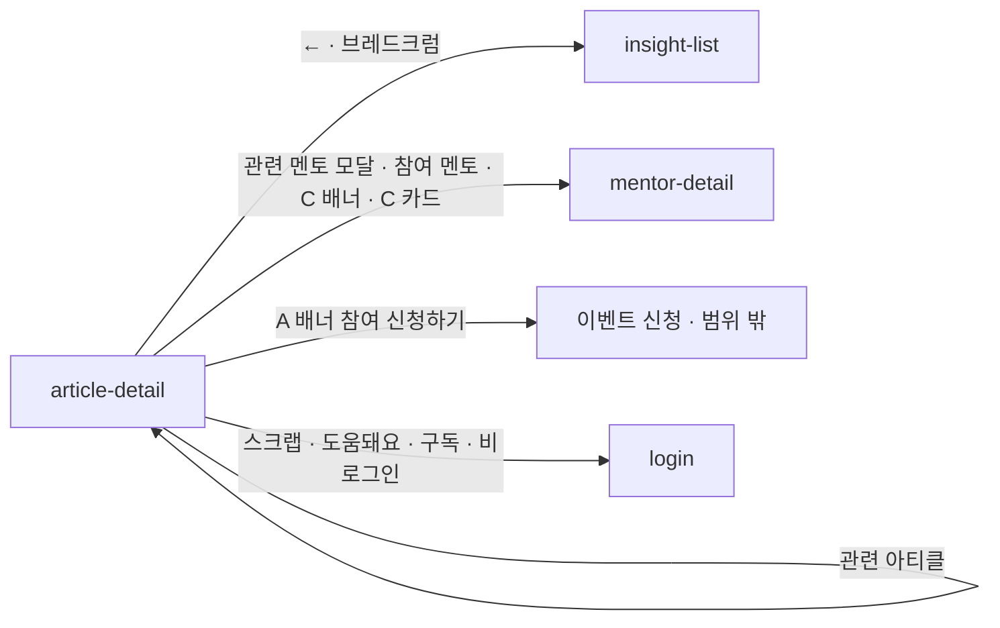

# article-detail: 아티클 상세

- 상태: **확정** (§1~5 UX승인 2026-09-16 · §6~11 작성 2026-09-16 · **`template/` 취임 2026-09-16**)
- 화면 구분: 열람
- 템플릿: [`template/`](template/) — 얇은 페이지 8장 ＋ 공용 화면 부품 `ArticleDetailScreen`. 출처는 [`template/SOURCE.md`](template/SOURCE.md)
- **부품이 없는 자리 셋은 임시로 조립한다**(상혁 2026-09-16) — 우측 목차(`DS-17` 앵커 변형) · 숫자 없는 토글 아이콘 버튼 · 구독 플로팅 카드. 부품이 오면 갈아끼운다

> 출처: Figma `zFWjJinW6NAtyMMzMujNl2` / `1059:41695` — 상세 프레임 `1059:42127` · 배너 3형 `1059:41748~41756` · 참여 멘토 `1059:41696` · 주석 9건. 읽은 날 2026-09-16.

---

# 1부 — UX 설계 의도 (§1~5)

> **이 5절을 먼저 승인받는다.** 승인 전에 §6 이하로 내려가지 않는다.

## 1. 화면의 사명

**「이 글이 내 상황에 무엇을 말해 주는가」를 끝까지 읽게 하고, 읽은 사람을 다음 행동으로 보낸다.**

다음 행동은 글의 카테고리가 정한다. 이벤트 글은 참여 신청으로, 인사이트 글은 관련 멘토로, 멘토 인터뷰는 그 멘토의 멘토링 신청으로 보낸다. **본문 끝의 배너가 그 전환의 자리다.**

## 2. 대상 사용자와 상황

- 대상 사용자: **비로그인 방문자 · 멘티 · 멘토**. 읽기를 막지 않는다
- 상황: 목록에서 한 건을 골라 들어온다. 검색 엔진과 공유 링크로 바로 들어오기도 한다 — 이 화면이 착지점이다
- 이용 패턴: 필요할 때만

**역할로 화면이 갈리지 않는다. 카테고리로 갈린다.**

| 글의 카테고리 | 배너 문구 | 배너 버튼 | 본문 아래 붙는 블록 |
|---|---|---|---|
| **A** 멘트리 이벤트 | 이 행사에 참여하고 싶다면? | 참여 신청하기 | 참여 멘토 4장 |
| **B** 멘트리 인사이트 | 이 주제와 관련된 멘토를 확인하고 싶다면? | 관련 멘토 보기 | 관련 아티클 4장 |
| **C** 멘토 인터뷰 | 이 멘토에게 상담을 받아보고 싶다면? | 멘토링 신청하기 | 그 멘토의 상세로 가는 길 |

와이어의 상세 프레임은 B형으로 그려져 있다. A·C 는 배너와 주석으로만 정해져 있다.

**A형은 이벤트 「기사」다. 이벤트 상세가 아니다**(2026-09-16 결정). 이벤트 상세는 따로 만든다 — 와이어를 받은 뒤다. 「참여 신청하기」가 가는 이벤트 신청 화면은 이 화면의 범위 밖이고 지금 정하지 않는다.

## 3. 액션 방침

- 주 액션: **본문을 읽고 배너의 버튼을 누른다.** 카테고리마다 하나다
- 부 액션: 스크랩 · 도움돼요 · 공유(좌측 고정 레일) · 목차로 이동 · 관련 아티클 · 참여 멘토의 상세 · **구독(이메일)**

**이 화면에서 하지 않는 것**:

| 하지 않는 것 | 이유 |
|---|---|
| **댓글·답글을 두지 않는다** | 아티클은 발행물이다. 대화는 Q&A 가 맡는다 |
| **스크랩·도움돼요의 숫자를 보이지 않는다** | 주석이 「숫자 비표시, 내부 지표로만」으로 정했다. Q&A 답변 카드와 다르다 |
| **글을 고치거나 지우지 않는다** | 어드민이 발행한다. 사용자 편집 진입이 없다 |
| **읽기에 로그인을 요구하지 않는다** | `P-01`. 스크랩·도움돼요·구독을 누를 때만 로그인으로 보낸다. 공유는 무관이다 |

## 4. 구성과 하이어라키

**「읽기 → 이 글에서 얻을 다음 행동 → 더 읽을 것」의 순서다.** 본문은 3단이고 나머지는 1단이다.

| 순 | 블록 | 무엇을 하나 |
|---|---|---|
| 1 | 되돌아가기 ＋ 브레드크럼 「멘트리 인사이트 ＞ 상세」 | 목록으로 돌아갈 길. 깊이 2단(`DS-16`) |
| 2 | **머리** — 태그(국가 · 키워드) · 제목 · 발행일. 가운데 정렬 | 무슨 글인지 한 눈에. 태그는 **목록 카드와 같은 컬러 태그**다 — 같은 글의 같은 태그가 두 곳에서 다르게 보이면 안 된다 |
| 3 | **본문 3단** — 좌 고정 레일 ／ 가운데 본문 ／ 우 목차 | 아래 표 |
| 4 | **배너** — 카테고리별 문구 ＋ 버튼 | 이 화면의 주 액션 |
| 5 | **카테고리별 부속 블록** — A 참여 멘토 4장 ／ B 관련 아티클 4장 ／ C 멘토 상세로 | 더 읽을 것, 더 만날 사람 |
| — | **구독 플로팅** — 우하단 카드. 「새로운 아티클 발행 소식을 받아보시겠어요?」 ＋ 버튼 ＋ 닫기 | 진입 후 **스크롤 70%** 에서 나타난다. 닫으면 다시 안 뜬다. **구독은 이메일이다**(2026-09-16 결정) — 로그인한 사람은 계정 이메일로 바로 구독된다 |

**본문 3단.**

| 단 | 무엇 | 규칙 |
|---|---|---|
| 좌 | 고정 레일 — 스크랩 · 도움돼요 · 공유 | 스크롤을 따라온다. 숫자 없음 |
| 가운데 | 본문 — H2 섹션 · 에디터가 지정한 **초록 형광 문장** · 이미지 | 리치 텍스트의 조판 규칙은 §6 이 갖는다 |
| 우 | 목차 — H2 를 자동 추출 | 누르면 그 섹션으로 스크롤. 스크롤 중 현재 섹션을 초록으로. **H2 가 없으면 목차를 숨긴다** |

**부속 블록은 카테고리가 정하고, 비면 섹션을 비운다.** 참여 멘토는 에디터가 글에 지정한다. 공란이면 블록 자체가 없다. 관련 아티클은 같은 키워드에서 최신 · 조회순으로 4장을 채우고, 못 채우면 조회 · 인기순으로 대체한다.

**「관련 멘토 보기」는 모달이다.** 같은 키워드가 많이 겹치는 멘토를 보인다. 모달 자체의 와이어는 없다(§11).

**모바일(768 이하).** 3단이 1단이 된다. 좌 레일은 **제목 아래 한 줄**로 내려온다 — Q&A 상세의 모바일과 같은 자리다. 우 목차는 **숨긴다.** 본문 안의 H2 가 그 일을 한다. 배너는 문구 위 · 버튼 아래로 쌓인다. 관련 아티클 4장은 세로 1열이다. **참여 멘토 4장도 1열이다**(2026-09-16 정정) — `MentorCard` 의 모바일 최소 폭이 179 라 좌우 패딩 16 을 둔 375 에서 2열이 들지 않는다(`DS-37`). 부품이 풀리면 2열로 되돌린다. 구독 플로팅은 하단 탭바 위에 좌우 꽉 차게 뜬다.

## 5. 적용 패턴 (P-nn)

| 패턴 | 이 화면에서의 적용 |
|---|---|
| `P-01` 로그인의 벽을 액션마다 가른다 | 스크랩 · 도움돼요 · 구독은 로그인. 읽기와 공유는 무관 |
| `P-03` 공유는 단말에 따라 수단이 갈린다 | 좌측 레일의 공유. PC 클립보드 → 모바일 OS 공유 시트 → 클립보드 ＋ 토스트 |
| **미승격** — 없는 글의 URL 은 404 화면으로 받는다 | 존재하지 않거나 비공개인 아티클은 「따로 제작한 404」로 간다(주석). `qna-detail` 의 에러 상태와 같은 판단인지 §6 에서 대조한다 |
| **미승격** — 본문을 읽은 뒤에만 유도를 낸다 | 구독 플로팅은 스크롤 70% 에서 뜬다. 첫 화면에서 요구하지 않는다 |

컴포넌트 레벨의 규칙은 [DESIGN.md](../../DESIGN.md) 를 따르고 여기에 중복해서 쓰지 않는다.

---

# 2부 — 구조 (§6~11)

## 6. 블록별 규칙 (구성 요소 포함)

| 요소명(English) | 종류 | 내용 | 이 화면에서의 규칙 |
|---|---|---|---|
| `Header` · `Footer` · `BottomTabBar` | 부품 | 공통 내비 | 「멘트리 인사이트」가 활성이다 |
| `IconButton` ← ＋ `Breadcrumb` | 부품 | 「멘트리 인사이트 ＞ 상세」 | 둘 다 목록으로. 깊이 2단, 마지막은 링크 아님(`DS-16`) |
| 머리 | 조립 | 컬러 `Badge sm` ≤2 · 제목 · 발행일 | **가운데 정렬.** 태그는 목록 카드와 같은 색 |
| **고정 레일(임시 조립)** | **임시** | `IconButton outline` ×3 — 스크랩 · 도움돼요 · 공유 | 세로. 스크롤을 따라온다. **숫자 없음.** 켜진 상태는 채움 ＋ 아이콘 fill. 부품이 없다 — **`DS-35`** 로 기표했다(2026-09-16). 모바일은 제목 아래 가운데 한 줄 |
| 본문 | 조립 | 리치 텍스트 | 아래 「본문 조판」 |
| **목차(임시 조립)** | **임시** | H2 자동 추출 · 현재 초록 | 스크롤을 따라온다. **H2 가 없으면 세우지 않는다.** `DS-17` 앵커 변형이 오면 갈아끼운다. 모바일은 숨김 |
| 배너 | 조립 | 문구 ＋ `Button primary` | 카테고리별 A · B · C(§2). 옅은 초록 채움 ＋ 초록 테두리. **`qna-detail` 의 멘토 배너와 같은 조립 — 2화면째. `DS-34` 로 기표했다**(2026-09-16) |
| 부속 블록 — A | 부품 | `SectionHeader` 「참여 멘토」 ＋ **`Carousel`**(mode peek) 에 `MentorCard` ×4 | 에디터가 지정. **공란이면 블록이 없다.** `MentorCard` 는 데스크톱 296 고정이라 4장이 컨테이너 1232 에 들지 않는다 — DS 캐러셀 규칙(「멘토는 peek」)대로 `Carousel` 에 담는다(2026-09-16 감사). 1판 template 은 가로 스크롤 줄이다 |
| 부속 블록 — B | 부품 | `SectionHeader` 「관련 아티클 추천」 ＋ `ArticlePreview` ×4 | 세로형. **발췌 · 태그를 넘기지 않는다** — 썸네일 ＋ 제목만 |
| 부속 블록 — C | 부품 | `SectionHeader` 「이 글의 멘토」 ＋ `MentorCard` ×1 | 그 멘토의 상세로 |
| **구독 카드(임시 조립)** | **임시** | `Card` ＋ 문구 ＋ `Button primary` ＋ `IconButton` ✕ | 우하단 고정. 스크롤 70% 에서 등장. **`DS-36`** 으로 기표했다(2026-09-16 · Q&A 멘토 플로팅과 함께 2화면째) |
| 관련 멘토 모달 | 부품 | `Dialog` ＋ `MentorCard` ×3 ＋ 「멘토 찾기에서 더 보기」 | **와이어가 없다. 첫 안이다**(§11). 같은 키워드가 많이 겹치는 순 ＋ 랜덤 |
| `Toast` | 부품 | 공유 복사 · 구독 완료 · 실패 되돌림 | 액션 0개 알림형 |

### 본문 조판

부품이 없다. 리치 텍스트는 FE 가 붙인다(`DS-15` 각하). 이 화면의 규칙은 이것이다.

| 무엇 | 규칙 |
|---|---|
| 본문 폭 | 720. 좌 레일과 우 목차 사이 가운데 |
| H2 | 섹션의 시작. 목차가 이것을 추출한다. 각 H2 에 앵커 id |
| 단락 | body 토큰. 줄 간격 1.8. 단락 사이 여백 24 |
| **형광 강조** | 에디터가 지정한 문장. 옅은 초록 배경(`--sage-100` 계열 토큰). 글자색은 그대로 |
| 이미지 | 폭 100%. `--radius-md`. 캡션은 caption muted |
| 목록 · 인용 · 링크 | 기본 조판. 링크는 `--primary` |

### 임시 조립을 표시한다

임시로 조립한 블록은 마크업에 `data-temp="rail"` · `data-temp="toc"` · `data-temp="subscribe"` 를 붙인다. 부품이 오면 그 자리만 바꾼다.

## 7. 상태 목록

| 상태 | 표시 내용 | 비고 |
|---|---|---|
| 정상 | §6 그대로 | 카테고리 A · B · C 가 각각 한 판이다 |
| 로딩 | 머리 · 본문 6줄 · 부속 블록을 **`Skeleton`** 으로 | 레일 · 목차 · 배너는 세우지 않는다 |
| 빈 상태 | **없음** | 상세에 0건이 없다. 부속 블록이 비면 그 블록을 비우고(§8), H2 가 없으면 목차를 숨긴다 |
| 에러 | **둘로 가른다** — 아래 | **아래 「에러 시의 거동」 필수 기재** |

**에러 시의 거동·대체 플로우**:

- **없는 글이거나 비공개다(404)** → 화면 전체를 「글을 찾을 수 없어요」로 바꾸고 **「멘트리 인사이트로」** 버튼을 낸다. 주석이 「따로 제작」이라 한 것이 이 판이다
- **본문을 못 불러왔다** → 화면 전체를 에러로 바꾸고 재시도를 낸다
- **부속 블록(관련 아티클 · 참여 멘토 · 관련 멘토)만 실패했다** → **그 블록을 통째로 감춘다.** 없어도 화면이 성립한다
- **스크랩 · 도움돼요 · 구독이 실패했다** → 누르기 전으로 되돌리고 `Toast` 로 알린다
- **문구는 미정이다**(§11)

## 8. 표시·활성 제어의 판정 조건과 아크션

| 판정 조건 | 아크션 |
|---|---|
| **비로그인이다** | 읽기 · 공유 · 목차를 막지 않는다. **스크랩 · 도움돼요 · 구독에서 로그인으로 보낸다**(`P-01`) |
| **글이 이벤트 기사다(A)** | 배너 「이 행사에 참여하고 싶다면?」 ＋ 「참여 신청하기」. 아래에 참여 멘토 4장 |
| **글이 인사이트다(B)** | 배너 「이 주제와 관련된 멘토를 확인하고 싶다면?」 ＋ 「관련 멘토 보기」(모달). 아래에 관련 아티클 4장 |
| **글이 멘토 인터뷰다(C)** | 배너 「이 멘토에게 상담을 받아보고 싶다면?」 ＋ 「멘토링 신청하기」(그 멘토의 상세). 아래에 그 멘토의 카드 1장 |
| 본문에 **H2 가 없다** | 목차를 세우지 않는다 |
| 목차 항목을 눌렀다 | 그 H2 로 스크롤. 스크롤 중 현재 섹션의 항목이 초록 |
| 참여 멘토가 **공란**이다 | 그 블록을 세우지 않는다 |
| 관련 아티클이 **4장이 안 된다** | 조회순 ＋ 인기순으로 채운다. **0장이면 블록을 세우지 않는다** |
| **스크롤이 70% 를 지났다** | 구독 카드를 낸다. 한 번만 |
| 구독 카드를 **닫았다** | 이 세션 동안 다시 내지 않는다 |
| **이미 구독 중**이다 | 구독 카드를 내지 않는다 |
| 「구독하기」를 눌렀다(로그인) | **계정 이메일로 구독.** `Toast` 「새 아티클 소식을 메일로 보내드릴게요」. 카드를 닫는다 |
| **공유를 눌렀다** | PC 클립보드 → 모바일 OS 공유 → 클립보드 ＋ `Toast`(`P-03`) |
| 스크랩 · 도움돼요를 눌렀다 | 켜짐/꺼짐만. **숫자를 보이지 않는다** |
| **768 이하다** | 레일은 제목 아래 가운데 한 줄. 목차 숨김. 배너는 세로 쌓임. 관련 아티클 세로 1열 · **참여 멘토도 1열**(`DS-37` 이 풀리면 2열). 구독 카드는 하단 탭바 위 좌우 꽉 |

## 9. 화면 전이

**전이도의 정본은 [transition-map.md](../../docs/transition-map.md) 다.** 여기에는 이 화면에서 나가는 것만 적는다.

- `article-detail` → `insight-list`: ← 또는 브레드크럼
- `article-detail` → `article-detail`: 관련 아티클 4장
- `article-detail` → `mentor-detail`: 관련 멘토 모달의 카드 · 참여 멘토 카드 · C 의 배너와 카드
- `article-detail` → 이벤트 신청: A 의 배너. **화면이 없고 이번 범위 밖이다**(2026-09-16)
- `article-detail` → `login`: 비로그인이 스크랩 · 도움돼요 · 구독을 누른다
- **들어오는 길**: `insight-list` 의 카드 · 공유 링크 · 검색 유입 · 다른 상세의 관련 아티클

## 10. 의존 API

| API (용도) | 계약 |
|---|---|
| 아티클 1건(카테고리 · 태그 · 본문 · 참여 멘토 · 구독 여부) | **계약 미정의.** 404 와 비공개를 가려 준다 |
| 관련 아티클 추천 | **계약 미정의.** 같은 키워드 → 최신 · 조회 → 부족하면 조회 · 인기 |
| 관련 멘토 추천 | **계약 미정의.** 키워드 겹침 순 ＋ 랜덤 |
| 스크랩 · 도움돼요 등록 · 해제(아티클) | **계약 미정의.** 숫자는 화면에 안 쓴다 |
| 구독 등록(이메일) | **계약 미정의.** 계정 이메일을 쓴다. 해제 자리는 §11 |
| 조회 집계 | **계약 미정의** |

**미정의인 채로 구현 인계하지 않는다.**

## 11. 미결 사항

| # | 무엇 | 왜 못 정하나 | 언제 걸리나 |
|---|---|---|---|
| 1 | **관련 멘토 모달의 화면** | 와이어가 없다. §6 의 것은 첫 안이다 | Claude Design 판을 보고 정한다 |
| 2 | **이벤트 신청 화면** | 범위 밖이다(2026-09-16). 배너의 목적지가 비어 있다 | 이벤트 화면 착수 |
| 3 | **구독 해제 자리** | 마이페이지인가 메일 안의 링크인가. 정한 적이 없다 | `mypage-mentee` 착수 |
| 4 | **형광 강조의 지정 방식** | 어드민 에디터의 사양이다 | 어드민 합의 |
| 5 | **에러 · 빈 블록 · 토스트의 문구** | UX 라이팅이며 한/일 2개국어다 | UX 라이팅 착수 |
| 6 | **임시 조립 3건의 교체** | 레일 · 목차 · 구독 카드. 부품이 오면 `data-temp` 자리를 바꾼다 | 부품 완료 |
| 7 | **참여 멘토를 `Carousel` 로** | 1판 export 가 `MentorCard` 4장을 맨줄에 세워 데스크톱에서 넘친다. 배치 판은 가로 스크롤로 막았다. `insight-fix.md` 6번 | 다음 export |

## 실행 계획

- [x] 와이어를 읽고 주석 9건을 전사한다 (2026-09-16)
- [x] §1~5 를 쓰고 UX승인을 받는다 (2026-09-16 · 상혁)
- [x] §6~11 을 쓴다 (2026-09-16)
- [x] 부족한 요소를 `DS-update-list.md` 에 기표한다 — `DS-34` 배너 · `DS-35` 숫자 없는 토글 · `DS-36` 플로팅 카드 (2026-09-16)
- [x] `template/` 을 Claude Design 에서 만들어 취임한다 (2026-09-16 · 9본)
- [x] 6품질축 감사와 표시 확인을 [`UI-REVIEW.md`](UI-REVIEW.md) 에 남긴다 (2026-09-16)
