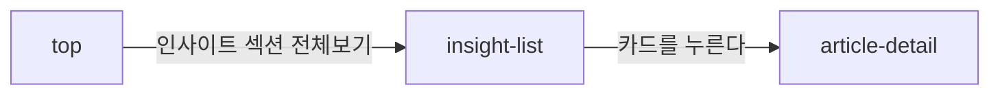

# insight-list: 멘트리 인사이트

- 상태: 확정 (§1~5 UX승인 2026-09-17 → §6~11 작성 완료)
- 화면 구분: 열람
- 템플릿: [`template/`](template/) (출처는 [`template/SOURCE.md`](template/SOURCE.md))

---

# 1부 — UX 설계 의도 (§1~5)

> **이 5절을 먼저 승인받는다.** 승인 전에 §6 이하로 내려가지 않는다.

## 1. 화면의 사명

**「해외 취업과 현지 생활에서 지금 내가 부딪힌 것을, 멘트리가 정리해 둔 글이 있는가」에 답한다.** 있으면 그 글로 보내고, 없으면 조건을 푸는 길을 낸다.

## 2. 대상 사용자와 상황

- 대상 사용자: 해외 취업·현지 생활을 준비하거나 겪고 있는 **멘티**. **비로그인 방문자를 포함한다** — 읽는 데 로그인을 요구하지 않는다
- 상황: **검색 엔진에서 특정 주제로 들어오거나**, TOP 의 인사이트 섹션에서 「전체보기」로 넘어온다
- 이용 패턴: 필요할 때만

**역할로 화면이 갈리지 않는다.** 멘티도 멘토도 같은 목록을 본다.

## 3. 액션 방침

- 주 액션: **글 1건을 골라 상세로 들어간다**
- 부 액션: 카테고리로 가르기 · 국가·키워드로 좁히기 · 검색 · 쪽 넘기기

**이 화면에서 하지 않는 것**:

| 하지 않는 것 | 이유 |
|---|---|
| **글을 쓰지 않는다** | 아티클은 멘트리가 싣는다. 사용자 투고가 아니다 |
| **정렬을 여러 개 주지 않는다** | 최신순 하나뿐이다. 읽을거리는 **새것이 먼저**이고, 인기순을 두면 오래된 글이 고착된다 |
| **직무로 좁히지 않는다** | 글은 직무가 아니라 **국가와 상황**으로 갈린다. `mentor-search` 와 축이 다르다 |
| **읽기에 로그인을 요구하지 않는다** | 검색 유입이 첫 접점이다 |

## 4. 구성과 하이어라키

**위에서 아래로 「무엇을 싣는 자리인가 → 어떤 종류인가 → 어떤 것인가」로 좁아진다.** 1열이고 우측 위젯이 없다.

| 순 | 블록 | 무엇을 하나 |
|---|---|---|
| 1 | 화면 제목과 안내문 | **이 자리가 무엇을 싣는지 2문으로 말한다.** 검색으로 처음 들어온 사람이 읽는다 |
| 2 | **카테고리** — 전체 / 멘트리 인사이트 / 멘트리 이벤트 / 멘토 인터뷰 | **글의 종류를 가른다.** 성격이 다른 세 가지가 한 목록에 섞여 있다 |
| 3 | **조건** — 국가 · 키워드 · 검색 · 최신순 | 나온 목록을 좁힌다 |
| 4 | 글 목록 | 이 화면의 본체 |
| 5 | 쪽 이동 | |

**카테고리와 조건은 층이 다르다.** 카테고리는 **무엇인가**(종류)이고, 조건은 **무엇에 관한 것인가**(주제)다. 그래서 위아래로 나누고 섞지 않는다.

**축의 이름은 「국가」로 통일한다.** `qna-feed`·`mentor-search` 와 같은 말을 쓴다.

**우측 위젯을 두지 않는다.** 이 화면은 읽을거리를 고르는 자리이고, 옆에 다른 것을 두면 글 제목을 읽는 폭이 줄어든다.

## 5. 적용 패턴 (P-nn)

**세 건 모두 이 화면이 3화면째다.** 이미 승격된 패턴을 그대로 쓴다.

| 패턴 | 이 화면에서의 적용 |
|---|---|
| **[`P-01`](../../UX-PATTERNS.md)** 목록의 상태를 URL 에 담는다 | 카테고리·국가·키워드·검색어·페이지를 URL 에 담는다. 조건을 바꾸면 1페이지로 되돌린다 |
| **[`P-02`](../../UX-PATTERNS.md)** 비로그인이 로그인이 필요한 조작을 눌렀다 | **이 화면에는 로그인이 필요한 조작이 없다.** 읽기와 검색만 있다 |
| **[`P-03`](../../UX-PATTERNS.md)** 0건의 면에서 다음 행동을 낸다 | 조건을 푸는 길을 낸다 |

**판단은 [UX-PATTERNS.md](../../UX-PATTERNS.md) 가 갖는다.** 여기에는 적용값만 남긴다.

컴포넌트 레벨의 규칙은 [DESIGN.md](../../DESIGN.md) 를 따르고 여기에 중복해서 쓰지 않는다.

---

# 2부 — 구조 (§6~11)

## 6. 블록별 규칙 (구성 요소 포함)

**화면 위에서부터의 순서다.** 요소명은 [용어집](../../../docs/glossary/ubiquitous-language.md) English 열이다.

| 요소명(English) | 종류 | 내용 | 이 화면에서의 규칙 |
|---|---|---|---|
| `Header` | 전역 셸 | — | 이 화면 고유의 규칙 없음 |
| — | 제목과 안내문 | 「멘트리 인사이트」 ＋ 2문 | 안내문이 §1 을 대신 말한다 |
| `ToggleGroup` | **카테고리** | 전체 / 멘트리 인사이트 / 멘트리 이벤트 / 멘토 인터뷰 | **URL 에 담는다.** 바꾸면 조건 축이 갈린다(§8) |
| `Select` ×N ＋ `SearchInput` | 조건 | **카테고리마다 다르다**(§8) ＋ 아티클 검색 ＋ 최신순 | 즉시 적용 · AND · 각 축 단일 선택 |
| `Chip` ×N ＋ `Button` | 걸린 조건 | 값 하나에 칩 하나 ＋ 「필터 초기화」 | **조건이 하나라도 걸렸을 때만 선다** |
| `ArticlePreview` ×10 | 글 목록 | 아래 「카드의 구성」 | 최신순 고정 |
| `Pagination` | 쪽 이동 | — | `qna-feed` 와 규칙을 통일한다 |
| `Footer` | 전역 셸 | — | |

### 카드의 구성 — `ArticlePreview`

| 단 | 무엇 | 규칙 |
|---|---|---|
| 1 | 썸네일 | **16:9.** 없으면 sage placeholder |
| 2 | `Badge` ×2 | **국가 ＋ 키워드.** 순서를 바꾸지 않는다 |
| 3 | 제목 | **2줄 고정** |
| 4 | 발췌 | **3줄 고정** |
| 5 | 날짜 | `YYYY.MM.DD`. 표시 전용 |

**카드에 스크랩·좋아요를 달지 않는다.** 이 화면에는 로그인이 필요한 조작이 없다(§3).

## 7. 상태 목록

| 상태 | 표시 내용 | 비고 |
|---|---|---|
| 정상 | 위 §6 그대로 | 카테고리 4종이 각각의 파일이다 |
| 로딩 | **`Skeleton`** 으로 카드 자리를 채운다 | **`Pagination` 은 남긴다** — 자리가 흔들리지 않게 |
| 빈 상태 | **「조건에 맞는 아티클이 없어요」** ＋ 「조건을 하나씩 풀어 보시거나, 전체 카테고리에서 다시 찾아보세요.」 ＋ **「조건 초기화」** | `P-03` |
| 에러 | **「아티클 목록을 불러오는 중 연결이 끊겼어요.」** ＋ **「다시 시도」** | **목록 자리만 바꾼다.** 카테고리·조건·`Pagination` 은 남는다 |

**빈 상태는 1종이다.** 이 화면에는 「내 것」이 없어서 `qna-feed` 처럼 두 갈래로 갈리지 않는다.

**에러 시의 거동**: 목록 자리를 에러 표시로 바꾸고 재시도 버튼을 낸다. **조건은 URL 에 남아 있으므로 재시도는 같은 조건으로 다시 부른다.**

## 8. 🔴 표시·활성 제어의 판정 조건과 아크션

### 카테고리가 조건 축을 바꾼다 — 이 화면의 핵심이다

| 카테고리 | 조건 축 | 왜 |
|---|---|---|
| **전체** | 국가 · 키워드 | 공통분모만 낸다 |
| **멘트리 인사이트** | 국가 · 키워드 | 전체와 같다 |
| **멘트리 이벤트** | **종류** | 이벤트는 나라가 아니라 **형식**(웨비나·클라쓰·라운드테이블)으로 갈린다 |
| **멘토 인터뷰** | 국가 · **직종** · 키워드 | 글의 주인공이 **사람**이다. 직종이 붙는다 |

**축의 개수가 3·1·3 으로 달라진다.** 카테고리를 바꾸면 **없어진 축의 값은 버린다.**

### 그 밖

| 판정 조건 | 아크션 |
|---|---|
| 카테고리나 조건을 바꿨다 | **1페이지로 되돌린다** |
| 페이지를 옮겼다 | 목록 머리로 스크롤한다. URL 에 페이지를 남긴다 |
| **뒤로가기 · 공유 링크 · 새로고침으로 들어왔다** | 카테고리 · 조건 · 검색어 · 페이지를 **URL 에서 복원한다** |
| **조건이 하나라도 걸렸다** | 걸린 조건 칩 줄과 **「필터 초기화」**를 낸다 |
| 조건이 하나도 없다 | **칩 줄째로 감춘다** |
| 검색어가 있다 | 칩에 **「검색: <말>」** 로 낸다. 다른 조건과 같은 줄에 선다 |
| 결과가 0건이다 | §7 의 빈 상태. **「조건 초기화」가 전체 카테고리로 되돌린다** |
| 제목이 2줄을 넘는다 | 말줄임한다 |
| 발췌가 3줄을 넘는다 | 말줄임한다 |

## 9. 화면 전이

**전이도의 정본은 [transition-map.md](../../docs/transition-map.md) 다.** 여기에는 나가는 것만 적는다.

**들어오는 경로가 둘이다** — TOP 의 「전체보기」와 **검색 엔진**. 검색 유입은 보통 `article-detail` 로 바로 간다.

## 10. 수용 조건

- [x] 카테고리 4종이 각각 선다
- [x] 카테고리마다 조건 축이 §8 표대로 갈린다
- [x] 걸린 조건이 칩으로 서고 「필터 초기화」가 함께 난다
- [x] 4상태가 전부 있다
- [x] 1280 · 390 에서 가로 넘침 0건
- [ ] **모바일 레이아웃을 실측으로 확인한다** — `UI-REVIEW.md`

## 11. 미결

| 무엇 | 왜 남았나 |
|---|---|
| **「종류」 축의 값 목록** | 이벤트의 형식 분류가 정해진 적이 없다. `taxonomy.js` 에 올릴지 화면이 가질지도 미정 |
| **「키워드」 축의 값** | `taxonomy.js` 의 `KEYWORD_GROUPS` 를 쓸 것인지 확정하지 않았다. 지금 화면은 자체 값을 갖고 있다 |
| **글을 싣는 주체와 주기** | 운영 규칙이다. 화면 설계에 영향을 주지 않아 남긴다 |
