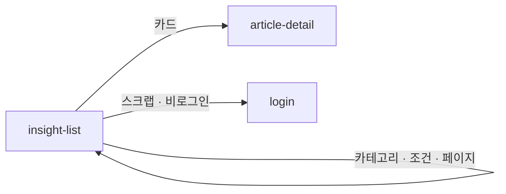

# insight-list: 멘트리 인사이트

- 상태: **확정** (§1~5 UX승인 2026-09-16 · §6~11 작성 2026-09-16 · `template/` 대기)
- 화면 구분: 열람
- 템플릿: 없음. §1~5 승인 뒤 Claude Design 에서 만든다
- **부품이 없는 자리 둘은 임시로 조립한다**(상혁 2026-09-16) — 세로 내비(`DS-17`) · 가로형 아티클 카드(`DS-33`). 부품이 오면 갈아끼운다. `DS-27` 페이지 이동의 시작·끝 형태도 기다린다

> 출처: Figma `zFWjJinW6NAtyMMzMujNl2` / `1059:41695` 「아티클/공지사항/뉴스」 — 목록 프레임 `1059:41918` 과 주석 8건. 읽은 날 2026-09-16.

---

# 1부 — UX 설계 의도 (§1~5)

> **이 5절을 먼저 승인받는다.** 승인 전에 §6 이하로 내려가지 않는다.

## 1. 화면의 사명

**「멘트리가 낸 읽을거리 중 내 상황에 맞는 것이 무엇인가」에 답한다.** 카테고리와 국가·키워드로 좁혀 아티클 1건으로 보낸다.

Q&A 피드가 「남의 질문」을 고르는 면이라면, 이 화면은 **「멘트리가 고른 글」**을 고르는 면이다. 글은 전부 어드민에서 발행된다. 사용자는 쓰지 않고 고른다.

## 2. 대상 사용자와 상황

- 대상 사용자: 해외 취업·커리어를 준비하는 **멘티**. **비로그인 방문자를 포함한다.** 멘토도 온다 — 자기 인터뷰나 참여한 이벤트 기사를 보러
- 상황: 헤더 메뉴 「멘트리 인사이트」, TOP 의 퀵메뉴(멘토 인터뷰 · 이벤트), 검색 유입으로 들어온다
- 이용 패턴: 정기 확인 ＋ 필요할 때만

**역할로 화면이 갈리지 않는다.** 한 화면이다. 로그인이 가르는 것은 스크랩 하나다.

## 3. 액션 방침

- 주 액션: **아티클 1건을 골라 상세로 들어간다**
- 부 액션: 카테고리 전환 · 국가·키워드·검색어로 좁히기 · 정렬 · 스크랩

**이 화면에서 하지 않는 것**:

| 하지 않는 것 | 이유 |
|---|---|
| **글을 쓰지 않는다** | 모든 컨텐츠는 멘트리 어드민에서 입력된 것이 기준이다(주석 `1059:42364`). 사용자 작성 진입을 두지 않는다 |
| **조회수·도움돼요 수를 카드에 보이지 않는다** | 주석이 「조회·좋아요는 카드 미표시」로 정했다. 숫자는 내부 지표다 |
| **공지사항을 여기 두지 않는다** | 공지사항은 독립 페이지고 진입이 푸터다(주석 `1059:42382`). 읽을거리와 운영 알림을 한 목록에 섞지 않는다 |
| **태그를 눌러 필터하지 않는다** | 카드의 태그는 표시 전용이다. 좁히는 조작은 조건 줄 하나로 모은다 |
| **읽기에 로그인을 요구하지 않는다** | `P-01`. 스크랩을 누를 때만 로그인으로 보낸다 |

## 4. 구성과 하이어라키

**「분류 → 조건 → 결과」로 좁아진다.** 좌측 카테고리와 우측 본문의 2단이다.

| 순 | 블록 | 무엇을 하나 |
|---|---|---|
| 1 | 화면 제목과 안내문 | 이 화면이 무엇인지 말한다 |
| 2 | **좌측 카테고리** — 전체 · 멘트리 인사이트 · 멘트리 이벤트 · 멘토 인터뷰 | 가장 큰 분류를 먼저 고른다. 기본은 「전체」. 선택 항목은 초록 강조 |
| 3 | **검색 조건** — 국가 · 키워드 · 검색창 | 고른 분류 안에서 조건을 건다. **카테고리에 따라 축이 바뀐다**(아래 표) |
| 4 | 걸린 조건 칩 ＋ 필터 초기화 ／ 정렬(최신순) | 무엇이 걸려 있는지 보이고, 한 번에 푼다 |
| 5 | 아티클 목록 | 이 화면의 본체. 카드는 **가로형** — 왼쪽 글, 오른쪽 썸네일. **태그는 부품대로 컬러 태그**(2026-09-16 결정) — 아티클은 읽을거리임을 색으로 가른다. Q&A 카드의 뉴트럴과 다른 것이 의도다 |
| 6 | 페이지 이동 | |

**카테고리가 조건의 축을 바꾼다.** 와이어가 검색 조건 줄을 4형으로 따로 그렸다.

| 카테고리 | 조건 축 |
|---|---|
| 전체 · 멘트리 인사이트 | 국가 · 키워드 · 검색창 |
| 멘트리 이벤트 | 종류 · 검색창 |
| 멘토 인터뷰 | 국가 · 직종 · 키워드 · 검색창 |

**Q&A 피드와 다른 세 가지.** ① 우측 위젯이 없고 좌측 분류가 있다. 여기서는 「고르는 축」이 화면의 뼈대다. ② 「주목받는」 블록이 없다. 발행물은 편집이 이미 골랐다. ③ 카드가 가로형이다. 아티클은 **썸네일이 시각 경계**를 만든다(부품 설명). 글이 앞서고 그림이 따른다.

**축의 이름은 「국가」다.** 와이어의 `지역` 은 쓰지 않는 말이다(2026-09-11 결정). 「키워드」의 목록은 아직 정해지지 않았다. 「종류」와 「직종」의 값도 와이어에 없다. **값에 의존하는 판단을 이 문서에 쓰지 않는다.**

**모바일(768 이하).** 좌측 단이 없어진다. 카테고리는 제목 아래 **가로 탭**으로 선다(2026-09-16 결정). 4항목이 한 줄에 든다. 조건은 국가·키워드 한 줄 ＋ 검색창 한 줄이다. 카드는 **세로형 부품 그대로**다 — 가로형은 좁은 폭에서 성립하지 않는다.

## 5. 적용 패턴 (P-nn)

| 패턴 | 이 화면에서의 적용 |
|---|---|
| `P-01` 로그인의 벽을 액션마다 가른다 | 스크랩만 로그인으로 보낸다. 읽기와 검색은 막지 않는다 |
| `P-02` 0건의 면에서 다음 행동을 낸다 | 조건을 걸어 0건이면 「조건 초기화」를 낸다. 카테고리 자체가 0건이면 다른 카테고리로 보낸다 |
| **승격 — `P-04` 목록의 상태를 URL 에 담고 뒤로가기로 되돌린다** | 카테고리 · 국가 · 키워드 · 검색어 · 정렬 · 페이지를 URL 에 담는다. 조건을 바꾸면 1페이지로 되돌린다. 페이지를 옮기면 목록 머리로 스크롤한다. `qna-feed` 에서 미승격이었고 **이 화면이 2화면째**라 승격한다(헌장 원칙 7) |

**검색은 부품 그대로 쓴다**(상혁 2026-09-16). 주석의 「입력 즉시(디바운스)」는 서버 검색의 규칙이고, 화면은 `SearchInput` 이 하는 대로 Enter 에 검색어를 조건으로 건다. 이 화면에서 따로 설계하지 않는다.

컴포넌트 레벨의 규칙은 [DESIGN.md](../../DESIGN.md) 를 따르고 여기에 중복해서 쓰지 않는다.

---

# 2부 — 구조 (§6~11)

## 6. 블록별 규칙 (구성 요소 포함)

| 요소명(English) | 종류 | 내용 | 이 화면에서의 규칙 |
|---|---|---|---|
| `Header` · `Footer` · `BottomTabBar` | 부품 | 공통 내비 | 「멘트리 인사이트」가 활성이다 |
| 화면 제목 ＋ 안내문 | 조립 | 「멘트리 인사이트」 ＋ 2줄 | h0. 안내문은 UX 라이팅 미정(§11) |
| **`VerticalNav`(임시 조립)** — 카테고리 | **임시** | `Card` 안에 제목 「카테고리」 ＋ 항목 4 | 전체(기본) · 멘트리 인사이트 · 멘트리 이벤트 · 멘토 인터뷰. 선택 항목은 옅은 초록 채움. **`DS-17` 부품이 오면 갈아끼운다.** 모바일은 `Tabs` 4개로 갈아 세운다 |
| `FilterSelect` — 국가 | 부품 | 다중 선택 ＋ 적용 | 국기 배지. **OR** |
| `FilterSelect` — 키워드 | 부품 | 다중 선택 ＋ 적용 | 국가와 같은 조작. **OR** |
| `Select` — 종류 | 부품 | 단일 | **이벤트 카테고리에서만.** 값 목록 미정(§11) |
| `FilterSelect` — 직종 | 부품 | 대분류 그룹 ＋ 소분류 | **멘토 인터뷰 카테고리에서만** |
| `SearchInput` | 부품 | 자동완성 ＋ 최근 검색어 | **부품 그대로.** Enter 에 검색어를 조건으로 건다 |
| 걸린 조건 — `Chip` ×n ＋ 「필터 초기화」 | 부품 | `onRemove` 칩 ＋ `Button ghost` | **조건이 하나 이상일 때만 뜬다.** 검색어도 칩이다 |
| `Select` — 정렬 | 부품 | 최신순 · 오래된순 | 오른쪽 끝 |
| **가로형 아티클 카드(임시 조립)** ×N | **임시** | 왼쪽 글 · 오른쪽 썸네일 | 아래 「카드의 구성」. **`DS-33` 부품이 오면 `ArticlePreview layout="horizontal"` 로 갈아끼운다.** 모바일은 `ArticlePreview` 세로형 그대로 |
| `Pagination` | 부품 | 시작 · 중간 · 끝 3형태 | `DS-27`. 한 페이지 **10건** |

### 카드의 구성 — 임시 조립

`ArticlePreview` 의 표면 규칙을 그대로 따른다. 카드 테두리·그림자 없음. 항목 사이는 1px 선이다.

| 자리 | 무엇 | 규칙 |
|---|---|---|
| 태그 | 컬러 `Badge sm` **최대 2개** | 국가 · 키워드. 1개면 1개. 3개 이상이면 **우선순위 1·2번**. 표시 전용 — 눌러도 필터하지 않는다 |
| 제목 | h3 | **2줄 고정 ＋ 말줄임** |
| 발췌 | body muted | **3줄 고정 ＋ 말줄임** |
| 발행일 | caption muted | `2026.07.04` |
| 썸네일 | 16:9 · 폭 296 | 없거나 실패하면 부품의 placeholder. 기본 OGP 는 어드민이 채운다 |
| 스크랩 | `BookmarkToggle` | **썸네일 우상단.** `DESIGN.md` §8.1 |
| 클릭 | 카드 전체 | **같은 탭**으로 상세. 스크랩 클릭은 카드 링크로 새지 않는다 |

**조회수 · 도움돼요 수는 카드에 없다.**

### 카테고리별 조건 축

| 카테고리 | 축 | 검색창 |
|---|---|---|
| 전체 · 멘트리 인사이트 | 국가 · 키워드 | 있다 |
| 멘트리 이벤트 | 종류 | 있다 |
| 멘토 인터뷰 | 국가 · 직종 · 키워드 | 있다 |

**카테고리를 바꾸면 조건과 검색어를 비우고 1페이지로 간다.** 축이 바뀌므로 남길 것이 없다.

### 임시 조립을 표시한다

임시로 조립한 블록은 마크업에 `data-temp="DS-17"` · `data-temp="DS-33"` 을 붙인다. 부품이 오면 그 자리만 바꾼다.

## 7. 상태 목록

| 상태 | 표시 내용 | 비고 |
|---|---|---|
| 정상 | §6 그대로 | 카테고리 4형이 각각 한 판이다 |
| 로딩 | 카드 자리를 **`Skeleton` 5장**으로 채운다 | 카테고리 · 조건 줄은 그대로 뜬다 |
| 빈 상태 | **조건에 걸린 0건**과 **카테고리 자체 0건**을 가른다 — 아래 | `P-02` |
| 에러 | 목록 자리에 사유 ＋ 재시도 | **아래 「에러 시의 거동」 필수 기재** |

| 빈 상태의 종류 | 무엇을 낸다 |
|---|---|
| 조건 · 검색어를 걸어 0건 | `EmptyState` 「조건에 맞는 아티클이 없어요」 ＋ **「조건 초기화」** 버튼 |
| 카테고리 자체가 0건 | `EmptyState` 「아직 발행된 글이 없어요」 ＋ **「전체 보기」** 버튼 |

**에러 시의 거동·대체 플로우**:

- **목록을 못 불러왔다** → 목록 자리에만 에러와 재시도. 카테고리와 조건 줄은 살려 둔다. 조건을 바꾸면 다시 부른다
- **필터 값 목록(국가 · 키워드 · 종류 · 직종)을 못 불러왔다** → 그 축의 드롭다운을 비활성으로 두고 목록은 부른다
- **스크랩이 실패했다** → 누르기 전으로 되돌리고 `Toast` 로 알린다
- **문구는 미정이다**(§11)

## 8. 표시·활성 제어의 판정 조건과 아크션

| 판정 조건 | 아크션 |
|---|---|
| **비로그인이다** | 읽기 · 검색 · 조건을 막지 않는다. **스크랩에서 로그인으로 보낸다**(`P-01`) |
| **카테고리를 골랐다** | 그 분류로 목록을 부른다. **조건 축을 그 카테고리의 것으로 갈아끼운다.** 조건 · 검색어를 비우고 1페이지. URL 갱신(`P-04`) |
| 조건이 **하나 이상** 걸렸다 | 걸린 조건 칩 줄 ＋ 「필터 초기화」를 낸다 |
| 조건이 **없다** | 칩 줄을 세우지 않는다 |
| 조건 · 검색어 · 정렬을 바꿨다 | **1페이지로** 되돌리고 URL 을 갱신한다. 필터끼리는 AND, 한 축 안은 OR |
| 칩의 ✕ 를 눌렀다 | 그 조건만 푼다. 1페이지 |
| 「필터 초기화」를 눌렀다 | 조건 · 검색어를 전부 푼다. 카테고리는 남긴다 |
| 페이지를 옮겼다 | **목록 머리로 스크롤.** URL 에 page |
| 검색창에서 Enter | 검색어를 조건 칩으로 건다. 부품의 자동완성 · 최근 검색어는 부품 그대로 |
| 태그가 3개 이상이다 | 우선순위 1 · 2번만 |
| 썸네일이 없거나 실패했다 | 부품의 placeholder |
| **768 이하다** | 카테고리는 `Tabs`, 카드는 `ArticlePreview` 세로형, 조건은 국가 · 키워드 한 줄 ＋ 검색창 한 줄 |
| 카드를 눌렀다 | **같은 탭**으로 `article-detail`. 카테고리에 따라 A · B · C 판 |

## 9. 화면 전이

**전이도의 정본은 [transition-map.md](../../docs/transition-map.md) 다.** 여기에는 이 화면에서 나가는 것만 적는다.

- `insight-list` → `article-detail`: 카드를 누른다. 같은 탭
- `insight-list` → `login`: 비로그인이 스크랩을 누른다
- `insight-list` → 자기 자신: 카테고리 · 조건 · 정렬 · 페이지는 URL 만 바뀐다(`P-04`)
- **들어오는 길**: 헤더 메뉴 · 하단 탭바 · TOP 퀵메뉴(멘토 인터뷰 → 인터뷰 카테고리, 이벤트 → 이벤트 카테고리) · 검색 유입

## 10. 의존 API

| API (용도) | 계약 |
|---|---|
| 아티클 목록(카테고리 · 국가 · 키워드 · 종류 · 직종 · 검색어 · 정렬 · 페이지) | **계약 미정의.** 검색 가중치 태그 → 제목 → 본문과 관련도 정렬은 서버가 갖는다 |
| 필터 값 목록(국가 · 키워드 · 종류 · 직종) | **계약 미정의** |
| 검색 자동완성 · 최근 검색어 | **계약 미정의** |
| 스크랩 등록 · 해제(아티클) | **계약 미정의** |
| 기본 OGP 이미지 | **어드민이 채운다.** 화면은 없으면 placeholder |

**미정의인 채로 구현 인계하지 않는다.**

## 11. 미결 사항

| # | 무엇 | 왜 못 정하나 | 언제 걸리나 |
|---|---|---|---|
| 1 | **「종류」(이벤트) · 「직종」(인터뷰) 축의 값 목록** | 와이어에 없다 | 백엔드 합의 |
| 2 | **한 페이지 건수** | 와이어는 5장을 그렸을 뿐이다. **10건으로 둔다** | 구현 인계 전 |
| 3 | **에러 · 빈 상태 · 안내문의 문구** | UX 라이팅이며 한/일 2개국어다 | UX 라이팅 착수 |
| 4 | **임시 조립 2건의 교체** | `DS-17` · `DS-33` 이 완료되면 `data-temp` 자리를 바꾼다 | 부품 완료 |
| 5 | **키워드 축이 다중인가** | 와이어가 안 정했다. 국가와 같은 다중으로 뒀다 | 백엔드 합의 |

## 실행 계획

- [x] 와이어를 읽고 주석 22건을 전사한다 (2026-09-16)
- [x] §1~5 를 쓰고 UX승인을 받는다 (2026-09-16 · 상혁)
- [x] §6~11 을 쓴다 (2026-09-16)
- [x] 부족한 요소를 `DS-update-list.md` 에 기표한다 (`DS-33` · `DS-17` 보강)
- [ ] `template/` 을 Claude Design 에서 만들어 취임한다 — 프롬프트 `design/_import/prompts/insight-screens.md`
- [ ] 6품질축 감사와 표시 확인을 `UI-REVIEW.md` 에 남긴다
