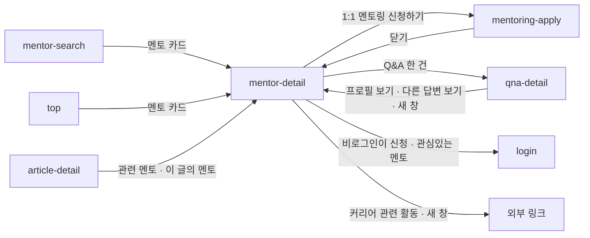

# mentor-detail: 멘토 상세

- 상태: 확정 (§1~5 UX승인 2026-09-24 → §6~11 확정 2026-09-24 · 1차 export 검수 뒤 개정 2026-09-24)
- 화면 구분: 열람
- 템플릿: 아직 없다. Claude Design 에서 만드는 중이다 — 1차 export(2026-09-24)를 검수하고 구성을 고쳤다(§4 멘토 바 · 표지 · 소개글). `DS-54` · `DS-57` · `DS-67` 은 아트디렉션 전까지 임시 조립이다(§6)

> **이번 판의 범위는 방문자가 보는 면이다.** 멘토 본인의 **편집 면**(편집 모달 11종)은 다음 라운드에 이 문서에 덧붙인다. 이번에는 본인일 때 **편집으로 들어가는 자리**만 정한다(§4 「본인 프로필일 때」).
>
> 와이어: 최종안 `1078:80585` · TOP 결정사항 `1078:80973` · 본인 프로필 `1078:80986` · 상단 참조 `1455:24409`

---

# 1부 — UX 설계 의도 (§1~5)

> **이 5절을 먼저 승인받는다.** 승인 전에 §6 이하로 내려가지 않는다.

## 1. 화면의 사명

**「이 멘토에게 1:1 멘토링을 신청할 것인가」를 정하게 한다.** 인터뷰로 사람을 알고, 경력으로 내 상황에 맞는지 보고, 답변과 리뷰로 믿을 만한지 확인한 뒤 신청으로 보낸다.

## 2. 대상 사용자와 상황

- 대상 사용자: 해외 취업·현지 생활을 준비하거나 겪고 있는 **멘티**. **비로그인 방문자를 포함한다.** **다른 멘토도 신청할 수 있다**(아래). 멘토 본인도 자기 페이지를 본다(§4)
- 상황: 들어오는 길이 여럿이다. 아래 표
- 이용 패턴: 필요할 때만

| 어디서 | 무엇을 눌러서 | 여는 탭 |
|---|---|---|
| `mentor-search` · `top` | 멘토 카드 | 프로필 |
| `article-detail` | 관련 멘토 모달에서 고른다 · 「이 글의 멘토」 카드 | 프로필 |
| `qna-detail` | 「이 멘토의 프로필 보기」 | 프로필 · 새 창 |
| `qna-detail` | 「이 멘토의 다른 답변 보기」 | **Q&A** · 새 창 |
| `mentoring-apply` | 신청을 마치고 「닫기」 | 프로필 |
| 공유 링크 | — | 링크에 담긴 탭 |

### 🔴 모든 멘토에게 인터뷰가 1편 이상 있다

**멘토는 섭외 → 인터뷰 → 등록의 순서로 서비스에 들어온다**(디자이너 확인 2026-09-24). 그래서 **인터뷰가 없는 멘토 페이지는 존재하지 않는다.**

이 화면은 인터뷰를 기본 구성으로 둔다. 인터뷰가 없는 상태를 설계하지 않는다. **인터뷰는 이 서비스의 특징이다.**

### 🔴 멘토도 다른 멘토에게 신청할 수 있다

**1.0 은 멘토가 신청하지 못했다. 그래서 불편이 컸고, 2.0 에서 연다**(디자이너 확인 2026-09-24). 이 화면은 로그인한 멘토에게도 신청 버튼을 똑같이 낸다.

## 3. 액션 방침

- 주 액션: **1:1 멘토링 신청하기** → `mentoring-apply`. **이 화면이 신청의 유일한 진입점이다**
- 부 액션: 관심있는 멘토 등록 · 공유 · 인터뷰 읽기 · 이 멘토의 답변 보기 · 리뷰 보기

**와이어의 「즐겨찾기 등록」은 용어집의 「관심있는 멘토」(`FavoriteMentor`)다.** Q&A 의 「좋아요」는 「도움돼요」(`Helpful`)다. 이 문서는 용어집의 말을 쓴다.

**이 화면에서 하지 않는 것**:

| 하지 않는 것 | 이유 |
|---|---|
| **이 화면에서 결제하지 않는다** | 신청과 결제는 `mentoring-apply` 가 맡는다. 이 화면은 신청할지 정하는 자리다 |
| **리뷰에 별점을 두지 않는다** | 리뷰를 점수가 아니라 글로 읽게 한다. 와이어 메모(`1078:80970`)가 「리뷰를 리치하게 길게 쓰도록 유도한다」고 적는다 |
| **인터뷰 탭에 아티클의 스크랩·좋아요·공유를 두지 않는다** | 이 화면의 공유는 **멘토 페이지**를 공유한다. 글의 공유가 옆에 서면 무엇을 공유하는지 갈린다. 글에 대한 조작은 `article-detail` 에서 한다 |
| **인터뷰를 저절로 넘기지 않는다** | 여러 편이어도 캐러셀을 두지 않는다. 최신 1편을 펼치고 지난 편은 아래에 목록으로 둔다(와이어 메모 `1078:80652`). 5초 넘게 저절로 움직이는 콘텐츠는 WCAG 2.2.2 에 걸린다 |
| **보는 데 로그인을 요구하지 않는다** | 로그인은 신청과 관심있는 멘토 등록에서만 요구한다(§5) |
| **0건인 섹션과 탭을 방문자에게 비워 두지 않는다** | 숨긴다(§4). 방문자는 빈 자리에서 할 수 있는 것이 없다 |
| **신청 묶음을 전역 `Header` 에 넣지 않는다** | 그 자리는 로그인 · 알림 · 내 아바타 — 「내 계정」의 자리다. 「이 멘토에게 신청」은 멘토 바에 둔다 |

## 4. 구성과 하이어라키

**위에서 아래로 「누구인가 → 어떤 사람인가(인터뷰) → 믿을 만한가(답변·리뷰) → 신청」이다.** 스크롤해도 **누구의 페이지인지**와 **신청**은 늘 손이 닿게 따라온다.

### 데스크톱 (769+)

```
Header(전역)
페이지 헤더 — 풀폭 · 세계지도 · 멘토 위치 핀
━ 멘토 바 (따라옴) ━━━━━━━━━━━━━━━━━━━━━━━━━━━━━━━━━━━━━━━━━━━
 [이름 자리]           프로필 인터뷰 Q&A 7 리뷰 8      [관심][공유][1:1 멘토링 신청하기]
  ↑ 페이지 헤더가 화면에서 사라지면 「● 박서연 · 프로덕트 엔지니어」가 나타난다
┌ 왼쪽 열 (따라옴) ──┬ 탭 본문 ─────────────────────────┐
│ 한 줄 요약           │                                  │
│ 인사이트 키워드      │                                  │
│ 커리어 히스토리      │                                  │
│ 학력 히스토리        │ 탭 끝 CTA 박스                    │
└────────────────────┴─────────────────────────────────┘
Footer
```

| 순 | 블록 | 무엇을 하나 |
|---|---|---|
| 1 | `Header` | 전역 헤더다. 데스크톱에서는 이 화면 고유의 구성이 없다 |
| 2 | **페이지 헤더** | **누구인가.** 아바타 · 이름 · 직무 @회사 · 연차 · 국가와 도시. 배경에 세계지도를 깔고 멘토의 위치에 핀을 찍는다 |
| 3 | **멘토 바** | **이름 자리 · 탭 · 신청 묶음**(1:1 멘토링 신청하기 ＋ 관심있는 멘토 ＋ 공유)을 한 줄에 둔다. **스크롤을 따라온다** |
| 4 | 왼쪽 열 | 한 줄 요약 · 인사이트 키워드 · 커리어 히스토리 · 학력 히스토리. **어느 탭에서든 보이고, 스크롤을 따라온다** |
| 5 | 탭 본문 | 아래 「탭」 |
| 6 | 탭 끝 CTA 박스 | 다 본 사람에게 신청을 한 번 더 낸다 |

**페이지 헤더는 전역 헤더와 별개다.** 상단 참조(`1455:24409`)의 구성을 따른다.

**핀은 밴드 오른쪽 한 자리에 고정하고, 지도를 밀어 멘토의 도시를 핀 아래로 가져온다.** 세계 전도를 고정하면 유럽·미주 멘토의 핀이 왼쪽으로 가서 신원 정보와 겹친다. **지도의 화풍은 아트디렉션에서 정한다.**

**멘토 바가 이름 · 탭 · 신청 묶음을 한 줄에 담는다**(디자이너 판단 2026-09-24 · 페이스북 · 링크드인 프로필의 구조).

- **「누구에게」와 「신청」이 한 줄에 선다.** 신청 묶음을 왼쪽 열에 두면 이름과 떨어진다
- **따라오는 요소가 하나로 준다** — 이름 · 탭 · 신청이 바 하나다
- **이름은 페이지 헤더가 화면에서 사라지면 나타난다.** 페이지 헤더가 보이는 동안에는 같은 이름이 두 번 서므로 비워 둔다
- 신청 묶음은 모바일 하단 신청 바와 **같은 셋**이다

**왼쪽 열 전체가 멘토 바 아래에 붙어 따라온다.** 신청 묶음이 빠진 왼쪽 열은 「이 사람이 누구인가」만 남는다. 긴 인터뷰와 답변을 읽는 동안 그 옆에 경력이 있다. 열이 화면보다 길면 끝까지 스크롤한 뒤 아래에 붙는다.

**한 줄 요약은 멘토카드의 소개(`intro`)와 같은 값이다.** 왼쪽 열 맨 위에 멘토카드와 같은 green-50 상자로 둔다. 검색 결과에서 본 한마디가 상세에서 이어진다.

### 탭

| 탭 | 무엇 | 0건일 때 |
|---|---|---|
| **프로필** | 인터뷰 표지(최신 1편) → 멘토 소개 → 멘토 N문N답 → 커리어 관련 활동 | N문N답 · 커리어 관련 활동은 **섹션을 숨긴다** |
| **인터뷰** | **최신 1편의 전문.** 맨 아래에 지난 편 목록 | 생기지 않는다(§2) |
| **Q&A** | 이 멘토가 답한 Q&A. **답변을 본체로 둔다** | **탭을 숨긴다** |
| **리뷰** | 멘티가 쓴 리뷰. 최신순 | **탭을 숨긴다** |

**탭은 늘 2개 이상이다.** 프로필과 인터뷰는 빠지지 않는다.

### 프로필 탭의 인터뷰 표지와 멘토 소개

**인터뷰 표지는 와이어의 가로형 표지다.** 세로형 카드(`InterviewCard`)를 쓰지 않는다(디자이너 판단 2026-09-24).

```
┌──────────┬──────────────────────────────┐
│          │ 제목                          │
│  이미지   │ 전문의 첫머리 발췌              │
│   1:1    │ (아래로 갈수록 흐려진다)         │
│          │            [ 이어서 보기 ]      │
└──────────┴──────────────────────────────┘
```

- 데스크톱은 **왼쪽 이미지 1:1 · 오른쪽 제목과 발췌.** 모바일은 **이미지를 위에 4:3** 으로 둔다 — 1:1 이면 위아래 고정 바를 빼고 「이어서 보기」가 첫 화면 밖으로 나간다
- 발췌는 전문의 첫머리다. 아래로 갈수록 흐려지고 그 위에 「이어서 보기」가 선다
- **「이어서 보기」를 누르면 인터뷰 탭으로 바꾸고, 탭이 멘토 바에 붙는 자리까지 부드럽게 스크롤해 전문이 이어진다.** 페이지를 떠나지 않는다
- 모양은 아트디렉션(매거진 표지)에서 정한다. 그때까지 임시 조립이다(`DS-67`)

**멘토 소개는 표지 바로 아래, 제목 ＋ 옅은 면 상자다.** 소개글은 **입력 칸 하나 · 최대 500자**다(편집 모달 `1411:85444`). 분량이 들쭉날쭉해서 넓은 탭 본문이 받는다.

- **기본은 2단이다.** 한 줄이 탭 본문 폭만큼 길어지지 않게 한다(디자이너 판단 2026-09-24)
- 좁아지거나 글이 짧으면 1단이다(§8)

### 인터뷰 탭

**인터뷰 탭의 전문은 `article-detail` 의 인터뷰 글과 같은 글이다.** 머리(배지·제목·날짜)와 본문(소제목·문단·그림·캡션·형광펜)을 그대로 두고 **본문 폭도 같다.** 아티클 페이지의 틀에 딸린 것은 뺀다.

| `article-detail` 의 블록 | 인터뷰 탭 | 이유 |
|---|---|---|
| 머리 · 본문 | **둔다** | 같은 글이다 |
| 빵부스러기 · 「목록으로 돌아가기」 | 뺀다 | 멘토 페이지 안이라 돌아갈 목록이 없다 |
| 「이 글의 멘토」 카드 | 뺀다 | 이미 그 멘토의 페이지다 |
| 배너 CTA | 뺀다 | 탭 끝 CTA 박스가 같은 일을 한다. 두면 두 개가 연달아 선다 |
| 우측 목차 | 뺀다 | 오른쪽 열에 본문과 목차가 함께 들어갈 폭이 없다 |
| 좌측 레일(스크랩·좋아요·공유) | 뺀다 | §3 |

### Q&A 탭

**Q&A 탭은 답변을 본체로 둔다.** 와이어 메모(`1078:80956`) — 「멘티가 여기서 보는 것은 질문의 내용보다 멘토의 답변 품질이다」. `qna-feed` 는 질문이 본체라 강조점이 반대다.

- 한 건의 구성은 **질문 한 줄이 머리, 답변 발췌가 본체, 반응 줄이 끝**이다. 누르면 `qna-detail` 로 간다
- **모양은 아트디렉션의 Q&A 개편에서 정한다.** 이 문서는 강조점만 정한다
- 「더보기」는 **5건씩 이 자리에서 펼친다.** `qna-feed` 에는 멘토로 좁히는 조건이 없다. 다른 목록으로 보내면 「이 멘토의 답변」이라는 맥락이 끊긴다

### 모바일 (~768)

```
Header(전역) — 아래로 스크롤하면 숨는다
페이지 헤더(낮게) — 신원 ＋ 한 줄 요약 ＋ 핀
━ 멘토 바 (따라옴) — 이름 줄 ＋ 탭 줄 ━
탭 본문
─ 하단 고정: 신청 바 ／ BottomTabBar(아래로 스크롤하면 숨는다) ─
```

**왼쪽 열이 없으므로 그 내용이 프로필 탭 안으로 들어간다.** 한 줄 요약만 페이지 헤더로 올라간다.

| 순 | 프로필 탭의 블록 | 왜 이 자리인가 |
|---|---|---|
| 1 | 인터뷰 표지(최신 1편 · 이미지 4:3) | 서비스의 특징이라 맨 앞이다 |
| 2 | 멘토 소개(1단) | |
| 3 | 인사이트 키워드 | **데스크톱의 왼쪽 열(3~5).** 데스크톱에서는 인터뷰·소개와 같은 높이에서 함께 보인다. 한 줄로 펴면 그 바로 뒤다 |
| 4 | 커리어 히스토리 | |
| 5 | 학력 히스토리 | |
| 6 | 멘토 N문N답 | |
| 7 | 커리어 관련 활동 | |
| 8 | 탭 끝 CTA 박스 | |

**한 줄 요약은 모바일에서 페이지 헤더의 신원 아래로 올린다**(디자이너 판단 2026-09-24). 프로필 탭 안에 두면 소개글 전문 뒤에 요약이 한 번 더 나온다. 페이지 헤더에 두면 **요약이 전문보다 먼저** 온다.

**왼쪽 열의 내용은 한 화면에 한 번만 선다.** 데스크톱에서는 왼쪽 열에만 있고 프로필 탭에 다시 넣지 않는다. 모바일에서는 프로필 탭(한 줄 요약은 페이지 헤더)에만 있고 다른 탭(인터뷰·Q&A·리뷰)에는 나오지 않는다.

**아래로 읽는 동안 위아래 전역 바가 비켜 준다**(디자이너 판단 2026-09-24).

- 아래로 스크롤하면 **전역 `Header` 가 위로, `BottomTabBar` 가 아래로 숨는다.** 남는 것은 멘토 바(이름 줄 ＋ 탭 줄)와 신청 바 — 이 멘토에 관한 바뿐이다
- 위쪽에 고정되는 높이가 140(전역 헤더 56 ＋ 멘토 바 84)에서 **84** 로 준다
- 위로 스크롤하면 둘 다 돌아온다
- **신청 바는 숨지 않는다**

### 본인 프로필일 때

| 무엇 | 방문자 | 본인 |
|---|---|---|
| 멘토 바의 신청 묶음 · 신청 바 | 신청 ＋ 관심있는 멘토 ＋ 공유 | **프로필 수정하기 ＋ 공유.** 관심있는 멘토 등록은 뺀다 — 자기를 등록할 일이 없다 |
| 섹션 머리 | 없음 | 연필(편집). 커리어·학력·커리어 관련 활동에는 ＋(추가)도 선다 |
| 페이지 헤더의 아바타 | 없음 | 연필(사진 편집) |
| 0건인 섹션 | 숨긴다 | 빈 자리 ＋ 등록 유도. **모양은 편집 면 라운드에서 정한다** |

편집할 수 있는 범위는 와이어 메모(`1078:80986`)를 따른다 — 기본정보(사진·현직장·거주국가 등) · 인사이트 · 커리어·학력 · 프로필 탭의 각 섹션. **각 편집 모달의 사양은 다음 라운드다.**

## 5. 적용 패턴 (P-nn)

> **P-nn 번호는 #31·#32 의 `UX-PATTERNS.md` 를 따랐다**(디자이너 판단 2026-09-24 — 리포에 올라간 번호를 기준으로 한다). `main` 에는 아직 행이 없다. `design/mentor-search-uispec` 은 같은 패턴에 다른 번호를 붙였고 그쪽을 고친다.

| 패턴 | 이 화면에서의 적용 |
|---|---|
| **`P-01`** 로그인의 벽을 액션마다 가른다 | **신청과 관심있는 멘토 등록에서만 로그인으로 보낸다**(와이어 결정사항). 보기와 공유는 막지 않는다 |
| **`P-02`** 0건의 면에서 다음 행동을 낸다 | **방문자는 0건에서 할 수 있는 것이 없다.** 그래서 섹션과 탭을 숨긴다 — 패턴의 단서 「할 수 있는 것이 없는 사람에게는 행동을 요구하지 않는다」에 해당한다. 본인에게는 등록 유도를 낸다 |
| **`P-03`** 공유는 단말에 따라 수단이 갈린다 | 멘토 바와 신청 바의 공유. 와이어 결정사항의 「모바일은 OS 공유 모달, 웹은 popover → 링크 복사 / 공유하기」와 같다 |
| **`P-05`** 없는 글의 URL 은 404 화면으로 받는다 | **없는 멘토**(탈퇴·비공개)의 URL 에 같은 판단을 쓴다. 패턴의 이름이 「글」이라 범위를 넓히는 개정을 §11 에 남긴다 |
| **미승격** 탭을 URL 에 담는다 | `?tab=` 로 탭을 담는다. `qna-detail` 의 「이 멘토의 다른 답변 보기」가 **새 창으로 Q&A 탭**을 연다. URL 에 탭이 없으면 이 전이가 성립하지 않는다. 새로고침과 공유 링크도 같은 탭을 연다 |
| **미승격** 모바일에서 아래로 읽는 동안 전역 바(`Header` · `BottomTabBar`)가 비켜 준다 | 1화면째다. 이 화면만의 바(멘토 바 · 신청 바)가 남는다. `mentoring-apply` · `qna-compose` 에서 같은 판단이 나오면 올린다 |
| **승격 후보** 본문 끝에 다음 행동을 한 번 더 낸다 | 탭 끝 CTA 박스. `article-detail` · `qna-detail` 의 끝 배너와 같은 판단이다. **올리는 시점은 §11** |

컴포넌트 레벨의 규칙은 [DESIGN.md](../../DESIGN.md) 를 따르고 여기에 중복해서 쓰지 않는다.

---

# 2부 — 구조 (§6~11)

## 6. 블록별 규칙 (구성 요소 포함)

**화면 위에서부터의 순서다.** 요소명은 [용어집](../../../docs/glossary/ubiquitous-language.md) English 열이다. 부품이 없는 자리는 「조립」 또는 `DS-nn` 으로 적었다 — 아래 「디자인 시스템에 없는 것」.

### 페이지 헤더 · 멘토 바 · 왼쪽 열

| 요소명(English) | 종류 | 내용 | 이 화면에서의 규칙 |
|---|---|---|---|
| `Header` | 전역 셸 | — | **모바일에서 아래로 스크롤하면 숨는다** → `DS-68`. 데스크톱은 그대로다 |
| — **`DS-54`** | 페이지 헤더 | `Avatar` · 이름 · 직무 @회사 · 연차 · 국기 ＋ 「<도시>에서 활동」 · 세계지도 ＋ 핀 | 풀폭. 핀 고정 · 지도 이동(§4). **이름과 직무를 말줄임하지 않는다** — 줄을 늘린다. 모바일은 신원 아래에 한 줄 요약 |
| 조립 | **멘토 바** | 이름 자리(`Avatar` · 이름 · 직무) · `Tabs` · 신청 묶음 | `Header` 아래에 붙어 따라온다. 이름 자리는 페이지 헤더가 사라지면 채운다. 모바일은 이름 줄 ＋ 탭 줄의 두 줄이다 |
| `Button` ＋ `IconButton`(`pressed`) ＋ `IconButton` | 멘토 바 · 신청 묶음 | 1:1 멘토링 신청하기(primary) · 관심있는 멘토 · 공유 | 관심있는 멘토는 **숫자 없는 켜짐·꺼짐 토글이고, 켜지면 반전한다** — 멘토카드의 `BookmarkToggle` 과 같은 모양이다(`DS-35`) |
| `Popover` | 공유 | 링크 복사 · 공유하기 | 데스크톱. 모바일은 OS 공유 시트(`P-03`) |
| 조립 | 한 줄 요약 | 멘토카드의 소개(`intro`)와 같은 값 | green-50 상자 — 멘토카드와 같다. 데스크톱은 왼쪽 열 맨 위, 모바일은 페이지 헤더 |
| `Chip` ×N | 인사이트 키워드 | 멘토가 고른 키워드 | **표시 전용이다.** 누르지 않는다. 1건 이상 있다(편집 면의 필수 항목) |
| 조립 | 커리어 히스토리 | 회사 로고(`Avatar`) · 기간 `YYYY.MM ~ YYYY.MM` · 회사명 · 직무 | 지금 다니는 곳은 끝 날짜 자리에 **「현재」**. 1건 이상 있다. 순서는 §11 |
| 조립 | 학력 히스토리 | 학교 로고(`Avatar`) · 기간 · 학교명 · 전공 | 0건이면 숨긴다 |

### 탭 본문

| 요소명(English) | 종류 | 내용 | 이 화면에서의 규칙 |
|---|---|---|---|
| `Tabs` | 탭 바 | 프로필 · 인터뷰 · Q&A · 리뷰 | **멘토 바 안에 선다.** **Q&A 와 리뷰에 건수를 붙인다** — 답변과 리뷰의 양이 신청을 정하는 신뢰 신호다. 탭을 열지 않아도 보인다 |
| — **`DS-67`** | 프로필 · 인터뷰 표지 | 최신 1편 · 이미지 · 제목 · 전문 첫머리 발췌 · 「이어서 보기」 | 데스크톱 왼쪽 이미지 1:1 · 모바일 위 이미지 4:3. 발췌는 아래로 흐려진다. **임시 조립**(`data-temp`) — 모양은 아트디렉션 |
| 조립 | 프로필 · 멘토 소개 | 소개글(최대 500자) | 제목 ＋ 옅은 면 상자. **기본 2단 · 좁거나 짧으면 1단**(§8). 반드시 있다 |
| 조립 | 프로필 · 멘토 N문N답 | 질문과 답의 쌍 | **접지 않고 전부 펼친다.** 0건이면 숨긴다 |
| 조립 | 프로필 · 커리어 관련 활동 | 썸네일 · 출처(YouTube · brunch) · 제목 | 누르면 **외부 링크를 새 창으로** 연다. 0건이면 숨긴다 |
| — **`DS-56`** | 인터뷰 · 전문 | 머리(`Badge` ×2 · 제목 · 날짜) ＋ 본문 | `article-detail` 과 **같은 글 · 같은 폭 720**(§4) |
| `InterviewCard` ×N | 인터뷰 · 지난 인터뷰 | 최신을 뺀 나머지 | **2편 이상일 때만 선다.** 누르면 같은 탭에서 그 편으로 바꾼다 |
| — **`DS-57`** | Q&A · 한 건 | 질문 한 줄 · 답변 발췌 · 반응 줄(도움돼요 · 조회 · 스크랩) | 카드 전체가 `qna-detail` 로 가는 링크다. **반응 줄의 도움돼요 · 스크랩은 `CountToggle`** — `QnaCard` 와 같다. 모양은 아트디렉션 |
| `Button` | Q&A · 리뷰 · 더보기 | — | 5건씩 그 자리에 붙인다 |
| 조립 | 리뷰 · 한 건 | `Avatar`(이니셜) · 가린 이름 · 상대 날짜 · 제목 · 본문 | 별점 없음(§3). 본문은 4줄을 넘으면 말줄임 ＋ 「더보기」 |
| `ActionBanner` | 탭 끝 CTA 박스 | 「이 멘토와 직접 이야기 나누고 싶나요?」 ＋ 1:1 멘토링 신청하기 | **모든 탭의 끝.** `DS-34` 의 세로형이다. 문구가 2줄이다 |
| `Footer` | 전역 셸 | — | |

### 모바일에만 있는 것

| 요소명(English) | 종류 | 내용 | 이 화면에서의 규칙 |
|---|---|---|---|
| 조립 | 신청 바 | 1:1 멘토링 신청하기 ＋ 관심있는 멘토 ＋ 공유 | 하단 고정. `BottomTabBar` 위. 숨지 않는다 |
| `BottomTabBar` — **`DS-55`** | 하단 탭바 | — | 아래로 스크롤하면 숨는다(§8) |

### 디자인 시스템에 없는 것

**2026-09-24 에 `DS-54`〜`57` · `DS-67` · `DS-68` 로 기표했다.** `DS-38`〜`53` 은 지수 쪽이 Claude Design 에서 이미 쓴 번호라 건너뛰었다([DS-update-list.md](../../DS-update-list.md) `DS-57` 아래).

**`DS-54` · `DS-57` · `DS-67` 은 아트디렉션 전까지 화면에서 임시 조립한다**(`data-temp`). 나머지는 디자인 시스템에서 먼저 만든다.

| 후보 | 무엇이 없나 | 판정 |
|---|---|---|
| **`DS-54`** 페이지 헤더(지도) | 풀폭 밴드 ＋ 세계지도 ＋ 고정 핀 ＋ 신원 블록. 도시에 맞춰 지도를 민다 | **기표한다.** 화풍은 아트디렉션에서 정한다 |
| **`DS-55`** `BottomTabBar` 의 스크롤 숨김과 위에 얹는 칸 | 스크롤로 숨는 거동이 없다. 신청 바를 얹을 자리가 없다 | **만들었다**(2026-09-24). 숨김은 켜는 화면에서만 동작한다 |
| **`DS-56`** 아티클 본문 | `article-detail` 은 본문을 화면에서 조립했다 | **만들었다**(2026-09-24 · `ArticleBody`) |
| **`DS-57`** Q&A 답변 강조형 | `QnaCard` 는 질문이 본체다. `AnswerCard` 는 링크가 없다 | **기표한다.** 아트디렉션의 Q&A 개편에 넣는다 |
| **`DS-67`** 인터뷰 표지(가로형) | `InterviewCard` 는 세로형 1종이다. 이미지 1:1 ＋ 제목 ＋ 흐려지는 발췌 ＋ 「이어서 보기」의 가로형이 없다 | **기표한다.** 아트디렉션의 「매거진 인터뷰 표지」에서 TOP 인터뷰 카드와 한 묶음으로 만든다 |
| **`DS-68`** `Header` 의 스크롤 숨김 | 전역 헤더가 스크롤로 숨지 않는다. 아래 붙는 요소가 헤더의 높이 변화를 알 수단도 없다 | **기표한다.** `BottomTabBar`(`DS-55`)와 짝이다. 켜는 화면에서만 동작한다 |

**기존 항목에 덧붙인 것**: `DS-34`(배너)에 **문구 2줄 · 세로형** · `DS-35`(숫자 없는 토글)에 **관심있는 멘토 · 켜지면 반전**. 둘 다 #32 의 번호다. `DS-34` · `DS-35` 는 만들었다(2026-09-24). **`DS-35` 의 켜짐 모양은 다시 고친다** — 처음에 `--secondary` 면으로 만들었는데, 멘토카드의 `BookmarkToggle` 은 반전한다. 같은 「저장」이 두 모양이 됐다.

**보류 후보 4건은 조립으로 판정했다**(`component-coverage.md` 「보류 후보」). `Timeline` · `LinkCard` · `QuoteBlock` · `QaPairItem` 은 이 화면에서만 쓴다. 기존 부품(`Avatar` · `Card`)과 토큰으로 만들고, **2화면째에 나오면 부품으로 올린다.**

## 7. 상태 목록

| 상태 | 표시 내용 | 비고 |
|---|---|---|
| 정상 | 위 §6 그대로 | **방문자**(비로그인 · 멘티 · 다른 멘토) 와 **본인** 의 2갈래다 |
| 로딩 | 페이지 헤더 · 왼쪽 열 · 탭 본문을 `Skeleton` 으로 채운다 | `Header` 는 남긴다. **탭을 바꿀 때는 탭 본문만** |
| 빈 상태 | **화면 전체의 빈 상태는 없다** | 멘토가 있으면 인터뷰 · 기본정보 · 소개글 · 인사이트 키워드 · 커리어가 반드시 있다(§2 · 편집 면의 필수 항목). 섹션 · 탭 단위의 0건은 §8 에서 숨긴다 |
| **없음(404)** | **「멘토를 찾을 수 없어요」** ＋ 「주소가 바뀌었거나 활동을 멈춘 멘토일 수 있어요.」 ＋ **「멘토 찾기로」** | `P-05`. 탈퇴 · 비공개 멘토 |
| 에러 | **「멘토 정보를 불러오지 못했어요」** ＋ 「잠시 뒤에 다시 시도해 주세요.」 ＋ **「다시 시도」** | 화면 전체 |
| 탭 에러 | 탭 본문 자리만 **「불러오지 못했어요」** ＋ **「다시 시도」** | 페이지 헤더 · 멘토 바 · 왼쪽 열은 남긴다 |

**404 와 에러를 가른다.** 404 는 멘토가 없는 것이라 `mentor-search` 로 보내고, 에러는 일시적인 것이라 재시도를 낸다. **두 문구를 섞지 않는다.**

**에러 시의 거동·대체 플로우**:

- 멘토 1건의 취득이 실패했다 → 화면 전체를 에러로 바꾼다. 「다시 시도」는 **URL 의 같은 탭으로** 다시 부른다
- 탭 본문의 취득이 실패했다 → 그 탭 자리만 바꾼다. 다른 탭으로 옮기면 그 탭을 새로 부른다
- 「더보기」가 실패했다 → 이미 붙은 목록은 그대로 두고 `Toast` 로 알린다. 「더보기」는 남긴다
- 관심있는 멘토 · 도움돼요 · 스크랩이 실패했다 → 누르기 전 상태로 되돌리고 `Toast` 로 알린다. `mentor-search` 의 스크랩 실패와 같다

## 8. 표시·활성 제어의 판정 조건과 아크션

### 탭

| 판정 조건 | 아크션 |
|---|---|
| 이 멘토가 답한 Q&A 가 0건이다 | **Q&A 탭을 숨긴다** |
| 리뷰가 0건이다 | **리뷰 탭을 숨긴다** |
| URL 에 탭이 없다 | 프로필 탭을 연다 |
| **URL 의 탭이 숨겨진 탭이다** | **프로필 탭을 연다.** URL 을 프로필로 바꾼다 — 기록을 남기지 않는다(replace) |
| 탭을 바꿨다 | URL 의 `?tab=` 를 바꾼다 — **기록을 남기지 않는다**(replace). 뒤로가기는 이 페이지를 떠난다 |
| 멘토 바가 화면 위에 붙은 채로 탭을 바꿨다 | **탭 본문의 머리로 스크롤한다.** 긴 인터뷰를 읽다가 리뷰로 바꾸면 리뷰 첫 줄이 보인다 |

### 섹션

| 판정 조건 | 아크션 |
|---|---|
| 학력 · N문N답 · 커리어 관련 활동이 0건이고 **방문자**다 | **섹션을 제목째 숨긴다** |
| 같은 조건이고 **본인**이다 | 빈 자리 ＋ 등록 유도. 모양은 편집 면 라운드에서 정한다 |

### 멘토 소개

| 판정 조건 | 아크션 |
|---|---|
| 기본 | **2단.** 한 단이 약 400px · 한 줄 25자 안팎이 된다 |
| **탭 본문이 좁아 한 단이 300px 아래로 내려간다** | **1단** |
| **글이 짧아 2단으로 나누면 한 단이 3줄이 안 된다**(약 150자 미만) | **1단.** 한 줄짜리 단 두 개가 되지 않게 한다 |
| 모바일이다 | 1단 |

### 인터뷰

| 판정 조건 | 아크션 |
|---|---|
| 인터뷰가 1편이다 | 지난 인터뷰 목록을 세우지 않는다 |
| 인터뷰가 2편 이상이다 | 프로필 탭의 표지와 인터뷰 탭의 전문은 **최신 1편**이다. 인터뷰 탭 맨 아래에 나머지를 목록으로 둔다 |
| 지난 인터뷰를 눌렀다 | **같은 탭에서 그 편의 전문으로 바꾼다.** URL 에 편을 담는다. 탭 본문의 머리로 스크롤한다 |
| 「이어서 보기」를 눌렀다 | **인터뷰 탭으로 바꾸고, 탭이 멘토 바에 붙는 자리까지 부드럽게 스크롤한다.** `prefers-reduced-motion` 이면 바로 옮긴다 |
| 전문에 그림이 있다 | 캡션을 아래에 단다. `article-detail` 과 같다 |

### Q&A 와 리뷰의 목록

| 판정 조건 | 아크션 |
|---|---|
| 탭을 처음 열었다 | **5건을 낸다** |
| Q&A 의 순서 | **도움돼요가 많은 순**이다. 같으면 최신순이다. 이 탭은 답변 품질을 보는 자리라 좋은 답이 먼저 온다. 용어집도 도움돼요를 「정렬 최우선」으로 적는다 |
| 리뷰의 순서 | 최신순이다. 정렬을 고르게 하지 않는다 |
| 남은 것이 있다 | 「더보기」가 5건씩 그 자리에 붙인다 |
| 남은 것이 없다 | 「더보기」를 감춘다 |
| Q&A 한 건을 눌렀다 | `qna-detail` 로 간다. 같은 창이다 |
| 리뷰 본문이 4줄을 넘는다 | 말줄임하고 「더보기」를 단다. 누르면 그 자리에서 펼친다 |
| 리뷰를 쓴 멘티의 이름 | **성 한 글자 ＋ `**`** 로 가린다(와이어 그대로) |
| 리뷰의 날짜 | 상대 날짜로 쓴다(「3일 전」). 30일이 넘으면 `YYYY.MM.DD` |

### 신청 묶음(멘토 바)과 신청 바

| 판정 조건 | 아크션 |
|---|---|
| **비로그인이 신청 · 관심있는 멘토를 눌렀다** | **로그인으로 보낸다**(`P-01`). 돌아오는 자리는 §11 |
| 로그인한 멘티가 신청을 눌렀다 | `mentoring-apply` 로 간다 |
| 로그인한 **멘토**가 다른 멘토의 신청을 눌렀다 | **`mentoring-apply` 로 간다.** 멘티와 같다(§2) |
| 로그인한 사람이 관심있는 멘토를 눌렀다 | 켜짐 · 꺼짐을 바꾸고 **`Toast` ＋ 실행취소**를 낸다. `mentor-search` 의 스크랩과 같다. **켜지면 반전한다**(`DS-35`) |
| 공유를 눌렀다 | `P-03` |
| 비로그인이 도움돼요 · 스크랩(Q&A 한 건)을 눌렀다 | 로그인으로 보낸다(`P-01`) |

### 본인 프로필

| 판정 조건 | 아크션 |
|---|---|
| 본인 프로필이다 | 멘토 바의 신청 묶음과 신청 바가 **「프로필 수정하기 ＋ 공유」**가 된다. 섹션 머리에 연필 · ＋, 아바타에 연필이 선다. **탭 끝 CTA 박스를 숨긴다** — 자기에게 신청할 일이 없다 |
| 연필 · ＋ · 「프로필 수정하기」를 눌렀다 | 편집 모달을 연다. 사양은 편집 면 라운드다 |

### 스크롤과 고정

| 판정 조건 | 아크션 |
|---|---|
| 데스크톱이다 | **멘토 바가 `Header` 아래에 붙는다. 왼쪽 열은 멘토 바 아래에 붙는다** |
| 페이지 헤더가 화면에서 사라졌다 | 멘토 바의 이름 자리(데스크톱) · 이름 줄(모바일)에 **아바타 ＋ 이름**을 채운다. 페이지 헤더가 다시 보이면 비운다 |
| 이름이 나타나고 사라진다 | **아래 콘텐츠를 밀지 않는다** |
| **왼쪽 열이 화면보다 길다** | 끝까지 스크롤한 뒤 아래에 붙는다 |
| **769~1024px 이다** | 멘토 바의 이름 자리에 **이름만** 둔다(직무를 뺀다). 이름 · 탭 · 신청 묶음이 한 줄에 들어가게 한다 |
| **모바일에서 아래로 스크롤한다** | **`Header` 가 위로, `BottomTabBar` 가 아래로 숨는다.** 멘토 바가 맨 위로, 신청 바가 바닥으로 간다 |
| 모바일에서 위로 스크롤한다 · 페이지 맨 위다 | 둘 다 돌아온다. 멘토 바는 `Header` 아래로 내려간다 |

### 페이지 헤더

| 판정 조건 | 아크션 |
|---|---|
| 도시가 있다 | 그 도시를 핀 아래로 가져온다. 도시는 프로필 수정 모달의 입력값이다(`1404:83478`) |
| 도시가 없다 | **국가의 대표 좌표**를 핀 아래로 가져온다 |

## 9. 화면 전이

**전이도의 정본은 [transition-map.md](../../docs/transition-map.md) 다.** 여기에는 이 화면에 드나드는 것만 적는다.



- `mentor-detail` → `mentoring-apply`: 멘토 바의 신청 묶음 · 신청 바 · 탭 끝 CTA 박스의 「1:1 멘토링 신청하기」
- `mentor-detail` → `qna-detail`: Q&A 탭의 한 건
- `mentor-detail` → `login`: 비로그인이 신청 · 관심있는 멘토 · 도움돼요 · 스크랩을 눌렀다
- `mentor-detail` → 외부 링크: 커리어 관련 활동. 새 창
- `qna-detail` → `mentor-detail`: 「이 멘토의 다른 답변 보기」는 **Q&A 탭**을 새 창으로 연다(`?tab=`)

## 10. 의존 API

| API (용도) | 계약 |
|---|---|
| 멘토 1건 — 기본정보 · 한 줄 요약 · 소개글 · 인사이트 키워드 · 커리어 · 학력 · N문N답 · 커리어 관련 활동 · 도시 좌표 · 본인 여부 | **계약 미정의.** 404 와 비공개를 가려 준다. 한 줄 요약은 멘토카드의 `intro` 와 같은 값이다 |
| 인터뷰 목록 · 1편 전문 | **계약 미정의.** `article-detail` 의 아티클 1건과 **같은 데이터**다 |
| 이 멘토의 답변 목록(5건씩 · 도움돼요순 → 최신순) · 건수 | **계약 미정의.** 질문 제목 · 답변 발췌 · 도움돼요 · 조회 · 스크랩 여부 |
| 리뷰 목록(5건씩 · 최신순) · 건수 | **계약 미정의.** 이름은 서버가 가려서 준다 |
| 관심있는 멘토 등록 · 해제 | **계약 미정의.** `mentor-search` 의 스크랩과 같은 것이다 |
| 도움돼요 · 스크랩 등록 · 해제(답변) | **계약 미정의.** `qna-feed` 와 같은 것이다 |

**미정의인 채로 구현 인계하지 않는다.**

## 11. 미결 사항

| 무엇 | 왜 남았나 | 누가 |
|---|---|---|
| **편집 면의 사양** — 편집 모달 11종 | 이번 판의 범위 밖이다. 다음 라운드에 이 문서에 덧붙인다 | 디자이너 |
| **한 줄 요약을 어디서 입력하나** | 멘토카드의 소개(`intro`)와 같은 값으로 두었다. 편집 모달 11종에 입력 칸이 없다 | 디자이너(편집 면 라운드) |
| **커리어 히스토리의 순서** | 기간순인지 멘토가 정한 순서인지. 편집 메모가 「기간 입력이 허들이면 순서 지정을 넣는다」고 적는다 | 디자이너(편집 면 라운드) |
| **인사이트 키워드의 값 목록** | `taxonomy.js` 의 키워드와 같은 목록인지 확인하지 않았다 | 디자이너 |
| **현지 시각을 페이지 헤더에 넣을지** | 상단 참조에 있다. 1:1 멘토링의 형식(화상 · 채팅)을 확인하지 않았다 | 디자이너 |
| **프로필 URL 변경** | 인벤토리 「프로필 URL 재정」 그대로다 | 디자이너 |
| **로그인 뒤 돌아오는 자리** | [transition-map.md](../../docs/transition-map.md) 4번이 미결이다 | 디자이너 |
| **같은 인터뷰가 두 주소에 선다** | `article-detail` 과 이 화면의 인터뷰 탭. 검색 엔진의 정본 주소(canonical)를 하나로 정해야 한다 | 엔지니어 |
| **지도 화풍 · 인터뷰 표지 · Q&A 한 건의 모양** | 아트디렉션에서 정한다 | 디자이너 |
| **`P-05` 의 범위** | 이름이 「없는 글」이다. 「없는 대상」으로 넓히는 개정은 `UX-PATTERNS.md` 가 `main` 에 들어온 뒤 낸다 | 디자이너 |
| **승격 후보 「본문 끝에 다음 행동을 한 번 더 낸다」** | 같은 시점에 `P-nn` 으로 올린다 | 디자이너 |

---

## 실행 계획

- [x] §1~5 를 쓰고 UX승인을 받는다 (2026-09-24)
- [x] §6~11 을 쓴다
- [x] 용어집을 고친다 — 「멘토」「멘토 인터뷰」「멘토링 신청」에 섭외 → 인터뷰 → 등록 · 인터뷰 1편 이상 · 멘토도 신청한다
- [x] 인벤토리를 고친다 — 상태를 확정으로 · 편집 모달 사양과 헤더 구성 재정을 착수 전 준비에서 뺀다 · 인터뷰 복수 표시를 정했다 · `mypage-mentor` 에 멘토의 신청을 적는다
- [x] 전이도를 고친다 — 탭 이름 「Q&A멘토링 활동」 → 「Q&A」 · 미결 6번(헤더 좌측 2종)을 지운다
- [x] `DS-54`〜`57` 을 `DS-update-list.md` 에 기표하고 `DS-34` · `DS-35` 에 덧붙인다
- [x] `DS-55` · `DS-56` · `DS-34` · `DS-35` 를 디자인 시스템에서 만든다 (2026-09-24 · `ds-export` 교체는 다음 PR)
- [x] 1차 export 를 검수하고 구성을 고친다 — 멘토 바 · 인터뷰 표지 · 멘토 소개 2단 · 한 줄 요약 · 모바일 전역 바 숨김 (2026-09-24)
- [ ] `DS-35` 의 켜짐을 반전으로 고치고 `DS-68` 을 디자인 시스템에서 만든다
- [ ] 2차 export — `DS-54` · `DS-57` · `DS-67` 은 `data-temp` 임시 조립
- [ ] `template/` 을 취임한다
- [ ] 아트디렉션 뒤 `DS-54` · `DS-57` · `DS-67` 을 부품으로 만들어 `data-temp` 자리를 갈아끼운다
- [ ] 6품질축 감사와 표시 확인을 `UI-REVIEW.md` 에 남긴다
- [ ] 편집 면 라운드
