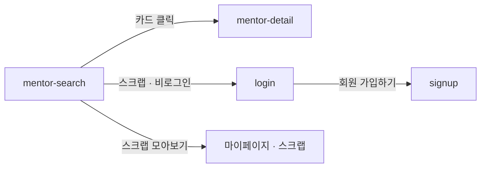

# mentor-search: 멘토 찾기

- 상태: 확정 (§1~5 UX승인 2026-09-12 → §6~11 작성 완료)
- 화면 구분: 열람
- 템플릿: 미작성 (Claude Design 에서 4상태를 만들어 취임한다)

> 출처: Figma `zFWjJinW6NAtyMMzMujNl2` / `1059:30247` 「B - 멘토찾기」의 주석 6건. 읽은 날 2026-09-12.

---

# 1부 — UX 설계 의도 (§1~5)

> **이 5절을 먼저 승인받는다.** 승인 전에 §6 이하로 내려가지 않는다.

## 1. 화면의 사명

**「내가 가려는 곳에 이미 가 있는 사람이 누구인가」에 답한다.** 조건이 있는 사람은 좁혀서 찾고, 없는 사람은 둘러보다 한 명을 고른다.

## 2. 대상 사용자와 상황

- 대상 사용자: 해외 취업·커리어를 준비하는 **멘티**. **비로그인 방문자를 포함한다** — 찾는 데 로그인을 요구하지 않는다
- 상황: **갈 나라나 직종이 정해진 뒤** 온다. 「누구에게 물을까」를 고르러 오는 화면이다. TOP·검색 엔진·헤더에서 들어온다
- 이용 패턴: 필요할 때만

**정해진 것이 없는 사람도 온다.** 그래서 조건을 안 걸어도 목록이 차 있어야 한다.

## 3. 액션 방침

- 주 액션: **멘토 1명을 골라 상세로 들어간다**
- 부 액션: 조건으로 좁히기 · 검색 · 스크랩
- **이 화면에서 하지 않는 것**:
  - **멘토링 신청을 하지 않는다.** 진입점은 `mentor-detail` 이다. 여기서 신청하면 **상대를 안 보고 돈을 쓰게 된다**
  - **정렬 UI 를 두지 않는다.** 와이어에 없고, 정렬은 조건을 걸었는지로 자동으로 갈린다(§8)
  - **멘토를 나란히 비교하지 않는다.** 축이 3개인데 비교표를 만들면 카드가 표가 되고, 사람을 고르는 화면이 스펙을 고르는 화면이 된다
  - **카드 안에 버튼을 두지 않는다.** 카드 전체가 클릭 대상이다(와이어 주석 「카드 클릭 영역: 카드 전체」)

## 4. 구성과 하이어라키

**위에서 아래로 「조건 → 결과」다.** 1열이고 우측 위젯이 없다.

| 순 | 블록 | 무엇을 하나 |
|---|---|---|
| 1 | 화면 제목과 안내문 | 이 화면이 무엇인지 1문으로 말한다 |
| 2 | **조건** — 국가 · 직종 · 키워드 ＋ 검색창 | 찾을 것이 있는 사람이 좁힌다 |
| 3 | **결과 수** — 「{N}명의 멘토」 | 좁힌 결과가 몇 명인지 즉시 답한다 |
| 4 | **걸린 조건** ＋ 「필터 초기화」 | 무엇이 걸려 있는지 보이고 풀 수 있게 한다 |
| 5 | 멘토 목록 | 이 화면의 본체 |
| 6 | 페이지 이동 | |

**`qna-feed` 와 달리 축이 한 줄뿐이다.** 저쪽은 「검색을 걸기 위한 조건」과 「나온 목록을 정렬하기 위한 축」이 두 줄로 갈리는데, 이 화면은 **정렬 UI 가 없어서** 갈릴 것이 없다.

**우측 위젯을 두지 않는다.** `qna-feed` 의 위젯은 「내가 쓴 것·스크랩한 것」을 보여주는데, 멘토 찾기에서 그에 해당하는 것은 **스크랩 하나뿐**이고 그것은 마이페이지가 갖는다. 한 덩어리를 위해 위젯 층을 세우지 않는다.

### 축은 3개다 — 국가 · 직종 · 키워드

**[용어집](../../../docs/glossary/ubiquitous-language.md) 이 정본이고 이미 정해져 있다**(2026-09-11).

| 축 | English | 근거 |
|---|---|---|
| **국가** | `Country` | 「국가와 함께 가장 큰 분류축」 |
| **직종** | `JobCategory` | 「분류축. 필터와 온보딩 설문이 쓴다」 |
| **키워드** | `Keyword` | 「테마 태그의 대분류」 |

**`지역` 을 쓰지 않는다.** 용어집이 「**필터의 축이 아니고 화면 라벨로도 쓰지 않는다**」로 닫았고 「쓰지 않는 말」 표에도 있다. 와이어의 `지역` 버튼은 누르면 팝오버 제목이 **「국가」**이므로 **내용이 이미 국가다.**

**세 번째 버튼의 라벨은 「키워드」다.** 와이어가 본 화면에서 「상세 필터」, 모달에서 「키워드」로 갈리는데 **용어집에 있는 말을 쓴다.**

**「키워드」의 목록은 아직 정해지지 않았다.** 값에 의존하는 판단을 이 문서에 쓰지 않는다.

## 5. 적용 패턴 (P-nn)

**이 화면이 2화면째다.** `qna-feed` 가 1화면째로 낸 미승격 3건이 여기서 전부 다시 나왔다. **[UX-PATTERNS.md](../../UX-PATTERNS.md) 로 승격시킨다**(헌장 원칙 7).

| 패턴 | 이 화면에서의 적용 |
|---|---|
| **`P-01`** 목록의 상태를 URL 에 담고 뒤로가기로 되돌린다 | 국가·직종·키워드·검색어·페이지 ＋ **정렬 시드**를 URL 에 담는다. 조건을 바꾸면 1페이지로 되돌린다 |
| **`P-02`** 비로그인이 로그인이 필요한 조작을 눌렀다 | **스크랩**에서 로그인으로 보낸다. 찾기·검색·상세 보기는 막지 않는다 |
| **`P-03`** 0건의 면에서 다음 행동을 낸다 | 「필터링 초기화」 ＋ **「이런 멘토는 어떠세요?」 추천 5장**을 낸다 |

**`P-01` 에 「정렬 시드」가 붙는 것이 이 화면의 사정이다.** 와이어의 주석 둘이 부딪혔다 — 「**기본은 랜덤순**」과 「정렬 상태를 URL 에 반영해 **새로고침·공유·뒤로가기에서 복원**」이다. 랜덤은 새로고침마다 순서가 바뀌고 링크를 받은 사람은 다른 화면을 본다.

**시드를 URL 에 담아 둘 다 지킨다**(2026-09-12 결정). 첫 방문에 시드를 하나 뽑아 URL 에 넣으면 노출은 공평하게 섞이고 복원은 정확해진다. 시드를 버리면 알파벳 앞 멘토가 늘 이긴다.

컴포넌트 레벨의 규칙은 [DESIGN.md](../../DESIGN.md) 를 따르고 여기에 중복해서 쓰지 않는다.

---

# 2부 — 구조 (§6~11)

## 6. 블록별 규칙 (구성 요소 포함)

**화면 위에서부터의 순서다.** 요소명은 [용어집](../../../docs/glossary/ubiquitous-language.md) English 열이다.

| 요소명(English) | 종류 | 내용 | 이 화면에서의 규칙 |
|---|---|---|---|
| `Header` | 전역 셸 | 로고 · 멘토 찾기 · Q&A 멘토링 · 멘트리 인사이트 | 이 화면 고유의 규칙 없음 |
| — | 제목과 안내문 | 「멘토 찾기」 ＋ 1문 | 안내문이 §1 의 사명을 사용자의 말로 대신 말한다 |
| `FilterSelect` ×3 | 조건 | **국가 · 직종 · 키워드** | **미구현**(`DS-27`). 누르면 **`Dialog` 가 열리고** 안은 **그룹으로 나눈** `FilterChip` 이다. 걸린 값을 트리거에 「일본 외 2」로 요약한다. 거동은 §8 |
| `SearchInput` | 검색창 | 직무 · 회사 · 키워드 · 이름 · 국가 **5종** | **미구현**(`DS-28`). 자동완성 드롭다운 ＋ 최근 검색어. 거동은 §8 |
| — | 결과 수 | 「{N}명의 멘토」 | **조건을 바꾸면 즉시 갱신한다.** 페이지 수가 아니라 전체 수다 |
| `Chip` ×N ＋ `Button` | 걸린 조건 | 걸린 값 ＋ 「필터 초기화」 | `Chip` `md` ＋ `onRemove`(`DS-20`). **「필터 초기화」는 `Button` `ghost` `sm`** — 조건을 지우는 것은 행동이다([DESIGN.md](../../DESIGN.md) §12) |
| `MentorCard` ×N | 멘토 목록 | 아래 「카드」 | 1280＋ **4열** / 767 · 390 **2열** |
| `Pagination` | 쪽 이동 | — | 와이어에 없다. 아래 「왜 페이지네이션인가」 |
| `Footer` | 전역 셸 | — | 이 화면 고유의 규칙 없음 |

### 카드 — `MentorCard` 를 그대로 쓴다

**이 화면 고유의 규칙이 없다.** 와이어의 「카드 공통」 주석 4건이 **전부 이미 부품 사양에 들어 있다.**

| 주석 | 부품의 어디에 |
|---|---|
| 카드 클릭 영역: 카드 전체 | 루트가 `<article>` 이고 스트레치 링크다(`DS-22`) |
| 긴 이름·회사·키워드는 1줄 ＋ 말줄임 | 「텍스트 오버플로: 이름·직무·회사·소개 1줄 …」 |
| 국가 태그는 모바일에선 국기만 | 「Mobile(~768) 국가 배지는 국기만」 |
| 신규 멘토 강조: 공개 후 1달 | `publishedAt` 기준 「신규 멘토」 배지 |

**값과 사양을 여기에 복제하지 않는다**(헌장 원칙 4). **`ds-export/` 를 본다.**

**「국가 `+N ⌄`」는 펼치지 않는다.** 정적 표시다. 펼침은 `DS-06` 의 잘림 판정이 붙어 있고, **이 화면이 그 판정의 확인 자리다** — 미디어 오버레이 안에서 부모 `overflow` 에 걸리는지 여기서 본다.

### 왜 페이지네이션인가

**와이어에 더보기도 페이지도 없는데 「{N}명의 멘토」 카운트가 있다.** 셋 중 하나를 골라야 한다.

| 판정 조건 | 아크션 |
|---|---|
| 목록의 상태를 URL 에 담는다(`P-01`) | **`Pagination` 을 쓴다.** 스크롤 위치는 URL 에 안 담긴다 |
| 주석이 「프로필 갔다 뒤로 왔을 때 **위치**·필터 복원」을 요구한다 | 같다. 무한스크롤은 이 복원을 못 한다 |
| `qna-feed` 가 이미 `Pagination` 이다 | **목록 화면의 쪽 이동을 통일한다** |

## 7. 상태 목록

| 상태 | 표시 내용 | 비고 |
|---|---|---|
| 정상 | 위 §6 그대로 | |
| 로딩 | **`Skeleton`**(`DS-10`) 으로 카드 자리를 채운다 | **그 페이지가 실을 수와 같게 한다.** 스피너를 쓰지 않는다 |
| 빈 상태 | **`EmptyState`**(`DS-11`) ＋ 「필터링 초기화」 ＋ **추천 5장** | `P-03`. 아래 |
| 에러 | 목록 자리에 사유와 재시도 버튼 | 아래 「에러 시의 거동」 |

**빈 상태가 이 화면의 볼거리다.** 「찾으시는 결과값의 멘토가 아직 없습니다」에서 끝내지 않고 **「이런 멘토는 어떠세요?」로 5장을 낸다.** 0건은 **조건이 좁은 것**이지 멘토가 없는 것이 아니다.

**추천 5장의 카드는 목록과 같은 `MentorCard` 다.** 와이어에는 「멘토 프로필 보기」 버튼이 붙어 있으나 **넣지 않는다** — 카드 전체가 이미 링크이고(`DS-22`), 버튼을 두면 5개의 버튼이 뜬다. 같은 판단을 `AnswerCard` 에서 이미 했다(`DS-23`).

**에러 시의 거동·대체 플로우**:

- **목록 취득이 실패했다** → 목록 자리를 에러 표시로 바꾸고 재시도 버튼을 낸다. **조건은 URL 에 남아 있으므로 같은 조건으로 다시 부른다**
- **자동완성만 실패했다** → **검색을 막지 않는다.** 드롭다운을 안 열고 입력한 말로 그대로 검색한다
- **스크랩이 실패했다** → 누르기 전 상태로 되돌리고 그 카드 옆에 실패를 알린다. 화면 전체를 다시 부르지 않는다
- **문구는 미정이다**(§11). 여기서는 **무엇을 내는가**만 정한다

## 8. 표시·활성 제어의 판정 조건과 아크션

### 정렬

| 판정 조건 | 아크션 |
|---|---|
| **조건이 하나도 안 걸렸다** | **시드 랜덤순.** 시드는 첫 방문에 뽑아 **URL 에 담는다**(`P-01`) |
| **조건이 하나라도 걸렸다** | **이름순** |
| 어느 쪽이든 | **신규 멘토를 맨앞에 세운다.** 신규 그룹 안에서 위 정렬을 적용한다 |
| 시드가 URL 에 없이 들어왔다 | **새로 뽑아 URL 에 넣고 한 번 치환한다.** 이력을 쌓지 않는다 |

**정렬 UI 를 두지 않는다.** 조건을 걸었는지로 자동으로 갈리므로 고를 것이 없다(§3).

**조건을 모달로 고른다**(2026-09-12 정정). 처음에 팝오버로 잡았으나 **국가만 19개고 직종·키워드는 더 많아** 앵커에 붙는 팝오버에 안 들어간다. 모달이 되면서 **「즉시 반영」이 「적용」으로 바뀐다** — 모달이 뒤 목록을 가린 채 매번 재조회하면 고르는 동안 무엇이 바뀌는지 안 보인다.

### 조건과 검색

| 판정 조건 | 아크션 |
|---|---|
| 축이 셋 다 걸렸다 | **국가 AND 직종 AND 키워드.** 각 축 안에서는 **다중 선택 OR** |
| **모달 안에서 칩을 골랐다** | **목록을 갱신하지 않는다.** 모달 안에만 반영한다 |
| **모달의 「N개 적용하기」를 눌렀다** | **목록을 갱신하고 모달을 닫는다** |
| **모달의 「초기화」를 눌렀다** | **그 축만 비운다.** 모달은 열린 채로 둔다 |
| 모달을 ✕ · ESC · 바깥 클릭으로 닫았다 | **고른 것을 버린다.** 열기 전 상태로 되돌린다 |
| **검색어와 조건이 함께 있다** | **조건으로 좁힌 결과 안에서 다시 검색한다**(AND 축소) |
| 검색어를 친다 | **디바운스 없이 즉시.** 최소 글자 수를 두지 않는다 |
| **조건 줄의 「필터 초기화」를 눌렀다** | **세 축을 전부 지우고 검색어는 남긴다.** 시드도 남긴다. **모달 안의 「초기화」는 그 축만**이다 |
| 조건이나 검색어가 바뀌었다 | **1페이지로 되돌린다** |
| 각 축 옆에 결과 수를 낼까 | **내지 않는다**(와이어 주석 「현재는 미표시」) |
| 걸린 조건이 하나도 없다 | **걸린 조건 줄째로 감춘다.** 빈 줄을 남기지 않는다 |

### 검색창

| 판정 조건 | 아크션 |
|---|---|
| 입력이 비어 있고 포커스가 들어왔다 | **최근 검색어를 낸다.** 로컬에 최대 **5개** 저장하고 **5개** 노출한다 |
| 입력 중이다 | **자동완성 드롭다운**을 낸다. 대상은 **직무·회사·키워드·이름·국가 5종** |
| 검색을 실행했다 | **새 창을 열지 않는다.** 아래 결과만 갱신한다 |
| 최근 검색어가 5개를 넘는다 | **오래된 것부터 버린다** |

**최근 검색어는 비로그인에도 남는다.** 로컬 저장이므로 계정과 무관하다. 그 판단의 위험은 §11.

### 스크랩

| 판정 조건 | 아크션 |
|---|---|
| **비로그인이 스크랩을 눌렀다** | **로그인으로 보낸다**(`P-02`). 「스크랩을 위해서는 로그인이 필요합니다」 ＋ 회원가입 경로를 함께 낸다 |
| 로그인 유저가 스크랩을 눌렀다 | **`Toast` 를 낸다**(`DS-09`) — 해제 문구 ＋ **실행취소**. 액션 1개이므로 체류는 짧게 |
| 찾기·검색·상세 보기를 한다 | **막지 않는다.** 비로그인의 첫 접점이다 |
| 스크랩한 멘토를 모아 본다 | **마이페이지로 보낸다.** 이 화면에 모아보기를 두지 않는다 |

### 복원

| 판정 조건 | 아크션 |
|---|---|
| **뒤로가기 · 공유 링크 · 새로고침으로 들어왔다** | 국가 · 직종 · 키워드 · 검색어 · 페이지 · **시드**를 URL 에서 복원한다. **세 경로가 같게 동작한다**(`P-01`) |
| **멘토 상세에 갔다 뒤로 왔다** | 같다. **스크롤 위치도 되돌린다** |
| 결과가 0건이다 | **`EmptyState` ＋ 추천 5장**(`P-03`). 조건 줄과 검색어는 그대로 둔다 |

## 9. 화면 전이

**전이도의 정본은 [transition-map.md](../../docs/transition-map.md) 다.** 여기에는 이 화면에서 나가는 것만 적는다.

- `mentor-search` → `mentor-detail`: 카드를 누른다. **카드 전체가 링크다.** 이 화면에서 신청까지 가지 않는다(§3)
- `mentor-search` → `login`: 비로그인이 스크랩을 누른다. **모달에서 회원가입으로도 갈 수 있다**
- `mentor-search` → 마이페이지: 스크랩 모아보기. **진입점의 자리는 이 화면이 아니다**(§11)
- **조건을 걸어도 화면을 떠나지 않는다.** 같은 화면의 결과가 갱신된다

## 10. 의존 API

| API (용도) | 계약 |
|---|---|
| 멘토 목록 취득(조건 · 검색어 · 정렬 시드 · 페이지) | **계약 미정의** |
| 검색 자동완성(직무 · 회사 · 키워드 · 이름 · 국가) | **계약 미정의** |
| 조건 축의 선택지 취득(국가 · 직종 · 키워드) | **계약 미정의.** 목록은 서버가 갖는다 |
| 0건일 때의 추천 멘토 취득 | **계약 미정의.** 선정 규칙은 서버가 갖는다 |
| 스크랩 등록·해제 | **계약 미정의** |

**미정의인 채로 구현 인계하지 않는다.** 백엔드 담당과 합의한 뒤 채운다.

**최근 검색어는 API 가 아니다.** 로컬에 저장한다.

## 11. 미결 사항

| # | 무엇 | 왜 못 정하나 | 언제 걸리나 |
|---|---|---|---|
| 1 | **「키워드」의 선택지** | 테마 태그의 대분류로 상정 중이며 바뀐다. **나중에 넣기로 했다**(2026-09-12). 값에 의존하는 판단을 이 문서에 쓰지 않았다 | 목록 확정 시 |
| 2 | **추천 5장의 선정 규칙** | 와이어가 「이런 멘토는 어떠세요?」까지만 적는다. 걸었던 조건을 한 축씩 푸는지, 인기순인지 아무도 정한 적이 없다 | 백엔드 합의 |
| 3 | **에러와 빈 상태의 문구** | UX 라이팅이며 **한/일 2개국어**다. 문구를 직접 쓰지 않고 키로 짠다 | UX 라이팅 착수 |
| 4 | **「여정」이라는 축** | 필터 주석에만 있고 화면·용어집 어디에도 없다. **키워드의 옛 이름으로 보고 안 만들었다** | 와이어 갱신 시 |
| 5 | **최근 검색어를 비로그인에도 로컬에 두는 것** | 공용 PC 에서 남는다. 와이어는 「로컬에 저장」까지만 적는다 | 보안 검토 |
| 6 | **스크랩 모아보기의 진입점** | 주석이 「스크랩한 멘토 모아보기 진입점」을 요구하는데 **이 화면의 어디인지가 없다.** 헤더인지 카운트 옆인지 | `mypage-*` 착수 |
| 7 | **「신규 멘토」의 실제 밀도** | 와이어는 거의 모든 카드에 붙어 있다. **더미다.** 공개 후 1달이면 실제로는 드물다 | 데이터 투입 시 |

---

## 실행 계획

- [x] §1~5 를 쓰고 UX승인을 받는다 (2026-09-12)
- [x] `P-01`〜`P-03` 을 `UX-PATTERNS.md` 로 승격시키고 `qna-feed` §5 를 참조로 바꾼다
- [x] §6~11 을 쓴다
- [x] 부족한 요소를 `DS-update-list.md` 에 기표한다 (`DS-27` · `DS-28`)
- [ ] `template/` 4상태를 Claude Design 에서 만들어 취임한다
- [ ] 6품질축 감사와 표시 확인을 `UI-REVIEW.md` 에 남긴다

