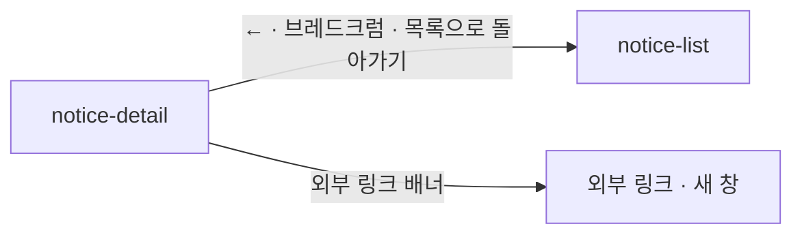

# notice-detail: 공지사항 상세

- 상태: **확정** (§1~5 UX승인 2026-09-17 — 결정 4건 · §6~11 작성 2026-09-17 · `template/` 대기)
- 화면 구분: 열람
- 템플릿: 없음. Claude Design 에서 만든다 — 프롬프트 `design/_import/prompts/notice-screens.md`
- **아티클 상세의 축약이다.** 부품이 없는 자리가 새로 생기지 않는다. 배너는 `DS-34` 의 조립을 그대로 쓴다

> 출처: Figma `zFWjJinW6NAtyMMzMujNl2` / `1059:41695` — 상세 프레임 `1059:42548` · 주석 `1059:42382` 「상세 화면 형태는 아티클 상세 축약(플로팅 · 섹션 등 기능이 없는)」. 읽은 날 2026-09-17.

---

# 1부 — UX 설계 의도 (§1~5)

## 1. 화면의 사명

**「멘트리가 알린 이 일이 무엇인가」를 끝까지 읽게 한다.** 다음 행동은 기본으로 없다. 어드민이 외부 링크가 필요하다고 판단한 공지에만 배너 하나를 붙인다.

## 2. 대상 사용자와 상황

- 대상 사용자: 멘트리를 쓰는 사람 전부. 비로그인 포함
- 상황: 공지 목록에서 한 건을 골라 들어온다. 알림이나 메일의 링크로 바로 들어오기도 한다
- 이용 패턴: 필요할 때만

**역할로도 카테고리로도 갈리지 않는다.** 한 판이다.

## 3. 액션 방침

- 주 액션: **본문을 읽는다**
- 부 액션: 목록으로 돌아간다 · (있을 때만) 외부 링크 배너

**이 화면에서 하지 않는 것** — 아티클 상세에서 뺀 것이다:

| 뺀 것 | 이유 |
|---|---|
| **좌측 고정 레일**(스크랩 · 도움돼요 · 공유) | 주석 「플로팅 없음」. 운영 알림에 반응을 남기지 않는다 |
| **우측 목차** | 공지는 짧다. H2 로 나눌 만한 길이가 아니다 |
| **카테고리 배너 · 부속 블록**(관련 아티클 · 참여 멘토 · 관련 멘토) | 주석 「섹션 없음」. **와이어의 「관련 멘토 보기」 배너는 아티클 프레임을 복사한 자리다**(2026-09-17 결정 — 두지 않는다) |
| **구독 카드** | 아티클 구독은 읽을거리의 것이다 |
| **태그** | 국가 · 키워드 축이 없다 |

## 4. 구성과 하이어라키

**「어디서 왔나 → 무엇인가 → 본문 → (외부 링크) → 돌아간다」의 1단이다.**

| 순 | 블록 | 무엇을 하나 |
|---|---|---|
| 1 | 되돌아가기 ＋ 브레드크럼 「공지사항 ＞ 상세」 | 목록으로 돌아갈 길(`DS-16`). 와이어의 「멘트리 인사이트 ＞ 상세」는 아티클의 것을 복사한 자리다 |
| 2 | **머리** — 제목 · 발행일. 가운데 정렬 | 태그 없음 |
| 3 | 대표 이미지 | 있으면. 없으면 블록이 없다 |
| 4 | 본문 | 아티클과 같은 조판. 형광 강조도 같다 |
| 5 | **외부 링크 배너** — 선택 | **어드민이 넣은 공지에만.** 문구 ＋ 버튼 → 외부 링크 새 창(2026-09-17 결정 「추가 외부 링크가 필요한 경우」) |
| 6 | **「목록으로 돌아가기」** | 인사이트 상세와 같은 자리 · 같은 모양(2026-09-17 결정 — 와이어의 「메인으로」 대신) |

**본문 폭은 아티클 상세와 같다**(720 · 가운데). 좌우 단이 없으니 3단이 아니라 1단이다.

**모바일(768 이하).** 1단 그대로. 이미지는 폭 100%. 배너는 문구 위 · 버튼 아래. 하단 버튼은 가운데.

## 5. 적용 패턴 (P-nn)

| 패턴 | 이 화면에서의 적용 |
|---|---|
| `P-01` 로그인의 벽을 액션마다 가른다 | 남기는 조작이 없다. 읽기를 막지 않는다 |
| **승격 — `P-05` 없는 글의 URL 은 404 화면으로 받는다** | `article-detail` 에서 미승격이었고 여기가 2화면째다. 존재하지 않거나 내려간 글은 「글을 찾을 수 없어요」 ＋ 목록으로 가는 버튼 |

컴포넌트 레벨의 규칙은 [DESIGN.md](../../DESIGN.md) 를 따르고 여기에 중복해서 쓰지 않는다.

---

# 2부 — 구조 (§6~11)

## 6. 블록별 규칙 (구성 요소 포함)

| 요소명(English) | 종류 | 내용 | 이 화면에서의 규칙 |
|---|---|---|---|
| `Header` · `Footer` · `BottomTabBar` | 부품 | 공통 내비 | 활성 메뉴 없음 |
| `IconButton` ← ＋ `Breadcrumb` | 부품 | 「공지사항 ＞ 상세」 | 둘 다 `notice-list` 로. 깊이 2단(`DS-16`) |
| 머리 | 조립 | 제목(display) · 발행일(caption) | **가운데 정렬.** 태그 없음 |
| 대표 이미지 | 조립 | 폭 720 · 16:9 · `--radius-md` | **없으면 블록이 없다.** 캡션은 두지 않는다 |
| 본문 | 조립 | 리치 텍스트 | `article-detail` §6 의 「본문 조판」과 같다 — 폭 720 · H2 · 형광 강조 · 이미지 · 링크 |
| **외부 링크 배너**(선택) | 조립 | 문구 ＋ `Button primary` ＋ `arrow-up-right-01` | `DS-34` 의 배너와 같은 조립. **어드민이 문구 · 라벨 · URL 을 넣은 공지에만 뜬다.** 새 창 |
| 「목록으로 돌아가기」 | 부품 | `Button outline md` ＋ `arrow-left-01` | 가운데. 목록에서 왔으면 `history.back` · 아니면 `notice-list` — `article-detail` 과 같은 규칙 |

**아티클 상세와 같은 자리의 것은 같은 값을 쓴다.** 머리 · 본문 · 배너 · 하단 버튼의 치수와 간격을 따로 정하지 않는다. 두 화면이 한 부품(`ArticleDetailScreen`)의 판이면 가장 좋다 — Claude Design 프롬프트에 그렇게 적었다.

## 7. 상태 목록

| 상태 | 표시 내용 | 비고 |
|---|---|---|
| 정상 | §6 그대로 | 외부 링크 배너가 있는 판과 없는 판 |
| 로딩 | 머리 · 본문 6줄을 `Skeleton` 으로 | 하단 버튼은 세우지 않는다 |
| 빈 상태 | **없음** | 상세에 0건이 없다 |
| 에러 | **둘로 가른다** — 아래 | **아래 「에러 시의 거동」 필수 기재** |

**에러 시의 거동·대체 플로우**:

- **없는 글이거나 내려갔다(404)** → 화면 전체를 「글을 찾을 수 없어요」로 바꾸고 **「공지사항으로」** 버튼을 낸다(`P-05`)
- **본문을 못 불러왔다** → 화면 전체를 에러로 바꾸고 재시도를 낸다
- **문구는 미정이다**(§11)

## 8. 표시·활성 제어의 판정 조건과 아크션

| 판정 조건 | 아크션 |
|---|---|
| **비로그인이다** | 아무것도 막지 않는다 |
| 대표 이미지가 **없다** | 이미지 블록을 세우지 않는다. 머리 아래 바로 본문 |
| 외부 링크 배너가 **있다** | 본문 아래에 세운다. 버튼은 **새 창** |
| 외부 링크 배너가 **없다** | 본문 아래 바로 「목록으로 돌아가기」 |
| 「목록으로 돌아가기」를 눌렀다 | 목록에서 들어왔으면 `history.back()` — 펼친 상태로. 메일 · 알림으로 바로 들어왔으면 `notice-list` 첫 화면 |
| **768 이하다** | 1단 그대로. 배너는 세로 쌓임 |

## 9. 화면 전이

- `notice-detail` → `notice-list`: ← · 브레드크럼 · 하단 버튼
- `notice-detail` → 외부: 배너의 버튼. 새 창
- **들어오는 길**: `notice-list` 의 카드 · 메일 · 알림 링크

## 10. 의존 API

| API (용도) | 계약 |
|---|---|
| 공지 1건(제목 · 발행일 · 대표 이미지 · 본문 · 외부 링크 배너의 문구 · 라벨 · URL) | **계약 미정의.** 404 를 가려 준다 |

**미정의인 채로 구현 인계하지 않는다.**

## 11. 미결 사항

| # | 무엇 | 왜 못 정하나 | 언제 걸리나 |
|---|---|---|---|
| 1 | **공지 본문의 에디터** | 아티클과 같다고 본다. 어드민의 사양이다 | 어드민 합의 |
| 2 | **메일 · 알림에서 들어오는 링크의 형태** | `notification` 화면이 미착수다 | `notification` 착수 |
| 3 | **404 · 에러의 문구** | UX 라이팅 | UX 라이팅 착수 |

**2026-09-17 에 답을 받아 적었다** — 배너는 기본 없음, 외부 링크가 필요한 공지에만 · 하단 버튼은 「목록으로 돌아가기」.

## 실행 계획

- [x] 와이어를 읽는다 (2026-09-17)
- [x] §1~5 를 쓰고 UX승인을 받는다 (2026-09-17 · 결정 4건)
- [x] §6~11 을 쓴다 (2026-09-17)
- [x] `P-05` 를 `UX-PATTERNS.md` 에 올린다 (2026-09-17)
- [ ] `template/` 을 Claude Design 에서 만들어 취임한다 — 프롬프트 `design/_import/prompts/notice-screens.md`
- [ ] 6품질축 감사와 표시 확인을 `UI-REVIEW.md` 에 남긴다
