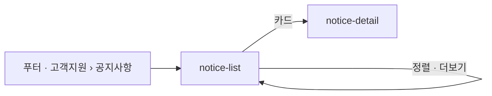

# notice-list: 공지사항 목록

- 상태: **확정** (§1~5 UX승인 2026-09-17 — 결정 4건 · §6~11 작성 2026-09-17 · `template/` 대기)
- 화면 구분: 열람
- 템플릿: 없음. Claude Design 에서 만든다 — 프롬프트 `design/_import/prompts/notice-screens.md`
- **부품이 없는 자리는 인사이트와 같다** — 가로형 아티클 카드(`DS-33`). 임시 조립을 그대로 쓴다

> 출처: Figma `zFWjJinW6NAtyMMzMujNl2` / `1059:41695` 「아티클/공지사항/뉴스」 — 목록 프레임 `1059:42312` · 주석 `1059:42382` · 현 블로그 카드 참고 `1059:42474`. 읽은 날 2026-09-17.

---

# 1부 — UX 설계 의도 (§1~5)

## 1. 화면의 사명

**「멘트리가 운영에 관해 알린 것이 무엇인가」를 최신순으로 낸다.** 읽을거리가 아니라 운영 알림이다. 고르는 축이 없다.

## 2. 대상 사용자와 상황

- 대상 사용자: 멘트리를 쓰는 사람 전부. **비로그인 방문자를 포함한다**
- 상황: **푸터의 「고객지원 › 공지사항」**에서 들어온다. 헤더에는 없다(주석 `1059:42382` 「독립 페이지 · 진입 경로 푸터」). 제휴 · 약관 개정 · 점검처럼 알려야 하는 일이 있을 때 온다
- 이용 패턴: 필요할 때만

**역할로 화면이 갈리지 않는다.** 로그인이 가르는 것도 없다 — 스크랩 · 도움돼요를 두지 않는다.

## 3. 액션 방침

- 주 액션: **공지 1건을 골라 상세로 들어간다**
- 부 액션: 더보기로 다음 묶음을 불러온다 · 정렬

**이 화면에서 하지 않는 것**:

| 하지 않는 것 | 이유 |
|---|---|
| **조건 · 검색 · 카테고리를 두지 않는다** | 와이어에 없다. 공지는 양이 적고 최신순 하나면 찾힌다 |
| **페이지 이동을 두지 않는다** — 더보기다 | 주석이 「더보기 버튼(무한스크롤)」로 정했다. 조건이 없어 URL 에 담을 상태도 없다(2026-09-17 결정) |
| **스크랩 · 도움돼요 · 공유를 두지 않는다** | 운영 알림에 반응을 남기는 자리가 아니다. 와이어에도 없다 |
| **읽기에 로그인을 요구하지 않는다** | `P-01` |

## 4. 구성과 하이어라키

**위에서 아래로 「고정된 알림 → 알림 → 더 오래된 알림」이다.** 1단이다. 좌측 분류도 우측 위젯도 없다.

| 순 | 블록 | 무엇을 하나 |
|---|---|---|
| 1 | 화면 제목 「공지사항」 | |
| 2 | 정렬 「최신순」 | 오른쪽 끝. 값은 최신순 · 오래된순 |
| 3 | **고정 공지** — 최대 3건 | 중요 공지를 맨 위에 붙인다. **제목 앞 「중요」 배지**(2026-09-17 결정). 정렬과 무관하다 |
| 4 | 공지 목록 — 가로형 카드 | 인사이트 목록과 같은 카드에서 **태그를 뺀 것.** 제목 · 발췌 · 발행일 · 썸네일 |
| 5 | 「더보기」 | 가운데 primary 버튼. 다음 묶음을 아래에 붙인다. 더 없으면 사라진다 |

**인사이트 목록과 같은 카드를 쓴다.** 왼쪽 글 · 오른쪽 썸네일 16:9. 다른 것은 태그가 없다는 것 하나다. 고정 공지는 그 태그 자리에 「중요」 배지가 선다. 썸네일이 없으면 부품의 placeholder — 기본 OGP 는 어드민이 채운다.

**모바일(768 이하).** 카드는 인사이트와 같이 `ArticlePreview` 세로형이다. 정렬은 제목 아래 오른쪽. 더보기는 폭 100%.

## 5. 적용 패턴 (P-nn)

| 패턴 | 이 화면에서의 적용 |
|---|---|
| `P-01` 로그인의 벽을 액션마다 가른다 | 남기는 조작이 없어 로그인이 필요한 자리가 없다. 읽기는 막지 않는다 |
| `P-02` 0건의 면에서 다음 행동을 낸다 | 공지가 0건이면 「아직 공지가 없어요」만. **행동을 요구하지 않는다** — 이 사람이 할 수 있는 것이 없다(`qna-detail` 의 답변 0건과 같은 판단) |
| `P-04` 목록의 상태를 URL 에 담는다 | **적용하지 않는다.** 조건 · 페이지가 없다. 더보기로 펼친 횟수는 URL 에 담지 않는다(§11) |

컴포넌트 레벨의 규칙은 [DESIGN.md](../../DESIGN.md) 를 따르고 여기에 중복해서 쓰지 않는다.

---

# 2부 — 구조 (§6~11)

## 6. 블록별 규칙 (구성 요소 포함)

| 요소명(English) | 종류 | 내용 | 이 화면에서의 규칙 |
|---|---|---|---|
| `Header` · `Footer` · `BottomTabBar` | 부품 | 공통 내비 | 활성 메뉴가 **없다.** 공지는 헤더 메뉴가 아니다. 푸터의 「공지사항」이 진입이다 |
| 화면 제목 | 조립 | 「공지사항」 | h0. 안내문 없음 |
| `Select` — 정렬 | 부품 | 최신순 · 오래된순 | 오른쪽 끝. 폭 160 |
| **고정 공지** ×0~3 | **임시 조립**(`DS-33`) | 가로형 카드 ＋ 뉴트럴 `Badge sm` 「중요」 | 태그 자리에 배지 하나. 맨 위. 정렬을 바꿔도 자리가 같다. 아래 목록과는 1px 선 ＋ 여백 8 로 가른다 |
| **공지 카드** ×N | **임시 조립**(`DS-33`) | 왼쪽 글 · 오른쪽 썸네일 | 아래 「카드의 구성」 |
| `Button primary md` 「더보기」 | 부품 | 가운데 | 한 번에 **10건**을 아래에 붙인다. 더 없으면 버튼을 세우지 않는다 |

### 카드의 구성 — 인사이트 목록의 카드에서 태그를 뺀 것

| 자리 | 무엇 | 규칙 |
|---|---|---|
| 배지 | 뉴트럴 `Badge sm` 「중요」 | **고정 공지에만.** 그 밖에는 이 줄이 없다 |
| 제목 | h3 | **2줄 고정 ＋ 말줄임** |
| 발췌 | body muted | **2줄 고정 ＋ 말줄임**(와이어 `1059:42312` 는 2줄이다. 인사이트는 3줄) |
| 발행일 | caption muted | `2026.07.04` |
| 썸네일 | 16:9 · 폭 296 | 없거나 실패하면 부품의 placeholder |
| 클릭 | 카드 전체 | **같은 탭**으로 `notice-detail` |

**조회수 · 도움돼요 · 스크랩은 없다.**

### 임시 조립을 표시한다

인사이트와 같다 — 카드에 `data-temp="DS-33"`. 부품이 오면 그 자리만 바꾼다.

## 7. 상태 목록

| 상태 | 표시 내용 | 비고 |
|---|---|---|
| 정상 | §6 그대로 | 고정 공지가 있는 판과 없는 판 |
| 로딩 | 카드 자리를 `Skeleton` 5장으로 | 제목 · 정렬은 그대로 |
| 빈 상태 | `EmptyState` 「아직 공지가 없어요」 | **버튼 없음**(`P-02` 의 예외 — 할 수 있는 것이 없다) |
| 에러 | 목록 자리에 사유 ＋ 「다시 시도」 | **아래 「에러 시의 거동」 필수 기재** |
| **더보기 끝** | 「더보기」가 없다 | 마지막 묶음까지 불렀다 |

**에러 시의 거동·대체 플로우**:

- **첫 묶음을 못 불러왔다** → 목록 자리에만 에러와 재시도. 제목 · 정렬은 살려 둔다
- **더보기가 실패했다** → 이미 있는 카드는 그대로. 「더보기」 버튼을 되살리고 `Toast` 로 알린다
- **고정 공지만 실패했다** → 고정 블록을 세우지 않고 목록은 낸다
- **문구는 미정이다**(§11)

## 8. 표시·활성 제어의 판정 조건과 아크션

| 판정 조건 | 아크션 |
|---|---|
| **비로그인이다** | 아무것도 막지 않는다 |
| 고정 공지가 **1~3건** 있다 | 맨 위에 「중요」 배지로 세운다. 정렬과 무관 |
| 고정 공지가 **없다** | 고정 블록을 세우지 않는다. 목록이 바로 시작한다 |
| **정렬을 바꿨다** | 목록을 첫 묶음부터 다시 부른다. 고정 공지는 그대로 |
| 「더보기」를 눌렀다 | 다음 10건을 아래에 붙인다. 부르는 동안 버튼을 비활성으로 두고 아래에 `Skeleton` 3장 |
| 마지막 묶음까지 불렀다 | 「더보기」를 세우지 않는다 |
| 썸네일이 없거나 실패했다 | 부품의 placeholder |
| **768 이하다** | 카드는 `ArticlePreview` 세로형(태그 없음). 정렬은 제목 아래 오른쪽. 더보기 폭 100% |
| 카드를 눌렀다 | **같은 탭**으로 `notice-detail` |

## 9. 화면 전이

**전이도의 정본은 [transition-map.md](../../docs/transition-map.md) 다.**

- `notice-list` → `notice-detail`: 카드를 누른다. 같은 탭
- `notice-list` → 자기 자신: 정렬 · 더보기. URL 은 바뀌지 않는다
- **들어오는 길**: 푸터의 「공지사항」. 헤더에는 없다

## 10. 의존 API

| API (용도) | 계약 |
|---|---|
| 공지 목록(정렬 · 다음 묶음) | **계약 미정의.** 10건 단위 |
| 고정 공지 목록(최대 3) | **계약 미정의** |
| 기본 OGP 이미지 | **어드민이 채운다** |

**미정의인 채로 구현 인계하지 않는다.**

## 11. 미결 사항

| # | 무엇 | 왜 못 정하나 | 언제 걸리나 |
|---|---|---|---|
| 1 | **한 번에 부르는 건수** | 와이어는 5장을 그렸을 뿐이다. **10건으로 둔다** | 구현 인계 전 |
| 2 | **더보기로 펼친 뒤 상세에 갔다 돌아오면 어디까지 펼쳐져 있나** | 구현이 정한다. URL 에 담지 않기로 했다 | 구현 인계 전 |
| 3 | **현 블로그(노션)의 공지를 옮겨 오는가** | 기획 문서의 미결(`1059:42473` 메모) | 어드민 합의 |
| 4 | **빈 상태 · 에러의 문구** | UX 라이팅 | UX 라이팅 착수 |

**2026-09-17 에 답을 받아 적었다** — 고정 공지는 「중요」 배지 ＋ 맨 위 · 더보기(페이지 이동 아님).

## 실행 계획

- [x] 와이어를 읽는다 (2026-09-17)
- [x] §1~5 를 쓰고 UX승인을 받는다 (2026-09-17 · 결정 4건)
- [x] §6~11 을 쓴다 (2026-09-17)
- [ ] `template/` 을 Claude Design 에서 만들어 취임한다 — 프롬프트 `design/_import/prompts/notice-screens.md`
- [ ] 6품질축 감사와 표시 확인을 `UI-REVIEW.md` 에 남긴다
