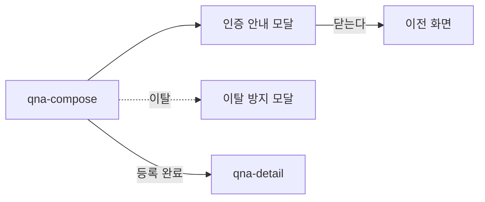

# qna-compose: Q&A 질문 작성

- 상태: 확정 (§1~11 ＋ `template/` 취임 2026-09-14 · **2026-09-15 개정** — 임시 저장 제거 · 이탈 모달 문구)
- 화면 구분: 작업
- 템플릿: [`template/`](template/) — 출처는 [`template/SOURCE.md`](template/SOURCE.md)

> 출처: Figma `zFWjJinW6NAtyMMzMujNl2` / `1059:35247` 「D-Q&A 페이지」의 주석. 읽은 날 2026-09-11.

---

# 1부 — UX 설계 의도 (§1~5)

## 1. 화면의 사명

**답을 받을 수 있는 질문을 쓰게 한다.**

질문을 올리는 것이 목적이 아니다. **멘토가 답할 수 있을 만큼 구체적인 질문**이 나와야 한다. 와이어가 작성 가이드를 플레이스홀더로 깔고 「구체적 작성」을 요구하는 이유다.

## 2. 대상 사용자와 상황

- 대상 사용자: **멘티 한 종류다.** 이 화면에 멘토·비로그인이 들어올 자리가 없다
- 상황: 피드나 상세에서 「찾는 답이 없다」고 판단한 직후에 온다
- 이용 패턴: 필요할 때만. **대부분 생애 몇 번이다**

**문턱이 둘이다.** 로그인이 필요하고, 그 위에 **전화번호 인증**이 또 필요하다. 어뷰징을 막기 위한 것이고 와이어가 **「작성 페이지 이동과 동시에 모달」** 로 타이밍까지 정했다.

| 판정 조건 | 아크션 |
|---|---|
| 인증을 나중에 묻는다 | **하지 않는다.** 다 쓰고 나서 막으면 쓴 것이 날아간다 |
| 들어오자마자 묻는다 | **이것이다.** 못 넘으면 아무것도 안 쓴 상태로 돌아간다 |

## 3. 액션 방침

- 주 액션: **질문을 등록한다**
- 부 액션: **없다.** 임시 저장은 두지 않는다(2026-09-15 협의 — 상혁·지수)

**이 화면에서 하지 않는 것**:

| 하지 않는 것 | 이유 |
|---|---|
| **사진을 넣지 않는다** | 와이어가 「사진·링크 불가, 텍스트만」으로 정했다. **모순이 있다**(§11) |
| **미리보기를 두지 않는다** | 텍스트만 받으므로 입력 화면이 곧 결과다 |
| **스텝으로 나누지 않는다** | 항목이 5개다. 나누면 이탈 지점만 는다 |
| **임시 저장을 두지 않는다** | 2026-09-15 협의. 쓰다 만 것은 이탈 모달이 지킨다 — 「작성중인 질문이 있습니다. 정말 이동하시겠습니까?」 |

## 4. 구성과 하이어라키

**위에서 아래로 「어디 이야기인가 → 무엇을 묻나 → 어떻게 찾게 할까」다.**

| 순 | 블록 | 필수 |
|---|---|---|
| 1 | 화면 제목과 작성 안내 | — |
| 2 | **국가** — `Select` ＋ 「모든 국가에 해당함」 | **필수** |
| 3 | **키워드** — `Select` | **필수** |
| 4 | **제목** — `Input`, 0/50자 | **필수** |
| 5 | **본문** — 에디터, 0/1000자 | **필수** |
| 6 | 태그 — `TagInput`, 최대 10개 | 선택 |
| 7 | **질문 등록하기** | — |

**필수가 위에 모여 있고 선택이 아래다.** 태그는 나중에 찾게 하기 위한 것이지 질문의 내용이 아니다.

**국가가 첫 칸인 이유**: 이 제품의 질문은 **어느 나라 이야기인가**로 먼저 갈린다. 같은 「비자」도 나라마다 답이 다르다.

## 5. 적용 패턴 (P-nn)

| 패턴 | 이 화면에서의 적용 |
|---|---|
| **`P-01`** — 로그인의 벽을 액션마다 가른다 | **이 화면은 통째로 벽 안쪽이다.** 읽을 것이 없으므로 진입에서 막는다. 3화면째의 실증이다 |
| **미승격** — 쓰다 만 것을 잃지 않게 한다 | 이탈 시 이동 확인. 임시 저장은 두지 않는다(2026-09-15). **답변 작성에도 같은 이탈 확인이 있다**(와이어 `1059:35523`) — 2화면째를 기다린다 |

**`P-02`·`P-03` 은 이 화면에 해당하지 않는다.** 0건의 면도 공유도 없다.

컴포넌트 레벨의 규칙은 [DESIGN.md](../../DESIGN.md) 를 따르고 여기에 중복해서 쓰지 않는다.

---

# 2부 — 구조 (§6~11)

## 6. 블록별 규칙 (구성 요소 포함)

| 요소명(English) | 종류 | 내용 | 이 화면에서의 규칙 |
|---|---|---|---|
| `Header` | 전역 셸 | — | 이 화면 고유의 규칙 없음 |
| `Field` ＋ `Select` ＋ `RadioGroup` | 국가 | 드롭다운 ＋ 「모든 국가에 해당함」 | **라디오를 켜면 드롭다운을 비활성으로 바꾼다**(§8). **라디오는 `Field` 밖에 둔다** — 안에 넣으면 부품이 설명문을 라디오 아래에 그려 라디오의 설명처럼 읽힌다(`DS-32`) |
| `Field` ＋ `Select` | 키워드 | 대분류 1개 | **목록은 미확정이다**([용어집](../../../docs/glossary/ubiquitous-language.md)). 값에 의존하는 판단을 쓰지 않는다 |
| `Field` ＋ `Input` | 제목 | **0/50자** | 아래 「글자 수 표시」 |
| `Field` ＋ **에디터 자리** | 본문 | **0/1000자** | 아래 「본문 에디터」 |
| `Field` ＋ `TagInput` | 태그 | **최대 10개** | 아래 「태그 입력」 |
| `Button` | 질문 등록하기 | — | primary. **조건을 못 채우면 비활성**(§8). 임시 저장 버튼은 두지 않는다(2026-09-15) |
| `Dialog` ×3 | 인증 안내 ／ 등록 확인 ／ 이탈 방지 | — | 아래 「모달 3종」 |
| `Footer` | 전역 셸 | — | |

### 글자 수 표시 — 세 칸이 같은 자리다

**상자 밖 오른쪽 아래에 둔다.** 제목 · 본문 · 태그가 같은 자리다. 상자 안에 넣지 않는다.

| 칸 | 표시 | 누가 그리나 |
|---|---|---|
| 제목 | `0/50자` | 화면 |
| 본문 | `0/1000자` | 화면 |
| 태그 | `0/10` | `TagInput` 부품. 개수라 단위를 안 붙인다 |

**글자 수에는 「자」를 붙인다**(와이어 `1059:38511`). 태그는 글자가 아니라 개수라 안 붙인다.

### 본문 에디터 — 부품을 만들지 않는다

**`RichTextEditor` 는 각하됐다**(`DS-15`). blocknote 를 **FE 가 직접 붙인다.** 이 문서가 정하는 것은 **무엇을 켜는가**다.

| 판정 조건 | 아크션 |
|---|---|
| 텍스트 서식(굵게·목록 등) | **켠다.** 긴 질문이 읽히려면 필요하다 |
| 사진 · 파일 | **끈다.** 와이어가 텍스트만으로 정했다 |
| 링크 | **끈다.** 단, 와이어에 모순이 있다(§11) |
| 글자 수 | **0/1000자를 에디터 밖 오른쪽 아래에 둔다.** 라이브러리가 아니라 화면이 센다 |
| 작성 가이드 | **플레이스홀더로 깐다.** 개인정보 금지 · 구체적 작성. **입력이 시작되면 사라진다** |

**`template/` 에서는 에디터 본체를 그리지 않는다.** 자리·툴바의 유무·글자 수 카운터만 보이면 된다. **카운터는 에디터 상자 밖이다**(위 「글자 수 표시」).

### 태그 입력

| 판정 조건 | 아크션 |
|---|---|
| 태그를 입력한다 | **자유입력이다.** 칩으로 쌓인다 |
| 추천 태그 | **항상 노출한다.** 5건. 기준은 사용 횟수 → 최근 클릭률 → 최근 답변순 |
| 2글자를 쳤다 | **자동완성 3건**을 낸다. 기준은 추천과 같다 |
| 10개를 채웠다 | 더 받지 않는다 |

**추천을 항상 띄우는 이유**: 자유입력만 두면 같은 뜻의 태그가 계속 늘어난다. **기존 태그를 재사용하게 만드는 것이 목적이다.**

### 모달 3종

**와이어를 화면으로 대조했다**(`1059:35577`, 2026-09-14 · 라이브 2026-09-15). **전부 「묻고 답하는」 형태다.** 와이어의 임시 저장 확인은 임시 저장을 없애면서 같이 뺐다(2026-09-15).

| 언제 | 무엇 | 닫으면 |
|---|---|---|
| **화면에 들어온 직후** | **「전화번호 인증이 필요합니다. 지금 인증을 진행할까요?」** | **이전 화면으로 돌아간다.** 빈 폼을 보여주지 않는다 |
| 등록을 눌렀다 | 「질문을 등록하시겠습니까?」 · 취소하기 ／ 등록하기 | 머무른다 |
| 쓰던 중 이탈 | **「작성중인 질문이 있습니다. 정말 이동하시겠습니까?」** · 이동하기(outline) ／ 취소하기(primary). 프레임 문구다(2026-09-15 결정 — 주석의 「입력 내용 파기하시겠습니까?」를 버린다) | 머무른다 |

**인증 모달은 입력 폼이 아니다.** 와이어는 **「진행할까요?」를 묻는 안내**다. 번호를 받는 것은 그 다음이며 **이 화면의 범위 밖**이다.

| 판정 조건 | 아크션 |
|---|---|
| 인증 모달에서 「예」를 눌렀다 | **인증 절차로 보낸다.** 이 화면이 번호를 받지 않는다 |
| 등록에 확인을 붙이는 이유 | **되돌릴 수 없다.** 등록은 공개된다 |
| 이탈 확인을 아무 때나 띄운다 | **띄우지 않는다.** 쓴 것이 없으면 지킬 것도 없다(§8) |

## 7. 상태 목록

| 상태 | 표시 내용 | 비고 |
|---|---|---|
| 정상 | 빈 폼. 필수 3칸이 비어 있고 등록이 비활성이다 | |
| 로딩 | **등록 중.** 버튼을 비활성으로 바꾸고 진행을 보여준다 | |
| **빈 상태** | **없다** | **근거**: 작성 폼에는 「0건」이라는 개념이 없다. 빈 폼이 정상 상태다 |
| 에러 | **유효성 에러** ＋ 등록 실패 | 아래 |

**에러 시의 거동·대체 플로우**:

- **필수를 안 채우고 등록을 눌렀다** → 등록이 **애초에 비활성**이라 눌리지 않는다. 어느 칸이 남았는지 `Field` 의 에러로 보여준다
- **글자 수를 넘겼다** → 카운터를 에러 색으로 바꾸고 등록을 비활성으로 둔다. **입력을 잘라내지 않는다**
- **등록이 실패했다** → **쓴 것을 지우지 않는다.** `Toast` 로 알리고 폼을 그대로 둔다. 다시 누르면 된다
- **전화번호 인증에 실패했다** → 모달 안에서 처리한다. 화면을 넘기지 않는다
- **문구는 미정이다**(§11)

## 8. 표시·활성 제어의 판정 조건과 아크션

| 판정 조건 | 아크션 |
|---|---|
| **화면에 들어왔다** | **인증 안내 모달을 즉시 띄운다.** 「지금 인증을 진행할까요?」를 묻는다. 폼을 먼저 보여주지 않는다 |
| 등록을 눌렀다 | **확인 모달을 먼저 띄운다.** 바로 등록하지 않는다 |
| 인증 모달을 닫았다 | **이전 화면으로 돌려보낸다** |
| **「모든 국가에 해당함」을 켰다** | **국가 드롭다운을 비활성으로 바꾼다.** 고른 값이 있으면 지운다 |
| 라디오를 껐다 | 드롭다운을 다시 활성으로 되돌린다 |
| **국가·키워드·제목·본문이 다 찼다** | 「질문 등록하기」를 **활성**으로 바꾼다 |
| 하나라도 비었다 | **비활성으로 둔다.** 감추지 않는다 |
| 제목이 50자를 넘겼다 | 카운터를 에러 색으로. 등록을 비활성으로 |
| 본문이 1000자를 넘겼다 | 같다 |
| 본문에 아무것도 안 썼다 | 작성 가이드가 플레이스홀더로 깔려 있다 |
| **입력이 시작됐다** | **작성 가이드를 지운다** |
| 태그가 10개다 | 더 받지 않는다 |
| **쓰던 중 화면을 떠나려 한다** | 「작성중인 질문이 있습니다. 정말 이동하시겠습니까?」를 묻는다(2026-09-15) |
| **아무것도 안 쓰고 떠난다** | **묻지 않는다.** 지킬 것이 없다 |
| 확인 모달에서 등록을 눌렀다 | 등록 버튼을 비활성으로 바꾸고 **중복 제출을 막는다** |
| **등록이 끝났다** | 만들어진 질문의 상세로 보낸다 |

## 9. 화면 전이

**전이도의 정본은 [transition-map.md](../../docs/transition-map.md) §4 다.**

- `qna-compose` → 인증 안내: **들어오자마자.** 사람의 조작이 아니다. 「예」를 누르면 **인증 절차로 나간다** — 이 화면의 범위 밖이다
- 인증 모달 → 이전 화면: 닫으면 돌아간다
- `qna-compose` → `qna-detail`: 등록이 끝나면 **만들어진 질문**으로 간다. 피드로 보내지 않는다
- 쓰던 중 이탈 → 이탈 방지 모달

## 10. 의존 API

| API (용도) | 계약 |
|---|---|
| 전화번호 인증(발송 · 확인) | **계약 미정의.** 인증 화면 자체는 이 화면의 범위 밖이다 |
| 국가 목록 취득 | **계약 미정의** |
| 키워드 목록 취득 | **계약 미정의** |
| 추천 태그 취득 | **계약 미정의** |
| 태그 자동완성(2글자) | **계약 미정의** |
| 질문 등록 | **계약 미정의** |

**미정의인 채로 구현 인계하지 않는다.**

## 11. 미결 사항

| # | 무엇 | 왜 못 정하나 | 언제 걸리나 |
|---|---|---|---|
| 1 | **링크를 넣을 수 있나** | **와이어가 스스로 모순된다** — `1059:35514` 는 「텍스트 ＋ 링크 가능」, `1059:36109` 는 「사진·링크 불가, 텍스트만」이다. §6 은 뒤의 것을 따랐다 | 백엔드 합의 전 |
| 2 | ~~임시 저장이 몇 벌인가~~ | **풀렸다** — 임시 저장을 두지 않는다(2026-09-15 협의) | — |
| 3 | **키워드의 목록** | 상정 중이며 바뀐다 | 목록 확정 시 |
| 4 | **에디터에서 어느 서식을 켜나** | blocknote 가 다 갖고 있어 **끄는 쪽을 정해야 한다.** 지금은 사진·파일만 껐다 | 구현 인계 전 |
| 5 | **문구 전부** | UX 라이팅이며 한/일 2개국어다. 작성 가이드의 문안도 여기에 든다 | UX 라이팅 착수 |
| 6 | **「모든 국가에 해당함」의 라벨** | 와이어는 「모든 나라/`지역`에 해당함」이다. **축의 이름을 국가로 통일했으므로**(2026-09-11) 이 문서는 「모든 국가에 해당함」으로 적었다. 화면에 나갈 최종 문구는 UX 라이팅이 정한다 | UX 라이팅 착수 |

## 실행 계획

- [x] §1~5 를 쓰고 UX승인을 받는다 (2026-09-14)
- [x] §6~11 을 쓴다
- [x] `template/` 을 Claude Design 에서 만들어 취임한다 (2026-09-14)
- [x] 6품질축 감사와 표시 확인을 [`UI-REVIEW.md`](UI-REVIEW.md) 에 남겼다 (2026-09-14)
