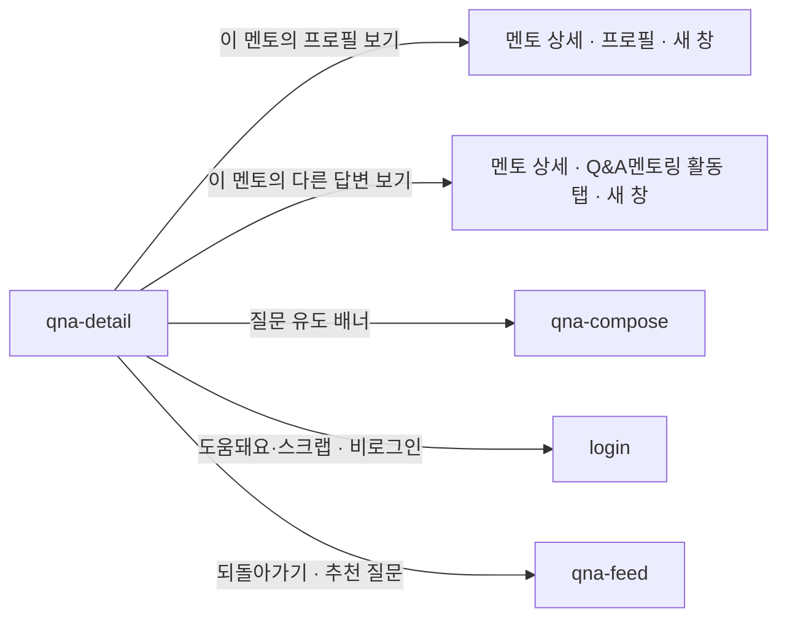

# qna-detail: Q&A 상세

- 상태: 확정 (§1~11 ＋ `template/` 취임 2026-09-14)
- 화면 구분: 열람
- 템플릿: [`template/`](template/) — 출처는 [`template/SOURCE.md`](template/SOURCE.md)

> 출처: Figma `zFWjJinW6NAtyMMzMujNl2` / `1059:35247` 「D-Q&A 페이지」의 주석. 읽은 날 2026-09-11.

---

# 1부 — UX 설계 의도 (§1~5)

> **이 5절을 먼저 승인받는다.** 승인 전에 §6 이하로 내려가지 않는다.

## 1. 화면의 사명

**「이 질문에 멘토가 뭐라고 답했나」에 답하고, 답한 멘토에게 보낸다.**

와이어가 답변 카드를 **「전환이 일어나는 핵심 루트」** 라고 쓴다. 읽고 끝나는 화면이 아니다. **좋은 답을 읽은 사람이 그 멘토의 프로필로 가는 것이 이 화면의 성과다.**

## 2. 대상 사용자와 상황

- 대상 사용자: **네 종류가 한 화면을 본다** — 아래 표
- 상황: 피드나 검색에서 질문 하나를 골라 들어온다. 공유 링크로 바로 들어오기도 한다
- 이용 패턴: 필요할 때만

| 누가 | 무엇을 하러 오나 | 이 사람에게만 뜨는 것 |
|---|---|---|
| **비로그인** | 읽으러 온다. 검색 유입의 착지점이다 | 없다. 읽기를 막지 않는다 |
| **멘티(그 외)** | 같은 고민의 답을 찾으러 온다 | 도움돼요 · 스크랩 |
| **멘티(질문자 본인)** | 답이 달렸는지 보러 온다 | **채택(도움돼요) · 감사인사 · 질문 수정·삭제** |
| **멘토** | **답할 질문을 찾아 들어온다** | 답변하기 CTA. **이미 답했으면 비활성** |

**역할로 갈리는 것이 많은 화면이다.** 본문은 같고 액션만 갈린다.

## 3. 액션 방침

- 주 액션: **답변을 읽고 그 멘토의 프로필로 간다**
- 부 액션: 도움돼요 · 스크랩 · 공유 ／ 멘토는 답변하기 ／ 질문자는 채택과 감사인사

**이 화면에서 하지 않는 것**:

| 하지 않는 것 | 이유 |
|---|---|
| **답변마다 스크랩을 두지 않는다** | **와이어에는 있으나 디자이너가 와이어 오류로 판정했다**(2026-09-14). 스크랩의 목록 단위가 **질문**이라 답변에 두면 한 질문에 여러 개가 동시에 켜진다. 와이어 자신도 「답변 스크랩은 질문 스크랩과 같은 것으로 간주」라고 쓴다 |
| **답변 목록을 쪽으로 나누지 않는다** | 와이어가 「페이지네이션/더보기 여부 X, **전부 등재**」로 정했다. 답을 찾으러 온 사람에게 답을 감추지 않는다 |
| **시간을 노출하지 않는다** | 연월일까지다. 「3분 전」은 답변의 가치와 무관하고 오래된 답을 낡아 보이게 만든다 |
| **질문자가 쓴 리뷰를 화면에 표시하지 않는다** | 멘토에게 직접 간다(`ThanksNote`). 공개 리뷰(`Review`)와 다르다 |
| **답변 상세 페이지를 만들지 않는다** | 답변은 갈 곳이 없다. 카드 전체를 링크로 만들지 않는다 |

## 4. 구성과 하이어라키

**위에서 아래로 「무엇을 물었나 → 누가 뭐라 답했나 → 다음에 무엇을 볼까」다.**

| 순 | 블록 | 무엇을 하나 |
|---|---|---|
| 1 | 되돌아가기 | 「Q&A 목록 ＜ 상세」 |
| 2 | **질문 블록** | 무엇을 물었나. 작성자는 **익명 마스킹**된다 |
| 3 | 답변 수와 정렬 | 「N건의 답변」 ＋ 정렬 |
| 4 | **답변 목록** | 이 화면의 본체. **전부 등재한다** |
| 5 | 답변하기 CTA | **멘토에게만** |
| 6 | 「이런 질문도 많이 봤어요」 | 다음 질문으로 보낸다 |
| 7 | 질문 유도 배너 | 답이 없으면 직접 묻게 한다 |
| 8 | **「인기 태그」** | 태그로 다음 질문을 찾게 한다 |

**답변 카드 안에서는 멘토가 제목보다 위다.** 본문이 아니라 **누가 답했는가**를 먼저 읽힌다. §1 의 사명이 여기서 실행된다.

### 형태가 둘이다 — 간단보기와 전체보기

와이어가 **「사이드바-상세페이지 분리형」** 이라고 쓴다. 피드에서 카드를 누르면 **사이드 패널이 슬라이드**하고, 거기서 전체 페이지로 갈 수 있다.

| 판정 조건 | 아크션 |
|---|---|
| 피드에서 카드를 눌렀다 | **사이드 패널로 연다.** 목록을 떠나지 않는다 — 다음 질문을 계속 훑을 수 있다 |
| 사이드에서 「전체페이지로」를 눌렀다 | 이 화면으로 온다 |
| 공유 링크·검색으로 들어왔다 | **전체 페이지로 연다.** 사이드는 목록이 있어야 성립한다 |

**두 형태는 같은 사양을 쓴다.** 폭이 다를 뿐 담기는 것과 규칙이 같다. **사이드에서 빠지는 것은 6·7번 블록뿐이다** — 추천과 배너는 목록으로 돌아가면 되므로 좁은 패널에 넣지 않는다.

## 5. 적용 패턴 (P-nn)

**`qna-feed` 에서 미승격으로 둔 판단 2건이 여기서 2화면째가 된다.** [UX-PATTERNS.md](../../UX-PATTERNS.md) 로 승격시킨다(헌장 원칙 7).

| 패턴 | 이 화면에서의 적용 |
|---|---|
| **`P-01` 승격** — 로그인이 필요한 액션과 아닌 액션을 가른다 | 도움돼요·스크랩은 로그인으로 보낸다. **공유는 막지 않는다.** 읽기도 막지 않는다 |
| **`P-02` 승격** — 0건의 면에서 다음 행동을 낸다 | 답변이 0건이면 「아직 답변이 등록되지 않았습니다」 ＋ **멘토에게만** 답변 유도 |
| **`P-03` 신설** — 공유는 단말에 따라 수단이 갈린다 | PC 는 클립보드 복사, 모바일은 OS 공유, 둘 다 안 되면 클립보드 복사 ＋ 토스트 |

**`P-03` 은 1화면째지만 올린다.** 근거가 **외부 참조원**(Web Share API)이고, 헌장 원칙 7 이 그 경우를 예외로 정한다.

**`qna-feed` 의 세 번째 미승격(목록 상태를 URL 에 담는다)은 아직 올리지 않는다.** 이 화면에는 목록 필터가 없다. `mentor-search` 나 `insight-list` 가 2화면째가 된다.

컴포넌트 레벨의 규칙은 [DESIGN.md](../../DESIGN.md) 를 따르고 여기에 중복해서 쓰지 않는다.

---

# 2부 — 구조 (§6~11)

## 6. 블록별 규칙 (구성 요소 포함)

**화면 위에서부터의 순서다.** 요소명은 [용어집](../../../docs/glossary/ubiquitous-language.md) English 열이다.

| 요소명(English) | 종류 | 내용 | 이 화면에서의 규칙 |
|---|---|---|---|
| `Header` | 전역 셸 | — | 이 화면 고유의 규칙 없음 |
| `Breadcrumb` | 되돌아가기 | 「Q&A 멘토링 ＜ 상세」 | 2단 고정. **우측에 「전체보기 ↗」를 나란히 둔다** — 간단보기에서 온 경우의 출구다 |
| — | **질문 블록** | 아래 「질문 블록의 구성」 | 카드 셸에 담는다. 답변과 시각으로 갈린다 |
| — | 답변 수와 정렬 | 「N건의 답변」 ＋ `Select` | **N 은 실제 수다.** 정렬 기본은 최신순 |
| `AnswerCard` ×N | **답변 목록** | 부품이 구성을 갖는다 | **전부 등재한다**(§3). 쪽으로 나누지 않는다 |
| `Button` | 답변하기 CTA | 「이 질문에 답변하기」 | **멘토에게만 선다**(§8). 상단과 하단 플로팅 2곳이다 |
| `SectionHeader` ＋ `QnaCard` ×N | 「이런 질문도 많이 봤어요」 | 추천 질문 | **답변 완료된 질문 중에서** 고른다. 겹치는 태그 기준(키워드 1순위 · 국가 2순위) |
| `Banner` | 질문 유도 | — | 추천 섹션 **위**다. 와이어의 순서다 |
| `Chip` ×N | **「인기 태그」** | 태그 목록 | **화면 맨 아래.** 기준은 사용 횟수 → 최근 클릭률 → 최근 답변순 |
| `Footer` | 전역 셸 | — | |

### 질문 블록의 구성

| 단 | 무엇 | 규칙 |
|---|---|---|
| 0 | 메타 | **조회수와 작성일을 우측 상단에 둔다.** 본문 위다 |
| 1 | `Badge` ×2 | **국가**(국기 leading) ＋ **키워드**. `QnaCard` 와 순서를 맞춘다 |
| 2 | 제목 | **앞에 `Q.` 를 붙인다.** 줄임 없음 — 카드가 아니라 본문이다 |
| 3 | 작성자 | **`김＊＊` 로 마스킹한다.** 성만 남긴다 |
| 4 | 본문 | **전문.** 줄임 없음 |
| 5 | `Chip` ×N | 해시태그. **여기서는 5개로 접지 않는다** — 전부 세운다 |
| 6 | 액션 3개 | 도움돼요 · 스크랩 · 공유. **가운데 정렬한다** — 카드 하단의 좌측 정렬과 다르다 |

**마스킹하는 이유**: 신분 노출을 줄여 질문을 유도한다. **본인이 볼 때는 원래 이름이 뜬다.**

**해시태그를 여기서 접지 않는 이유**: `QnaCard` 는 격자에 깔려 높이가 고정돼야 했다. 여기는 본문이고 옆에 다른 카드가 없다.

### `AnswerCard` 에 넘기는 것

부품이 이미 구성을 갖는다([`AnswerCard.d.ts`](../../ds-export/project/components/surfaces/AnswerCard.d.ts)). 이 화면이 정하는 것은 **무엇을 넘기는가**다.

| 판정 조건 | 아크션 |
|---|---|
| 질문자가 이 답변에 도움돼요를 눌렀다 | `accepted` 를 넘긴다 → 「질문자가 도움된다고 한 답변입니다」 |
| 지금 보는 사람이 질문자다 | `isQuestionerView` 를 넘긴다 → 감사인사 버튼이 선다 |
| 지금 보는 사람이 이 답변을 쓴 멘토다 | `isMine` 을 넘긴다 → 더보기(⋯)로 수정·삭제 |
| **스크랩을 넘긴다** | **넘기지 않는다.** 부품에 없고 §3 이 금지한다 |
| 「멘토 프로필 보기」 버튼 | **`DS-23` 개정을 기다린다.** 와이어는 초록 채움 버튼이다 |
| 액션 3개의 형태 | **`DS-23` 개정을 기다린다.** 와이어는 테두리 있는 박스 버튼이다 |
| 채택된 답변의 표시 | **`DS-23` 개정을 기다린다.** 와이어는 **👍 배지**다. 카드 테두리는 채택 여부와 무관하게 전부 초록이다(2026-09-15 정정) |

## 7. 상태 목록

| 상태 | 표시 내용 | 비고 |
|---|---|---|
| 정상 | 위 §6 그대로 | |
| 로딩 | **`Skeleton`** 으로 질문 블록과 답변 자리를 채운다 | 답변 수를 모르므로 **3장으로 고정**한다 |
| 빈 상태 | **답변 0건.** 아래 | 질문 블록은 그대로 뜬다 |
| 에러 | 답변 목록 자리에 사유와 재시도 | **아래 「에러 시의 거동」 필수 기재** |

**빈 상태는 화면 전체가 아니다.** 질문은 불러왔고 답변만 0건이다. **질문 블록을 감추지 않는다.**

| 누가 보나 | 무엇을 낸다 |
|---|---|
| 멘티 · 비로그인 | 「아직 답변이 등록되지 않았습니다」만. **행동을 요구하지 않는다** — 이 사람이 할 수 있는 것이 없다 |
| **멘토** | 같은 문구 ＋ **답변 유도.** 이 사람은 지금 답할 수 있다 |

**에러 시의 거동·대체 플로우**:

- **질문을 못 불러왔다** → 화면 전체를 에러로 바꾼다. 질문이 없으면 답변도 뜻이 없다
- **질문은 왔고 답변만 실패했다** → **답변 자리에만** 에러와 재시도를 낸다. 질문은 읽게 한다
- **추천 섹션만 실패했다** → **그 섹션을 통째로 감춘다.** 없어도 화면이 성립한다. 에러를 내지 않는다
- **도움돼요·스크랩·감사인사가 실패했다** → 누르기 전으로 되돌리고 `Toast` 로 알린다
- **문구는 미정이다**(§11)

## 8. 표시·활성 제어의 판정 조건과 아크션

| 판정 조건 | 아크션 |
|---|---|
| **비로그인이다** | 읽기·공유를 막지 않는다. 도움돼요·스크랩에서 로그인으로 보낸다(`P-01`) |
| **지금 보는 사람이 질문자다** | 각 답변에 **채택(도움돼요)** 과 **감사인사**를 낸다. 질문 블록에 수정·삭제를 낸다 |
| 질문자가 답변에 도움돼요를 눌렀다 | **텍스트 배지**로 표시한다. **복수로 누를 수 있다** |
| **지금 보는 사람이 멘토이고 이 질문에 아직 안 답했다** | 상단 「이 질문에 답변하기」 ＋ **하단 플로팅**을 세운다 |
| **멘토인데 이미 답했다** | **버튼을 비활성으로 둔다.** 1인 1답이다. 감추지 않는다 — 왜 못 쓰는지 보여야 한다 |
| 답변을 수정했다 | **별도 표시를 하지 않는다.** 알림도 보내지 않는다 |
| 답변이 0건이다 | §7 의 빈 상태. **역할로 문구가 갈린다** |
| 답변 정렬을 바꿨다 | 최신순이 기본. 가중치는 **질문자 도움돼요 → 도움돼요 수 → 스크랩 수 → 오래된 → 최신** |
| **공유를 눌렀다** | PC 는 클립보드 복사, 모바일은 OS 공유. 둘 다 안 되면 클립보드 복사 ＋ `Toast`(`P-03`) |
| 답변의 「이 멘토의 프로필 보기」를 눌렀다 | **새 창**으로 멘토 상세 |
| 답변의 「이 멘토의 다른 답변 보기」를 눌렀다 | **새 창**으로 멘토 상세의 「Q&A멘토링 활동」 탭. **전용 화면을 만들지 않는다** |
| 그 멘토의 답변이 0건이다 | 그 탭이 없으므로 **이 버튼도 세우지 않는다** |
| **사이드 패널로 열렸다** | 추천 섹션과 배너를 **빼고** 나머지는 같다(§4) |

## 9. 화면 전이

**전이도의 정본은 [transition-map.md](../../docs/transition-map.md) §4 다.** 여기에는 이 화면에서 나가는 것만 적는다.

- `qna-detail` → 멘토 상세(프로필): 답변 카드의 헤더 블록을 누른다. **새 창**
- `qna-detail` → 멘토 상세(Q&A 활동 탭): 「이 멘토의 다른 답변 보기」. **새 창**
- `qna-detail` → `qna-compose`: 하단 질문 유도 배너
- `qna-detail` → `login`: 비로그인이 도움돼요·스크랩을 누른다
- `qna-detail` → `qna-feed`: 되돌아가기, 또는 추천 질문을 누른다
- **답변하기는 화면을 떠나지 않는다** — 이 화면 안에서 쓴다

## 10. 의존 API

| API (용도) | 계약 |
|---|---|
| 질문 1건 취득 | **계약 미정의** |
| 답변 목록 취득(정렬) | **계약 미정의.** 정렬 가중치는 서버가 갖는다 |
| 답변 등록·수정 | **계약 미정의** |
| 도움돼요 등록·해제(질문 · 답변) | **계약 미정의.** 질문자가 누른 것이 채택을 겸한다 |
| 스크랩 등록·해제(질문) | **계약 미정의** |
| 감사인사 전송 | **계약 미정의.** 화면에 표시하지 않는다 |
| 추천 질문 취득 | **계약 미정의** |
| 조회수 집계 | **계약 미정의**(§11) |

**미정의인 채로 구현 인계하지 않는다.**

## 11. 미결 사항

| # | 무엇 | 왜 못 정하나 | 언제 걸리나 |
|---|---|---|---|
| 1 | **채택을 해제할 수 있나** | 와이어가 「복수 가능 / 해제 가능 여부」로 끝낸다. **해제 쪽이 물음표다** | 백엔드 합의 |
| 2 | **답변이 달린 뒤 질문을 수정·삭제할 수 있나** | 와이어가 「허용 여부 X」로 끝낸다. 답을 받은 뒤 질문이 바뀌면 답이 붕 뜬다 | 백엔드 합의 |
| 3 | **조회수의 집계 기준** | `qna-feed` §11 과 같은 건이다. 중복을 빼는지 안 빼는지 정한 적이 없다 | 백엔드 합의 |
| 4 | **로그인 뒤 돌아오는 자리** | [transition-map](../../docs/transition-map.md) 미결 4번과 같다 | `login` 착수 |
| 5 | **에러와 빈 상태의 문구** | UX 라이팅이며 한/일 2개국어다 | UX 라이팅 착수 |
| 6 | **해시태그의 색** | 와이어는 파란 계열인데 부품은 `--muted` 하나다. `DS-30` 이 `tone` 을 더하면 풀린다 | `DS-30` |
| 7 | **사이드 패널에 URL 이 붙나** | 붙지 않으면 공유·뒤로가기가 전체 페이지로만 간다. transition-map 미결 5번(모달의 URL)과 같은 층이다 | 구현 인계 전 |

## 실행 계획

- [x] §1~5 를 쓰고 UX승인을 받는다 (2026-09-14)
- [x] §6~11 을 쓴다
- [x] `UX-PATTERNS.md` 에 `P-01`~`P-03` 을 올린다
- [ ] **`Breadcrumb`(`DS-16`)를 기다린다** — 지수
- [x] `template/` 을 Claude Design 에서 만들어 취임한다 (2026-09-14)
- [x] 6품질축 감사와 표시 확인을 [`UI-REVIEW.md`](UI-REVIEW.md) 에 남겼다 (2026-09-14)
