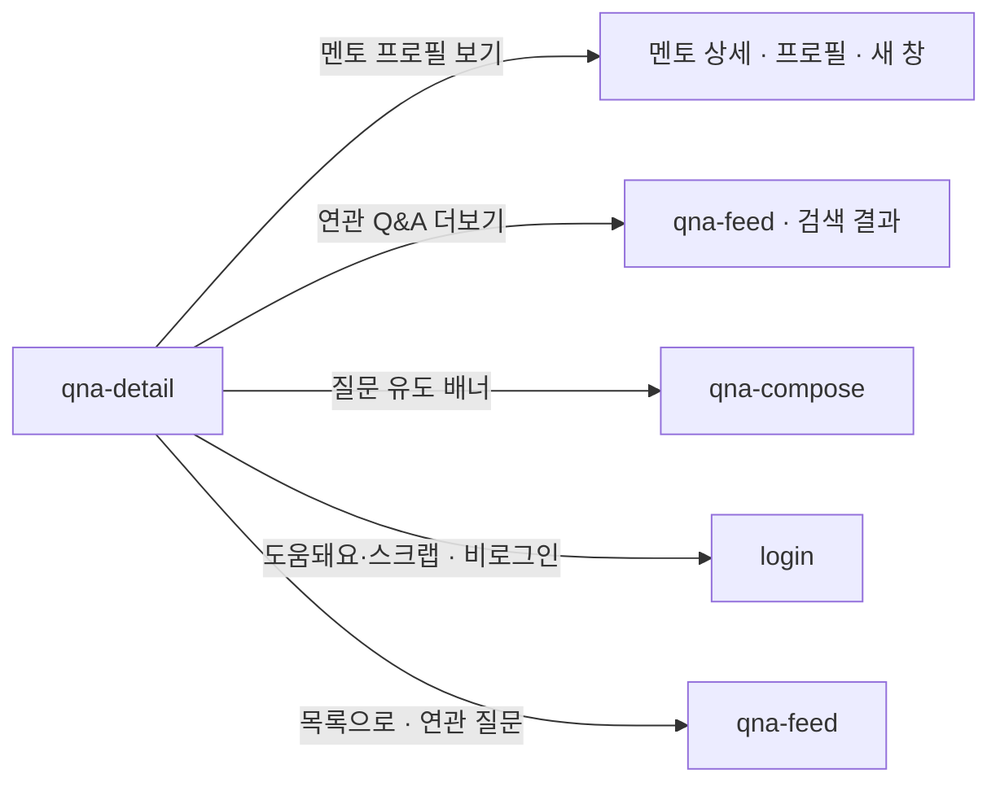

# qna-detail: Q&A 상세

- 상태: 확정 (§1~11 ＋ `template/` 취임 2026-09-14 · 2026-09-15 개정 · **2026-10-09 개정** — Figma `1697:34438` ＋ 상혁 코멘트로 §4 · §6〜§11 을 다시 썼다. 간단보기를 지웠다. `template/` 4판 9장)
- 화면 구분: 열람
- 템플릿: [`template/`](template/) — 출처는 [`template/SOURCE.md`](template/SOURCE.md)

> 출처: Figma `zFWjJinW6NAtyMMzMujNl2` / `1059:35247` 「D-Q&A 페이지」의 주석. 읽은 날 2026-09-11.

---

# 1부 — UX 설계 의도 (§1~5)

> **이 5절을 먼저 승인받는다.** 승인 전에 §6 이하로 내려가지 않는다.

## 1. 화면의 사명

**「이 질문에 멘토가 뭐라고 답했나」에 답하고, 답한 멘토에게 보낸다.**

와이어가 답변 카드를 **「전환이 일어나는 핵심 루트」** 라고 쓴다. 읽고 끝나는 화면이 아니다. **좋은 답을 읽은 사람이 그 멘토의 프로필로 가는 것이 이 화면의 성과다.**

## 2. 대상 사용자와 상황

- 대상 사용자: **네 종류가 한 화면을 본다** — 아래 표
- 상황: 피드나 검색에서 질문 하나를 골라 들어온다. 공유 링크로 바로 들어오기도 한다
- 이용 패턴: 필요할 때만

| 누가 | 무엇을 하러 오나 | 이 사람에게만 뜨는 것 |
|---|---|---|
| **비로그인** | 읽으러 온다. 검색 유입의 착지점이다 | 없다. 읽기를 막지 않는다 |
| **멘티(그 외)** | 같은 고민의 답을 찾으러 온다 | 도움돼요 · 스크랩 |
| **멘티(질문자 본인)** | 답이 달렸는지 보러 온다 | **채택(도움돼요) · 감사인사 · 질문 수정·삭제** |
| **멘토** | **답할 질문을 찾아 들어온다** | 답변하기 CTA. **이미 답했으면 비활성** |

**역할로 갈리는 것이 많은 화면이다.** 본문은 같고 액션만 갈린다.

## 3. 액션 방침

- 주 액션: **답변을 읽고 그 멘토의 프로필로 간다**
- 부 액션: 도움돼요 · 스크랩 · 공유 ／ 멘토는 답변하기 ／ 질문자는 채택과 감사인사

**이 화면에서 하지 않는 것**:

| 하지 않는 것 | 이유 |
|---|---|
| **답변마다 스크랩을 두지 않는다** | **와이어에는 있으나 디자이너가 와이어 오류로 판정했다**(2026-09-14). 스크랩의 목록 단위가 **질문**이라 답변에 두면 한 질문에 여러 개가 동시에 켜진다. 와이어 자신도 「답변 스크랩은 질문 스크랩과 같은 것으로 간주」라고 쓴다 |
| **답변 목록을 쪽으로 나누지 않는다** | 와이어가 「페이지네이션/더보기 여부 X, **전부 등재**」로 정했다. 답을 찾으러 온 사람에게 답을 감추지 않는다 |
| **시간을 노출하지 않는다** | 연월일까지다. 「3분 전」은 답변의 가치와 무관하고 오래된 답을 낡아 보이게 만든다 |
| **질문자가 쓴 리뷰를 화면에 표시하지 않는다** | 멘토에게 직접 간다(`ThanksNote`). 공개 리뷰(`Review`)와 다르다 |
| **답변 상세 페이지를 만들지 않는다** | 답변은 갈 곳이 없다. 카드 전체를 링크로 만들지 않는다 |

## 4. 구성과 하이어라키

**위에서 아래로 「무엇을 물었나 → 누가 뭐라 답했나 → 다음에 무엇을 볼까」다.** 본문은 **한 열 · 최대 768** 이다(2026-10-09 · 상혁). 데스크톱에서도 넓히지 않는다 — 읽는 글의 폭이다. 헤더 · 푸터만 전폭이다.

| 순 | 블록 | 무엇을 하나 |
|---|---|---|
| 1 | 「< 목록으로」 | 피드로 돌아간다. 브레드크럼은 없다 |
| 2 | **질문 블록** | 무엇을 물었나. 작성자는 **익명 마스킹**된다 |
| 3 | 답변 수 | 「N건의 답변」. **정렬 드롭다운은 두지 않는다**(2026-09-15 결정) |
| 4 | **답변 목록** | 이 화면의 본체. **전부 등재한다.** 카드는 3상태(§6) |
| 5 | 답변 유도 띠 ＋ **답변 작성 카드** | **멘토에게만.** 띠 ＋ 카드 ＋ 카드 안 「답변 등록하기」. 플로팅 버튼은 없다(2026-10-09) |
| 6 | 질문 유도 배너 | 답이 없으면 직접 묻게 한다 |
| 7 | 「이 질문과 연관된 Q&A 멘토링」 | 다음 질문으로 보낸다. **목록 행 3건** ＋ 「더보기 >」 |
| 8 | **「인기 태그로 찾기」** | 태그로 다음 질문을 찾게 한다. 가운데 정렬 |

**답변 카드 안에서는 멘토가 본문보다 위다.** 머리부(연초록 면)에 멘토가 서고 본문이 그 아래다. §1 의 사명이 여기서 실행된다.

**간단보기(사이드 패널)는 없다**(2026-10-09 · 상혁). 09-15 까지는 피드에서 행을 누르면 패널이 열리고 거기서 전체 페이지로 갔다. 지금은 **행을 누르면 바로 이 화면**이다 — 데스크톱도 모바일도. 패널 6장(`qna-detail-side-*`)은 template 에서 지웠다.

**768 이하**: 같은 한 열이다. 좌우 패딩만 24 → 16 으로 준다. 모바일 전용 구성은 없다.

## 5. 적용 패턴 (P-nn)

**`qna-feed` 에서 미승격으로 둔 판단 2건이 여기서 2화면째가 된다.** [UX-PATTERNS.md](../../UX-PATTERNS.md) 로 승격시킨다(헌장 원칙 7).

| 패턴 | 이 화면에서의 적용 |
|---|---|
| **`P-01` 승격** — 로그인이 필요한 액션과 아닌 액션을 가른다 | 도움돼요·스크랩은 로그인으로 보낸다. **공유는 막지 않는다.** 읽기도 막지 않는다 |
| **`P-02` 승격** — 0건의 면에서 다음 행동을 낸다 | 답변이 0건이면 「아직 답변이 등록되지 않았습니다」 ＋ **멘토에게만** 답변 유도 |
| **`P-03` 신설** — 공유는 단말에 따라 수단이 갈린다 | PC 는 클립보드 복사, 모바일은 OS 공유, 둘 다 안 되면 클립보드 복사 ＋ 토스트 |

**`P-03` 은 1화면째지만 올린다.** 근거가 **외부 참조원**(Web Share API)이고, 헌장 원칙 7 이 그 경우를 예외로 정한다.

**`qna-feed` 의 세 번째 미승격(목록 상태를 URL 에 담는다)은 아직 올리지 않는다.** 이 화면에는 목록 필터가 없다. `mentor-search` 나 `insight-list` 가 2화면째가 된다.

**디자인 시스템을 바이패스한다**(2026-10-08 결정 · `qna-feed` 와 같다). 부품에 없는 모양은 화면 CSS(`.qd-` 접두사)로 먼저 그리고 `DS-23` · `DS-86` · `DS-87` 로 돌려보낸다.

컴포넌트 레벨의 규칙은 [DESIGN.md](../../DESIGN.md) 를 따르고 여기에 중복해서 쓰지 않는다.

---

# 2부 — 구조 (§6~11)

## 6. 블록별 규칙 (구성 요소 포함)

**화면 위에서부터의 순서다.** 요소명은 [용어집](../../../docs/glossary/ubiquitous-language.md) English 열이다. **치수와 색은 Figma `1697:34438` 와 `design/ds-export/project/tokens/` 가 갖는다** — 여기에 복제하지 않는다.

| 요소명(English) | 종류 | 내용 | 이 화면에서의 규칙 | 조립 |
|---|---|---|---|---|
| `Header` | 전역 셸 | — | 이 화면 고유의 규칙 없음 | 부품 |
| `Button` ghost · primary | 되돌아가기 | ← 「목록으로」 | **이것 하나다.** `Breadcrumb` 도 「간단보기」 링크도 없다(2026-10-09). 피드로 간다 — 브라우저 기록이 있으면 뒤로가기와 같다 | 부품(`DS-81`) |
| — | **질문 블록** | 아래 「질문 블록의 구성」 | **카드 셸에 담지 않는다.** 맨바닥에 놓고 액션 줄 아래에 구분선 하나(2026-09-15 결정) | 조립 |
| — | 답변 수 | 「N건의 답변」 | **N 은 실제 수다.** 정렬 드롭다운은 두지 않는다. 순서는 서버 가중치(§8) | 조립 |
| — | **답변 목록** | 아래 「답변 카드 — 3상태」 | **전부 등재한다**(§3). 쪽으로 나누지 않는다 | **화면 CSS**(`.qd-answer` · `DS-23`) — `AnswerCard` 를 안 쓴다. Figma 와 너무 달라 덮는 것보다 그리는 쪽이 짧았다 |
| `CalloutBar` ＋ 답변 작성 카드 ＋ `Button` | 답변 유도 | 띠 「이 질문에 대해 멘토님의 지혜를 나눠주세요」 ＋ 에디터 카드 ＋ 카드 안 「답변 등록하기」 | **멘토에게만**(§8). **버튼은 비활성으로 시작해 글자가 들어오면 primary**(2026-10-09). 플로팅 버튼은 없다. 임시 저장은 두지 않는다 | 부품 |
| `ActionBanner` | 질문 유도 | 연초록 면 · 글 2줄 ＋ 버튼 가운데 | 연관 Q&A **위**다. **테두리 없음 · 반경 22**(Figma — 피드의 배너와 다르다). 멘토에게는 「멘토님, 다른 멘토에게 질문할 궁금증이 생기셨나요? 부담없이 질문 남겨보세요.」 | 부품 ＋ `.qd-banner`(`DS-34` 덧붙임) |
| — ＋ 목록 행 ×3 ＋ 「더보기 >」 | 「이 질문과 연관된 Q&A 멘토링」 | 피드 우측 추천과 같은 항목 — 국기 ＋ 「국가 / 키워드」 · 제목 2줄 · 「답변 N」 ＋ 조회 · 도움돼요 · 스크랩 | **답변 완료된 질문 중에서** 고른다. 겹치는 태그 기준(키워드 1순위 · 국가 2순위). **「더보기 >」 는 이 질문의 키워드로 검색한 피드**(`qna-feed` search)로 간다 — 전용 화면을 만들지 않는다. **멘토에게는 「아직 답변이 등록되지 않은 질문들이에요」 — 답변 0건 질문** 3건 | `.qd-reco`(`DS-84`) |
| `Chip` ×N | **「인기 태그로 찾기」** | 태그 목록 | **화면 맨 아래. 제목과 칩을 가운데 정렬한다.** 기준은 사용 횟수 → 최근 클릭률 → 최근 답변순 | 부품 |
| `Footer` | 전역 셸 | — | | 부품 |

**본문 글자는 15px · `--sage-700` 이다**(2026-10-09 · 상혁 「본문 글씨색도 너무 진함, 약간 흐릿하게」). 질문 본문과 답변 본문 둘 다. 타입 스케일에 15 가 없어 화면 CSS(`.qd-body`)로 두고 `DS-87` 로 기표했다.

### 질문 블록의 구성

| 단 | 무엇 | 규칙 |
|---|---|---|
| 0 | 메타 | **조회수와 작성일을 우측 상단에 둔다.** 본문 위다 |
| 1 | `Badge` ×2 | **국가**(국기 leading) ＋ **키워드**. `QnaCard` 와 순서를 맞춘다 |
| 2 | 제목 | **앞에 `Q.` 를 붙인다.** 줄임 없음 — 카드가 아니라 본문이다 |
| 3 | 작성자 | `Avatar`(이니셜) ＋ 이름. **`김＊＊` 로 마스킹한다.** 성만 남긴다 |
| 4 | 본문 | **전문.** 줄임 없음 |
| 5 | `Chip` ×N | 해시태그. **여기서는 5개로 접지 않는다** — 전부 세운다 |
| 6 | 액션 3개 | 도움돼요 · 스크랩 · 공유. **가운데 정렬한다** — 카드 하단의 좌측 정렬과 다르다. **숫자는 버튼에 붙인다**(`CountToggle`). 메타 줄에는 조회수·작성일만(2026-09-15 결정). 공유는 `Popover` 「링크 복사」 |

**마스킹하는 이유**: 신분 노출을 줄여 질문을 유도한다. **본인이 볼 때는 원래 이름이 뜬다.**

**해시태그를 여기서 접지 않는 이유**: `QnaCard` 는 격자에 깔려 높이가 고정돼야 했다. 여기는 본문이고 옆에 다른 카드가 없다.

### 답변 카드 — 3상태

**`AnswerCard` 를 쓰지 않고 화면에서 그린다**(`.qd-answer` · 2026-10-09). 부품이 Figma `1695:90003〜90005` 와 너무 달라 덮는 것보다 그리는 쪽이 짧았다. 부품 개정은 `DS-23` 이 받는다.

| 단 | 무엇 | 규칙 |
|---|---|---|
| 1 | **머리부**(연초록 면) | `Avatar` 60 ＋ 이름 ＋ `Flag` · 둘째 줄 「일본 · 채용 담당 @IT 기업 (11년차)」 · 오른쪽 끝 **「멘토 프로필 보기 >」**(새 창). 「이 멘토의 다른 답변 보기」 는 **없다**(Figma 에 없다 · 2026-10-09) |
| 2 | 채택 라벨 | ✓ 「질문자가 도움된다고 한 답변입니다」. **채택된 카드에만.** 아래 「채택」 |
| 3 | 본문 | 15px · `--sage-700`. 전문 |
| 4 | 날짜 | 14 · muted |
| 5 | 액션 행 | **[♥ N]** · (질문자 · 채택 전) **[감사인사 작성]** · **[공유]** — 셋 다 흰 면 · 테두리 · 반경 12 의 박스 버튼 |
| 6 | 감사인사 블록 | **글을 썼을 때만.** 왼쪽 테두리 3px primary · `Avatar` 24 ＋ 이름 ＋ 날짜 · 본문 |

**세 상태다.** 표본 페이지(`qna-detail-questioner`)는 이 순서로 보여 준다.

| 상태 | 누가 보나 | 머리부 · 본문 · 날짜 | 라벨 | 액션 행 | 감사인사 블록 |
|---|---|---|---|---|---|
| **디폴트** | 누구나 | 같다 | 없음 | ♥ N · 공유 | 없음 |
| **채택 전** | 질문자 | 같다 | 없음 | ♥ N(윤곽) · **감사인사 작성** · 공유 | 없음 |
| **채택** | 누구나 | 같다 | **✓ 질문자가 도움된다고 한 답변입니다** | ♥ N(채움) · 공유 | **썼으면** 선다 |

**채택 ＝ 질문자의 하트다**(2026-10-09 · 상혁). 질문자가 그 답변의 하트를 누르면 라벨이 **무조건** 선다 — 누가 보든. 따로 「채택」 버튼을 두지 않는다.

**하트는 토글이 아니다**(2026-10-09 · 상혁 「취소는 없고 여러 번 누를 수 있고 그만큼 카운트가 올라감」).

| 판정 조건 | 아크션 |
|---|---|
| 하트를 눌렀다 | **수가 1 오른다.** 하트가 채워진 채로 남는다 |
| 채워진 하트를 다시 눌렀다 | **또 1 오른다.** 취소되지 않는다 |
| 질문자가 눌렀다 | 위에 더해 **채택 라벨이 선다.** 이미 섰으면 그대로 |
| 비로그인이 눌렀다 | 로그인으로 보낸다(`P-01`) |
| 상한이 있나 | **미결**(§11) |

`CountToggle` 로 만들 수 없다 — 그것은 켜고 끄는 부품이다. 화면 스크립트로 두고 `DS-86` 으로 기표했다. **질문 블록의 도움돼요 · 스크랩은 지금처럼 토글이다** — 다회 규칙은 답변의 하트에만 든다.

**감사인사는 버튼을 눌러 글을 썼을 때만 블록이 선다**(2026-10-09). 버튼 → `Dialog`(글 한 칸 ＋ 취소 · 보내기) → 보내면 `Toast` ＋ 그 카드에 블록 ＋ 버튼은 사라진다(2026-09-15 결정 그대로). 채택 라벨은 감사인사와 무관하게 하트로 선다.

**지금 보는 사람이 이 답변을 쓴 멘토**면 더보기(⋯)로 수정 · 삭제 — 09-15 와 같다.

## 7. 상태 목록

| 상태 | 표시 내용 | 비고 |
|---|---|---|
| 정상 | 위 §6 그대로 | |
| 로딩 | **`Skeleton`** 으로 질문 블록과 답변 자리를 채운다 | 답변 수를 모르므로 **2장으로 고정**한다(2026-10-09 · 768 폭) |
| 빈 상태 | **답변 0건.** 아래 | 질문 블록은 그대로 뜬다 |
| 에러 | 답변 목록 자리에 사유와 재시도 | **아래 「에러 시의 거동」 필수 기재** |

**빈 상태는 화면 전체가 아니다.** 질문은 불러왔고 답변만 0건이다. **질문 블록을 감추지 않는다.**

| 누가 보나 | 무엇을 낸다 |
|---|---|
| 멘티 · 비로그인 | 「아직 답변이 등록되지 않았습니다」만. **행동을 요구하지 않는다** — 이 사람이 할 수 있는 것이 없다 |
| **멘토** | 같은 문구 ＋ **안내 띠와 답변 작성 카드**(§8). 이 사람은 지금 답할 수 있다 |

**에러 시의 거동·대체 플로우**:

- **질문을 못 불러왔다** → 화면 전체를 에러로 바꾼다. 질문이 없으면 답변도 뜻이 없다
- **질문은 왔고 답변만 실패했다** → **답변 자리에만** 에러와 재시도를 낸다. 질문은 읽게 한다
- **추천 섹션만 실패했다** → **그 섹션을 통째로 감춘다.** 없어도 화면이 성립한다. 에러를 내지 않는다
- **도움돼요·스크랩·감사인사가 실패했다** → 누르기 전으로 되돌리고 `Toast` 로 알린다
- **문구는 미정이다**(§11)

## 8. 표시·활성 제어의 판정 조건과 아크션

| 판정 조건 | 아크션 |
|---|---|
| **비로그인이다** | 읽기·공유를 막지 않는다. 도움돼요·스크랩에서 로그인으로 보낸다(`P-01`) |
| **지금 보는 사람이 질문자다** | 채택 전 답변에 **「감사인사 작성」** 버튼을 낸다. **답변이 0건일 때만** 질문 블록에 「수정하기」「삭제하기」 텍스트 링크를 낸다(와이어 `1059:40054` ＋ 주석) |
| **질문자가 답변의 하트를 눌렀다** | **채택 라벨**이 선다 — 누가 보든. 복수의 답변을 채택할 수 있다. 해제는 없다(§11 1번 풀림) |
| 누구든 답변의 하트를 눌렀다 | **수가 1 오른다. 취소 없음 · 다회 가능**(§6 「하트는 토글이 아니다」) |
| 질문자가 「감사인사 작성」 으로 글을 보냈다 | 그 카드 아래에 **감사인사 블록**이 서고 버튼은 사라진다. 안 쓰면 라벨만 선다 |
| **지금 보는 사람이 멘토이고 이 질문에 아직 안 답했다** | **안내 띠**(`CalloutBar`) ＋ **답변 작성 카드**를 세운다. **플로팅 버튼은 없다**(2026-10-09 삭제). 상단 버튼도 없다 |
| 작성 카드의 에디터가 비어 있다 | **「답변 등록하기」 비활성.** 글자가 하나라도 들어오면 primary(2026-10-09) |
| **멘토인데 이미 답했다** | 띠·작성 카드를 **세우지 않는다.** 1인 1답이다. 내 답변 카드에 더보기(⋯) |
| 답변을 수정했다 | **별도 표시를 하지 않는다.** 알림도 보내지 않는다 |
| 답변이 0건이다 | §7 의 빈 상태. **역할로 문구가 갈린다** |
| 답변의 순서 | **화면에서 바꾸지 않는다**(정렬 드롭다운 없음 · 2026-09-15). 서버 가중치는 **질문자 도움돼요 → 도움돼요 수 → 스크랩 수 → 오래된 → 최신** |
| **공유를 눌렀다** | PC 는 클립보드 복사, 모바일은 OS 공유. 둘 다 안 되면 클립보드 복사 ＋ `Toast`(`P-03`) |
| 답변의 「멘토 프로필 보기 >」를 눌렀다 | **새 창**으로 멘토 상세 |
| 연관 Q&A 의 「더보기 >」 를 눌렀다 | **이 질문의 키워드로 검색한 피드**(`qna-feed` search)로 간다 |
| 「< 목록으로」 를 눌렀다 | 피드로 간다. 브라우저 기록이 있으면 뒤로가기와 같다 |

## 9. 화면 전이

**전이도의 정본은 [transition-map.md](../../docs/transition-map.md) §4 다.** 여기에는 이 화면에서 나가는 것만 적는다.

```mermaid
flowchart LR
  qad["qna-detail"]
  mdetP["멘토 상세 · 프로필 · 새 창"]
  search["qna-feed · 검색 결과"]
  comp["qna-compose"]
  login["login"]
  qa["qna-feed"]

  qad -->|"멘토 프로필 보기"| mdetP
  qad -->|"연관 Q&A 더보기"| search
  qad -->|"질문 유도 배너"| comp
  qad -->|"도움돼요·스크랩 · 비로그인"| login
  qad -->|"목록으로 · 연관 질문"| qa
```

- `qna-detail` → 멘토 상세(프로필): 답변 카드의 「멘토 프로필 보기 >」. **새 창**
- `qna-detail` → `qna-feed` 검색 결과: 연관 Q&A 의 「더보기 >」. 이 질문의 키워드로 검색한 결과다
- `qna-detail` → `qna-compose`: 하단 질문 유도 배너
- `qna-detail` → `login`: 비로그인이 도움돼요·스크랩을 누른다
- `qna-detail` → `qna-feed`: 「< 목록으로」. 연관 질문을 누르면 그 질문의 이 화면이다
- **답변하기는 화면을 떠나지 않는다** — 이 화면 안에서 쓴다

## 10. 의존 API

| API (용도) | 계약 |
|---|---|
| 질문 1건 취득 | **계약 미정의** |
| 답변 목록 취득(정렬) | **계약 미정의.** 정렬 가중치는 서버가 갖는다 |
| 답변 등록·수정 | **계약 미정의** |
| 도움돼요 등록·해제(질문) | **계약 미정의** |
| **답변 하트 ＋1**(해제 없음 · 다회) | **계약 미정의.** 질문자가 누른 것이 채택을 겸한다. 상한은 §11 |
| 스크랩 등록·해제(질문) | **계약 미정의** |
| 감사인사 전송 | **계약 미정의.** 화면에 표시하지 않는다 |
| 추천 질문 취득 | **계약 미정의** |
| 조회수 집계 | **계약 미정의**(§11) |

**미정의인 채로 구현 인계하지 않는다.**

## 11. 미결 사항

| # | 무엇 | 왜 못 정하나 | 언제 걸리나 |
|---|---|---|---|
| 1 | ~~채택을 해제할 수 있나~~ | **풀렸다** — 해제는 없다. 하트가 채택이고 하트에 취소가 없다(2026-10-09 · 상혁) | — |
| 2 | ~~답변이 달린 뒤 질문을 수정·삭제할 수 있나~~ | **풀렸다** — 와이어 주석 「질문 등록 후 삭제: 답변 달리기 전에만 가능. 답변 달린 뒤엔 문의하기로 소화」(2026-09-15 확인) | — |
| 3 | **조회수의 집계 기준** | `qna-feed` §11 과 같은 건이다. 중복을 빼는지 안 빼는지 정한 적이 없다 | 백엔드 합의 |
| 4 | **로그인 뒤 돌아오는 자리** | [transition-map](../../docs/transition-map.md) 미결 4번과 같다 | `login` 착수 |
| 5 | **에러와 빈 상태의 문구** | UX 라이팅이며 한/일 2개국어다 | UX 라이팅 착수 |
| 6 | **해시태그의 색** | 와이어는 파란 계열인데 부품은 `--muted` 하나다. `DS-30` 이 `tone` 을 더하면 풀린다 | `DS-30` |
| 7 | ~~사이드 패널에 URL 이 붙나~~ | **풀렸다** — 패널을 지웠다(2026-10-09) | — |
| 8 | **답변 하트의 상한** | 「여러 번 누를 수 있다」만 정해졌다. 한 사람이 몇 번까지인지, 연타를 어떻게 막는지는 아무도 정한 적이 없다 | 백엔드 합의 |
| 9 | **연관 Q&A 「더보기」 의 검색어** | 「알고리즘상 태깅된 검색 결과」로 정해졌다. 키워드 하나인지 태그 묶음인지는 미정 — 지금 template 은 키워드 하나다 | 백엔드 합의 |

## 실행 계획

- [x] §1~5 를 쓰고 UX승인을 받는다 (2026-09-14)
- [x] §6~11 을 쓴다
- [x] `UX-PATTERNS.md` 에 `P-01`~`P-03` 을 올린다
- [x] ~~`Breadcrumb`(`DS-16`)를 기다린다~~ — 「< 목록으로」 하나로 바뀌어 안 쓴다 (2026-10-09)
- [x] `template/` 을 Claude Design 에서 만들어 취임한다 (2026-09-14)
- [x] 6품질축 감사와 표시 확인을 [`UI-REVIEW.md`](UI-REVIEW.md) 에 남겼다 (2026-09-14)
- [x] Figma `1697:34438` 로 §4 · §6〜§11 을 다시 쓰고 `template/` 4판(9장)을 취임했다 (2026-10-09)
- [ ] 4판의 6품질축 감사 — `DS-23` · `86` · `87` 이 들어온 뒤 화면 CSS 를 걷을 때 같이 한다
