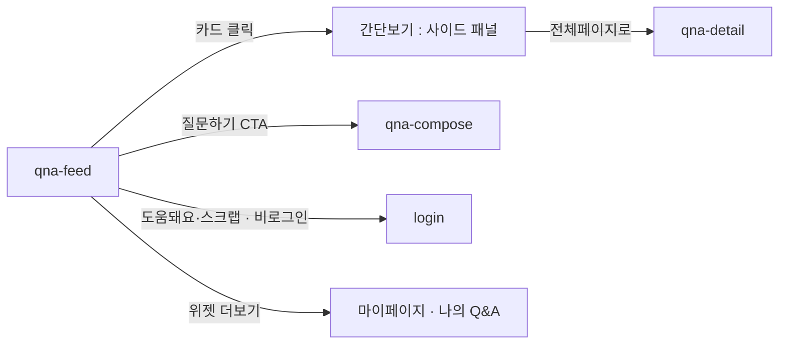

# qna-feed: Q&A 피드

- 상태: 확정 (§1~11 ＋ `template/` 취임 2026-09-14)
- 화면 구분: 열람
- 템플릿: [`template/`](template/) — 출처는 [`template/SOURCE.md`](template/SOURCE.md)
- **부품은 전부 갖춰졌다**(2026-09-14 확인). 이 화면이 기다리는 `DS-nn` 이 없다

> 출처: Figma `zFWjJinW6NAtyMMzMujNl2` / `1059:35247` 「D-Q&A 페이지」의 주석 20건. 읽은 날 2026-09-11.

---

# 1부 — UX 설계 의도 (§1~5)

> **이 5절을 먼저 승인받는다.** 승인 전에 §6 이하로 내려가지 않는다.

## 1. 화면의 사명

**「나와 같은 고민을 이미 누가 물었고, 멘토가 답했는가」에 답한다.** 답이 있으면 그 질문으로 보내고, 없으면 질문을 쓰게 한다.

## 2. 대상 사용자와 상황

- 대상 사용자: 해외 취업·커리어를 준비하는 **멘티**. **비로그인 방문자를 포함한다** — 읽는 데 로그인을 요구하지 않는다. **멘토도 온다** — 답할 질문을 찾으러 온다
- 상황: 구체적인 고민이 생겼을 때 온다. 검색 엔진이나 TOP 에서 들어온다
- 이용 패턴: 필요할 때만

**역할에 따라 화면이 갈리는 곳은 우측 위젯 하나다.** 멘티는 「내가 질문한」, 멘토는 「내가 답변한」을 본다. 본문 목록은 역할과 무관하게 같다.

## 3. 액션 방침

- 주 액션: **질문 1건을 골라 상세로 들어간다**
- 부 액션: 질문하기 · 검색과 필터로 좁히기 · 태그로 찾기 · 도움돼요 · 스크랩

**이 화면에서 하지 않는 것**:

| 하지 않는 것 | 이유 |
|---|---|
| **직무로 좁히지 않는다** | 직무 태그를 달지 않기로 정해져 있다. 전문 상담은 키워드로 묶고 1:1 로 보낸다 |
| **답변을 쓰지 않는다** | 답변은 상세에서만 쓴다. 목록에 답변 입력을 두면 질문을 다 안 읽고 답한다 |
| **정렬을 여러 개 주지 않는다** | 하단 정렬은 최신순 단일이다 |
| **읽기에 로그인을 요구하지 않는다** | 검색 유입이 첫 접점이다. 도움돼요·스크랩을 누를 때만 로그인으로 보낸다 |

## 4. 구성과 하이어라키

**위에서 아래로 「전체 → 고른 것」으로 좁아진다.** 본문과 우측 위젯의 2단이다.

| 순 | 블록 | 무엇을 하나 |
|---|---|---|
| 1 | 화면 제목과 안내문 | 이 화면이 무엇인지 1문으로 말한다 |
| 2 | **검색 조건** — 국가 · 키워드 · 검색창 | 찾을 것이 있는 사람이 검색을 건다 |
| 3 | **주목받는 Q&A** | 찾을 것이 없는 사람에게 먼저 보여준다 |
| 4 | 답변 완료 / 답변 대기 전환 | 읽으러 온 사람과 답하러 온 사람을 가른다 |
| 5 | **목록 정렬** — 국가 · 키워드 · 최신순 | 이미 나온 목록을 정렬하고 좁힌다 |
| 6 | 질문 목록 | 이 화면의 본체 |
| 7 | 페이지 이동 | |

**두 줄에 같은 축이 있지만 하는 일이 다르다.** 위는 **검색을 걸기 위한 조건**이고, 아래는 **나온 목록을 정렬하기 위한 것**이다. 층이 아니라 조작이 갈린다.

**축의 이름은 「국가」로 통일한다.** 와이어의 `지역` 은 잘못된 단어다(2026-09-11 결정). 유럽·아시아/중동·북미/오세아니아는 축이 아니라 **국가의 대분류 계층**이며, 화면 라벨로 쓰지 않는다. [용어집](../../../docs/glossary/ubiquitous-language.md) 이 정본이다.

**「키워드」의 목록은 아직 정해지지 않았다.** 테마 태그의 대분류로 상정 중이며 바뀐다. **값에 의존하는 판단을 이 문서에 쓰지 않는다.**

우측 위젯은 **질문하기 CTA → 나의 Q&A → 주목받는 태그로 찾기** 순이다. 상시 노출한다.

**2페이지부터 「주목받는 Q&A」가 사라진다.** 1페이지는 발견의 면이고 2페이지부터는 찾는 면이다. 찾고 있는 사람에게 추천을 반복하면 목록이 밀린다.

**우측 위젯은 부품이 아니라 이 화면의 조립으로 본다.** 2화면째에 같은 구조가 나오면 그때 부품으로 올린다.

## 5. 적용 패턴 (P-nn)

[UX-PATTERNS.md](../../UX-PATTERNS.md) 는 지금 비어 있다. **이 화면이 1화면째다.**

| 패턴 | 이 화면에서의 적용 |
|---|---|
| **미승격** — 목록의 상태를 URL 에 담고 뒤로가기로 되돌린다 | 국가·키워드·전환·정렬·페이지를 URL 에 담는다. 필터를 바꾸면 1페이지로 되돌린다. 페이지를 옮기면 목록 머리로 스크롤한다 |
| **미승격** — 비로그인이 로그인이 필요한 조작을 눌렀다 | 도움돼요·스크랩에서 로그인으로 보낸다. 읽기와 공유는 막지 않는다 |
| **미승격** — 0건의 면에서 다음 행동을 낸다 | 찾은 결과가 0건이면 질문 쓰기로 보낸다 |

**세 가지 모두 `mentor-search`·`insight-list` 에서 다시 나올 것이므로 2화면째에 승격시킨다.** 지금 올리면 이 화면의 사정이 전 제품의 규칙이 된다.

컴포넌트 레벨의 규칙은 [DESIGN.md](../../DESIGN.md) 를 따르고 여기에 중복해서 쓰지 않는다.

---

# 2부 — 구조 (§6~11)

## 6. 블록별 규칙 (구성 요소 포함)

**화면 위에서부터의 순서다.** 요소명은 [용어집](../../../docs/glossary/ubiquitous-language.md) English 열이다.

### 본문

| 요소명(English) | 종류 | 내용 | 이 화면에서의 규칙 |
|---|---|---|---|
| `Header` | 전역 셸 | 로고 · 멘토 찾기 · Q&A 멘토링 · 멘트리 인사이트 | 이 화면 고유의 규칙 없음 |
| — | 제목과 안내문 | 화면 이름 ＋ **2문** | **문구는 와이어(`1059:36726`)가 정본이다** — 「해외 취업과 커리어에 대한 고민을 올려주세요. / 해외 각국에서 활약하고 있는 멘트리의 멘토분들이 직접 고민에 대해 답변해드립니다.」 §1 의 사명을 여기에 옮겨 적지 않는다 |
| `Select` ×2 ＋ `Input` | 검색 조건 | 국가 · 키워드 · 검색창 | **검색을 걸기 위한 것이다.** 일치 가중치는 **제목 ＞ 키워드 ＞ 태그 ＞ 본문** |
| `SectionHeader` | 섹션 제목 | 「주목받는 Q&A멘토링」 | **1페이지에만 선다**(§8) |
| `QnaCard` ×6 | 추천 목록 | 아래 「카드의 구성」 | 선정은 **답변 많은 순 → 도움돼요 순**. 시간 가중치로 순서를 흔든다 |
| `ToggleGroup` | 2분 전환 | 답변 완료된 질문 / 답변 기다리는 질문 | **URL 에 담는다.** 두 쪽의 카드 구성은 같다 |
| `Select` ×3 | 목록 정렬 | 국가 · 키워드 · 최신순 | **나온 목록을 좁히고 정렬한다.** 즉시 적용 · AND · **각 축에서 단일 선택**. 정렬은 최신순 하나뿐이다 |
| `QnaCard` ×6 또는 ×12 | 질문 목록 | 아래 「카드의 구성」 | 개수는 페이지에 따라 갈린다(§8) |
| `Pagination` | 쪽 이동 | — | 규칙을 `insight-list` 와 통일한다. **`« »` 는 마지막 번호 뒤에 나란히 선다** |
| `Footer` | 전역 셸 | — | `notice-list` 의 진입점이다 |

### 카드의 구성 — `QnaCard`

**위에서 아래로 7단이다.**

| 단 | 무엇 | 규칙 |
|---|---|---|
| 1 | `Badge` ×2 | **국가**(국기 leading) ＋ **키워드**. 순서를 바꾸지 않는다 |
| 2 | 제목 | 2줄 고정 |
| 3 | 본문 미리보기 | **3줄 이상이면 말줄임**한다 |
| 4 | `Chip` ×N ＋ `Badge` | 해시태그. **5개까지 세우고 넘으면 `+N` 을 붙인다**(`DS-20`). **`+N` 은 눌리지 않고 펼치지도 않는다** — 아래 「해시태그를 접는 방식」 |
| 5 | `AvatarGroup` ＋ 「멘토 답변 N개」 | **사진 최대 3명**, 넘으면 `+N`. **텍스트의 N 은 실제 수를 그대로 쓴다** |
| 6 | 조회수 | 눌리지 않는다. 표시 전용 |
| 7 | `CountToggle` ×2 | 도움돼요 · 스크랩(`DS-21`). **표시이자 액션이다** |

**해시태그를 접는 방식** (2026-09-11 결정):

| 판정 조건 | 아크션 |
|---|---|
| 해시태그가 5개 이하다 | 전부 세운다 |
| 6개 이상이다 | **5개까지 세우고 `+N` 을 붙인다.** N 은 남은 수다 |
| `+N` 을 눌렀다 | **아무 일도 일어나지 않는다.** 카드 전면이 이미 상세로 가는 링크다(`DS-22`) |

**`+N` 은 `Chip` 이 아니라 `Badge` 다.** 태그가 아니라 개수이고 눌리지 않는다([DESIGN.md](../../DESIGN.md) §12). 크기는 `Chip` sm 과 맞춘다.

**펼치지 않는 이유가 둘이다.** ① 카드가 격자로 6장 깔리므로 높이가 고정돼야 한다 ② 카드 안에서 펼치면 옆 카드를 덮는다. **전부는 상세에서 본다.**

**아바타의 순서**: 질문자가 도움돼요를 누른 답변 → 도움돼요 수 → 최신.

**답변이 0건이면 5단을 「아직 작성된 답변이 없습니다」로 바꾼다.** 아바타 자리를 비우지 않는다.

### 우측 위젯

**부품이 아니라 이 화면의 조립이다**(§4). 2화면째에 같은 구조가 나오면 승격시킨다.

| 순 | 무엇 | 규칙 |
|---|---|---|
| 1 | **질문 유도 블록** — 문구 3줄 ＋ `Button` | **박스 안에 넣는다.** 버튼만 두지 않는다. 문구는 와이어(`1059:36073`)가 정본이다 — 「구체적인 고민이 있나요? / 현재 가지고 있는 고민을 / 바로 물어보세요.」 **상시 노출한다** |
| 2 | 나의 Q&A — `Tabs`(`DS-02`) ＋ 카드 미니 목록 ＋ 더보기 | 탭 구성이 **역할로 갈린다**(§8) |
| 3 | 주목받는 태그로 찾기 — `Chip` ×N | 누르면 **그 태그로 검색한 결과**가 된다. 단어 검색이 아니라 태그 검색이다 |

**미니 목록의 카드는 해시태그를 달지 않는다.** 폭이 좁아 5개가 안 들어간다.

## 7. 상태 목록

| 상태 | 표시 내용 | 비고 |
|---|---|---|
| 정상 | 위 §6 그대로 | |
| 로딩 | **`Skeleton`**(`DS-10`) 으로 카드 자리를 채운다 | 개수는 그 페이지가 실을 수와 같게 한다. 스피너를 쓰지 않는다 |
| 빈 상태 | **`EmptyState`**(`DS-11`) ＋ 질문하기 버튼 | 아래 2종으로 갈린다 |
| 에러 | 목록 자리에 사유와 재시도 버튼 | **아래 「에러 시의 거동」 필수 기재** |

**빈 상태가 2종이다.**

| 어느 경우 | 무엇을 낸다 |
|---|---|
| **검색·필터의 결과가 0건** | 「찾으시는 질문이 없습니다」 ＋ 질문 작성으로 유도 |
| **우측 위젯에 내 질문이 0건** | 유도 문구와 버튼을 **가운데 정렬**한다. 목록 자리를 빈 채로 두지 않는다 |

**에러 시의 거동·대체 플로우**:

- **목록 취득이 실패했다** → 목록 자리를 에러 표시로 바꾸고 재시도 버튼을 낸다. 검색 조건과 페이지는 URL 에 남아 있으므로 재시도는 같은 조건으로 다시 부른다
- **우측 위젯만 실패했다** → **본문을 막지 않는다.** 위젯 자리에만 에러를 내고 목록은 그대로 읽게 한다
- **도움돼요·스크랩이 실패했다** → 누르기 전 상태로 되돌리고 그 카드 옆에 실패를 알린다. 화면 전체를 다시 부르지 않는다
- **문구는 미정이다**(§11). 여기서는 **무엇을 내는가**만 정한다

## 8. 표시·활성 제어의 판정 조건과 아크션

| 판정 조건 | 아크션 |
|---|---|
| **1페이지다** | 「주목받는 Q&A멘토링」 6장을 세우고 아래 목록도 6장으로 한다 |
| **2페이지 이상이다** | **「주목받는 Q&A멘토링」 섹션째로 감춘다.** 목록을 12장으로 한다 |
| 검색 조건이나 목록 정렬을 바꿨다 | **1페이지로 되돌린다** |
| 페이지를 옮겼다 | 목록 섹션의 머리로 스크롤한다. URL 에 페이지를 남긴다 |
| **뒤로가기 · 공유 링크 · 새로고침으로 들어왔다** | 국가 · 키워드 · 전환 · 정렬 · 페이지를 **URL 에서 복원한다.** 세 경로가 같게 동작한다 |
| **비로그인이 도움돼요·스크랩을 눌렀다** | 로그인으로 보낸다. **읽기와 검색은 막지 않는다.** 돌아오는 자리는 §11 |
| 답변이 0건인 질문이다 | 카드 5단을 「아직 작성된 답변이 없습니다」로 바꾼다 |
| **답변이 0건인 질문을 스크랩했다** | 「답변이 달리면 알림을 받겠습니까」를 묻는다. **응답이 없으면 받지 않음으로 둔다** |
| 답변자가 4명 이상이다 | 사진 3장 ＋ `+N`. **텍스트의 「멘토 답변 N개」는 줄이지 않는다** |
| 본문이 3줄을 넘는다 | 말줄임한다 |
| 해시태그가 5개를 넘는다 | 5개까지 세우고 **`+N`(`Badge`)** 을 붙인다. 펼치는 조작을 달지 않는다 |
| **로그인 유저가 멘티다** | 우측 위젯 탭을 **내가 질문한 / 스크랩한**으로 한다 |
| **로그인 유저가 멘토다** | 탭을 **내가 답변한 / 스크랩한**으로 하고 **위에 답변 수·도움돼요 수를 얹는다** |
| 우측 위젯이 스크랩 탭이다 | 카드의 버튼을 **「스크랩중」 상태로 세운다.** 여기서 해제할 수 있다 |
| 우측 위젯의 더보기를 눌렀다 | 마이페이지의 해당 목록으로 보낸다. 이 화면에서 펼치지 않는다 |
| **비로그인이다** | 우측 위젯을 **감춘다.** 질문하기 CTA 는 남긴다 |

## 9. 화면 전이

**전이도의 정본은 [transition-map.md](../../docs/transition-map.md) §4 다.** 여기에는 이 화면에서 나가는 것만 적는다.

- `qna-feed` → 간단보기: 카드를 누른다. **사이드 패널에서 열린다.** 화면을 떠나지 않는다
- 간단보기 → `qna-detail`: 「전체페이지로」를 누른다
- `qna-feed` → `qna-compose`: 질문하기 CTA 를 누른다. **이동과 동시에 전화번호 인증 모달**이 뜬다
- `qna-feed` → `login`: 비로그인이 도움돼요·스크랩을 누른다
- `qna-feed` → 마이페이지: 우측 위젯의 더보기를 누른다
- **주목받는 태그를 눌러도 화면을 떠나지 않는다.** 같은 화면의 검색 결과가 된다

## 10. 의존 API

| API (용도) | 계약 |
|---|---|
| 질문 목록 취득(검색 조건 · 전환 · 정렬 · 페이지) | **계약 미정의** |
| 주목받는 질문 취득 | **계약 미정의.** 선정 규칙은 서버가 갖는다 |
| 나의 Q&A 위젯(역할별 탭) | **계약 미정의** |
| 주목받는 태그 취득 | **계약 미정의** |
| 도움돼요 등록·해제 | **계약 미정의** |
| 스크랩 등록·해제 | **계약 미정의** |

**미정의인 채로 구현 인계하지 않는다.** 백엔드 담당과 합의한 뒤 채운다.

## 11. 미결 사항

| # | 무엇 | 왜 못 정하나 | 언제 걸리나 |
|---|---|---|---|
| 1 | **조회수의 집계 기준** | 와이어가 「자주 사용하는 방식이 있다면 따르는걸로」로 끝낸다. 중복을 빼는지 안 빼는지 아무도 정한 적이 없다 | 백엔드 합의 |
| 2 | **키워드의 목록** | 테마 태그의 대분류로 상정 중이며 바뀐다. **값에 의존하는 판단을 이 문서에 쓰지 않았다** | 목록 확정 시 |
| 3 | **로그인 뒤 돌아오는 자리** | [transition-map](../../docs/transition-map.md) 미결 4번과 같다. 와이어가 물음표로 끝낸다 | `login` 착수 |
| 4 | **주목받는 Q&A 의 랜덤성** | 「시간에 대한 가중치로 랜덤성 부여」까지만 적혀 있다. 다층 조합은 P2 로 미뤄져 있다 | 백엔드 합의 |
| 5 | **에러와 빈 상태의 문구** | UX 라이팅이며 **한/일 2개국어**다. 문구를 직접 쓰지 않고 키로 짠다 | UX 라이팅 착수 |

## 실행 계획

- [x] §1~5 를 쓰고 UX승인을 받는다 (2026-09-11)
- [x] §6~11 을 쓴다
- [x] 부족한 요소를 `DS-update-list.md` 에 기표한다 (`DS-25`)
- [x] `template/` 을 Claude Design 에서 만들어 취임한다 (2026-09-14)
- [x] 6품질축 감사와 표시 확인을 [`UI-REVIEW.md`](UI-REVIEW.md) 에 남겼다 (2026-09-14)
