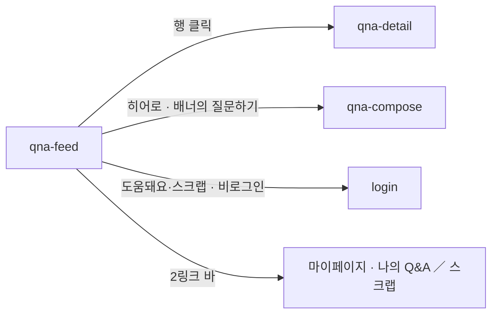

# qna-feed: Q&A 피드

- 상태: 확정 (§1~11 ＋ `template/` 취임 2026-09-14 · 2026-09-15 개정 · **2026-10-08 개정** — Figma 개정판 `1646:33282` 로 §4 · §6〜§9 를 다시 썼다. `template/` 2판 취임)
- 화면 구분: 열람
- 템플릿: [`template/`](template/) — 출처는 [`template/SOURCE.md`](template/SOURCE.md)
- **부품은 전부 갖춰졌다**(2026-09-14 확인). 이 화면이 기다리는 `DS-nn` 이 없다

> 출처: Figma `zFWjJinW6NAtyMMzMujNl2` / `1059:35247` 「D-Q&A 페이지」의 주석 20건. 읽은 날 2026-09-11.

### 2026-10-08 결정 3건 — Figma 개정판(`1646:33282`)

**결정 3건이 §4 · §6〜§9 에 들어갔다.** `template/` 은 개정판 export(2026-10-08 18:28)다. 와이어(`1059:36726`)가 정하던 것 중 Figma 개정판이 바꾼 것은 **Figma 가 이긴다.** 와이어는 모바일 · 로딩 · 0건 · 에러 · 멘토 관점처럼 Figma 가 안 그린 것에만 남는다.

| # | 결정 | 내용 | 기록 |
|---|---|---|---|
| 1 | **악센트는 주황이다** | 목록 행의 「New」 배지(24시간 안 질문)가 첫 사용처다. 토큰은 Claude Design 에서 디자이너가 정한다 | `DS-04` |
| 2 | **쪽 이동을 버리고 무한 스크롤로 간다** | 첫 10건 · 끝에 닿으면 10건씩 · 싣는 동안 스켈레톤 행 1건 · 「맨 위로」 버튼과 한 벌 · 하단 CTA 배너는 **목록 끝에 닿았을 때** 선다. 제목은 데스크톱 1줄 · 모바일 2줄, 발췌 2줄, 해시태그는 질문당 **5개**(행에는 3개 ＋ 「+N」). §8 에 들어갔다 | `DS-85` · `qna-compose` §6(10 → 5) |
| 3 | **디자인 시스템을 바이패스한다** | 부품에 없는 모양은 화면 CSS(`.qf-` 접두사)로 먼저 그리고, 뒤에 디자인 시스템을 고쳐 다시 씌운다. 덮은 것은 전부 기표했다 | `DS-82`〜`85` · `DS-28` 덧붙임 |

---

# 1부 — UX 설계 의도 (§1~5)

> **이 5절을 먼저 승인받는다.** 승인 전에 §6 이하로 내려가지 않는다.

## 1. 화면의 사명

**「나와 같은 고민을 이미 누가 물었고, 멘토가 답했는가」에 답한다.** 답이 있으면 그 질문으로 보내고, 없으면 질문을 쓰게 한다.

## 2. 대상 사용자와 상황

- 대상 사용자: 해외 취업·커리어를 준비하는 **멘티**. **비로그인 방문자를 포함한다** — 읽는 데 로그인을 요구하지 않는다. **멘토도 온다** — 답할 질문을 찾으러 온다
- 상황: 구체적인 고민이 생겼을 때 온다. 검색 엔진이나 TOP 에서 들어온다
- 이용 패턴: 필요할 때만

**역할에 따라 화면이 갈리는 곳은 네 곳이다**(2026-10-09). ① 멘토는 **「답변을 기다리는 질문」 탭이 먼저**이고 기본 선택이다 ② 멘토의 우측 맨 위에 **「Q&A멘토링 활동 요약」**(나의 답변 수 · 받은 도움돼요 수) ③ 2링크 바의 왼쪽이 멘티는 「나의 Q&A 멘토링」, 멘토는 「내가 답변한 멘토링」 ④ 목록 끝 배너의 문구. 본문 행의 구성은 역할과 무관하게 같다.

## 3. 액션 방침

- 주 액션: **질문 1건을 골라 상세로 들어간다**
- 부 액션: 질문하기 · 검색과 필터로 좁히기 · 태그로 찾기 · 도움돼요 · 스크랩

**이 화면에서 하지 않는 것**:

| 하지 않는 것 | 이유 |
|---|---|
| **직무로 좁히지 않는다** | 직무 태그를 달지 않기로 정해져 있다. 전문 상담은 키워드로 묶고 1:1 로 보낸다 |
| **답변을 쓰지 않는다** | 답변은 상세에서만 쓴다. 목록에 답변 입력을 두면 질문을 다 안 읽고 답한다 |
| **정렬을 여러 개 주지 않는다** | 하단 정렬은 최신순 단일이다 |
| **읽기에 로그인을 요구하지 않는다** | 검색 유입이 첫 접점이다. 도움돼요·스크랩을 누를 때만 로그인으로 보낸다 |

## 4. 구성과 하이어라키

**위에서 아래로 「전체 → 고른 것」으로 좁아진다.** 본문(860)과 우측(337)의 2단이다(Figma `1646:33282`).

| 순 | 블록 | 무엇을 하나 |
|---|---|---|
| 1 | **히어로** — 화면 이름 ＋ 2문 ＋ 질문하기 버튼 ＋ 일러스트 | 이 화면이 무엇인지 말하고 **질문하기를 첫 화면에 둔다** |
| 2 | **전환 탭** — 답변이 완료된 질문 ／ 답변을 기다리는 질문 | 읽으러 온 사람과 답하러 온 사람을 가른다. 본문 폭을 2등분한다 |
| 3 | **검색 줄** — 국가 · 키워드 · 검색창 | 조건을 건다. **한 줄이다** |
| 4 | **결과 줄** — 「N개의 답변」 · 걸린 조건 칩 · 최신순 | 걸린 조건을 보여 주고 풀게 한다 |
| 5 | 질문 목록 — 행 | 이 화면의 본체 |
| 6 | 목록 끝 — 스켈레톤 행 → **CTA 배너** | 더 실을 것이 있으면 싣고, 없으면 질문하기로 보낸다 |

**검색 조건과 목록 정렬이 한 줄로 합쳐졌다**(2026-10-08). 09-11 판은 「검색을 걸기 위한 조건」과 「나온 목록을 정렬하는 것」을 두 줄로 갈랐다. Figma 개정판은 조건 셋을 한 줄에 두고 정렬을 결과 줄로 내렸다 — **걸린 조건이 결과 줄에 칩으로 보이므로** 층을 가를 필요가 없어졌다.

**축의 이름은 「국가」로 통일한다.** 와이어의 `지역` 은 잘못된 단어다(2026-09-11 결정). 유럽·아시아/중동·북미/오세아니아는 축이 아니라 **국가의 대분류 계층**이며, 화면 라벨로 쓰지 않는다. [용어집](../../../docs/glossary/ubiquitous-language.md) 이 정본이다.

**「키워드」의 목록은 아직 정해지지 않았다.** 테마 태그의 대분류로 상정 중이며 바뀐다. **값에 의존하는 판단을 이 문서에 쓰지 않는다.**

**「주목받는 Q&A」 6장은 본문에서 사라졌다.** 우측 「추천 Q&A 멘토링」 3건이 그 자리다. 선정 규칙은 그대로다(§6).

우측은 **추천 Q&A 멘토링 → 주목받는 태그로 찾기 → 2링크 바(나의 Q&A 멘토링 ／ 스크랩한 멘토링)** 순이다. 상시 노출한다. **검색 결과 0건일 때만 우측을 통째로 감춘다**(2026-09-15 결정 — 와이어 `1059:37433`). 질문 유도 블록과 나의 Q&A 미니 목록은 **없어졌다** — 질문하기는 히어로와 목록 끝 배너가, 나의 Q&A 는 마이페이지가 맡는다.

**쪽 이동이 없다.** 무한 스크롤이다(2026-10-08 결정 2). 「1페이지는 발견의 면, 2페이지부터는 찾는 면」이라는 09-11 의 구분은 사라졌다 — 추천이 우측으로 가서 목록을 밀지 않는다.

**768 이하는 Figma 가 그리지 않았다.** 데스크톱 구성을 그대로 세로로 쌓는다 — 히어로(일러스트 없음) → 탭 → 검색 줄(국가 · 키워드 2등분 ＋ 검색창) → 결과 줄 → **추천 3건을 가로 스크롤로** → 목록. 2링크 바는 모바일에 없다. **주목받는 태그 박스는 목록의 10번째 행 뒤에 한 번 끼운다**(2026-10-09 · 상혁 「무한스크롤중 10건 후에 중간 삽입」) — 10건이 안 되면 목록 끝. 멘토의 활동 요약은 히어로 아래 · 탭 위에 폭 100% 다. 09-15 의 모바일 탭 3개(전체 · 내가 질문한 · 스크랩한)는 **지웠다** — 나의 Q&A 는 마이페이지가 맡는다(데스크톱과 같은 결정).

**우측 위젯은 부품이 아니라 이 화면의 조립으로 본다.** 2화면째에 같은 구조가 나오면 그때 부품으로 올린다.

## 5. 적용 패턴 (P-nn)

[UX-PATTERNS.md](../../UX-PATTERNS.md) 는 지금 비어 있다. **이 화면이 1화면째다.**

| 패턴 | 이 화면에서의 적용 |
|---|---|
| **`P-04`** 목록의 상태를 URL 에 담고 뒤로가기로 되돌린다 | 국가·키워드·검색어·전환·정렬을 URL 에 담는다. **페이지는 없다**(무한 스크롤 · 2026-10-08). 조건을 바꾸면 목록을 처음부터 다시 싣는다. 뒤로가기의 스크롤 복원은 §11 |
| **미승격** — 비로그인이 로그인이 필요한 조작을 눌렀다 | 도움돼요·스크랩에서 로그인으로 보낸다. 읽기와 공유는 막지 않는다 |
| **미승격** — 0건의 면에서 다음 행동을 낸다 | 찾은 결과가 0건이면 질문 쓰기로 보낸다 |

**세 가지 모두 `mentor-search`·`insight-list` 에서 다시 나올 것이므로 2화면째에 승격시킨다.** 지금 올리면 이 화면의 사정이 전 제품의 규칙이 된다.

컴포넌트 레벨의 규칙은 [DESIGN.md](../../DESIGN.md) 를 따르고 여기에 중복해서 쓰지 않는다.

---

# 2부 — 구조 (§6~11)

## 6. 블록별 규칙 (구성 요소 포함)

**화면 위에서부터의 순서다.** 요소명은 [용어집](../../../docs/glossary/ubiquitous-language.md) English 열이다. **치수와 색은 Figma `1646:33282` 와 `design/ds-export/project/tokens/` 가 갖는다** — 여기에 복제하지 않는다.

**디자인 시스템을 바이패스한 자리는 「조립」 열에 적는다**(2026-10-08 결정 3). 부품이 없거나 모양이 다른 곳은 화면 CSS(`.qf-` 접두사)로 그렸고, 되돌릴 길은 `DS-82`〜`85` 다.

### 본문

| 요소명(English) | 종류 | 내용 | 이 화면에서의 규칙 | 조립 |
|---|---|---|---|---|
| `Header` | 전역 셸 | 로고 · 멘토 찾기 · Q&A 멘토링 · 멘트리 인사이트 | 이 화면 고유의 규칙 없음 | 부품 |
| — | **히어로** | 화면 이름 ＋ 2문 ＋ `Button` primary ＋ 일러스트 | **문구는 Figma 가 정본이다** — 「취업 준비, 커리어, 현지 생활... / 해외 커리어에 대해서라면 무엇이든 경험 있는 멘토에게 물어보세요」. 버튼은 `qna-compose` 로. 일러스트는 `template/assets/` 의 PNG 이고 768 이하에서 뺀다 | **화면 CSS**(`.qf-hero`) · 2화면째에 나오면 부품으로 |
| `Tabs` | 2분 전환 | 답변이 완료된 질문 ／ 답변을 기다리는 질문 | **URL 에 담는다.** 본문 폭 2등분 · 선택 쪽 연초록 면 ＋ 초록 밑줄. 두 쪽의 행 구성은 같다. **멘토는 순서가 반대다** — 「답변을 기다리는 질문」이 왼쪽 · 기본(2026-10-09). URL 값은 같다 | 부품 ＋ `.qf-tabs`(`DS-28`) |
| `Select` ×2 ＋ `SearchInput` | 검색 줄 | 국가 · 키워드 · 검색창 | 즉시 적용 · AND · 각 축에서 단일 선택. 일치 가중치는 **제목 ＞ 키워드 ＞ 태그 ＞ 본문** | 부품 |
| — ＋ `FilterChip` ×N ＋ `Select` | 결과 줄 | 「N개의 답변」 · 걸린 조건 칩 · 최신순 | N 은 선택된 탭의 건수. 조건이 걸려 있을 때만 칩이 선다 — ✕ 로 그 조건만 푼다. 정렬은 최신순 하나뿐이다 | 부품 ＋ `.qf-result` |
| `QnaListItem` ×N | 질문 목록 | 아래 「행의 구성」 | 첫 10건 · 끝에서 10건씩 | 부품 ＋ `.qf-row`(`DS-84`) |
| `Skeleton` ×5 | 싣는 중의 행 | 배지 2 · 제목 · 발췌 2줄 | **목록 끝에 1행.** 로딩 화면은 5행 | 부품 |
| `ActionBanner` | 목록 끝 배너 | 「구체적인 고민이 있나요? / 현재 가지고 있는 고민을 바로 물어보세요.」 ＋ 질문하기 | **더 실을 것이 없을 때만** 선다. 멘토는 「멘토님, 다른 멘토에게 질문할 궁금증이 생겼나요?」 | 부품(`layout="stacked"`) |
| — | 맨 위로 | 원형 버튼 | 히어로를 지난 뒤에만 보인다. 768 이하에서는 떠 있는 질문하기 버튼 위에 쌓인다 | **화면 CSS**(`.qf-top` · `DS-85`) |
| `Footer` | 전역 셸 | — | `notice-list` 의 진입점이다 | 부품 |

### 행의 구성 — `QnaListItem default`

**위에서 아래로 5단이다.** 카드 셸이 없고 행 위아래가 hairline 이다.

| 단 | 무엇 | 규칙 |
|---|---|---|
| 1 | `Badge` ×2 ＋ **「New」** | **국가**(국기 leading) ＋ **키워드**(아이콘 leading · `DS-79`). 순서를 바꾸지 않는다. 오른쪽에 「New」 — **24시간 안에 올라온 질문에만.** 주황 악센트(`DS-04` · `DS-83`) |
| 2 | 제목 | **데스크톱 1줄 · 768 이하 2줄** 말줄임(2026-10-08) |
| 3 | 발췌 | **2줄** 말줄임(2026-10-08) |
| 4 | `Chip` ×3 ＋ `Badge` | 해시태그. **자기 줄이다.** 3개까지 세우고 넘으면 `+N`. 질문당 상한이 5 라 N 은 2 를 넘지 않는다. **`+N` 은 눌리지 않는다** — 행 전체가 상세로 가는 링크다(`DS-22`) |
| 5 | `AvatarGroup` ＋ 「멘토 답변 N개」 ／ 조회 · `CountToggle` ×2 | 왼쪽 **사진 최대 3명**, 넘으면 `+N`. 텍스트의 N 은 실제 수. 오른쪽 조회(표시 전용) · 도움돼요 · 스크랩(**표시이자 액션**) |

**부품이 그리는 것과 세 곳이 다르다** — 해시태그가 끝 줄 오른쪽이 아니라 자기 줄, 통계가 머리 줄이 아니라 끝 줄, 제목이 데스크톱 1줄. `.qf-row` 가 덮고, `DS-84` 가 부품으로 돌려보낼 길이다.

**아바타의 순서**: 질문자가 도움돼요를 누른 답변 → 도움돼요 수 → 최신.

**답변이 0건이면 5단 왼쪽을 「아직 작성된 답변이 없습니다」로 바꾼다.** 아바타 자리를 비우지 않는다. 부품이 한다.

### 우측 위젯

**부품이 아니라 이 화면의 조립이다**(§4). 셋 다 `Card` 로 감싼다 — 새 부품을 만들지 않는다.

| 순 | 무엇 | 규칙 | 조립 |
|---|---|---|---|
| 0 | **Q&A멘토링 활동 요약** — 제목 ＋ 「나의 답변 수」 「받은 도움돼요 수」 | **멘토에게만.** 맨 위. 수는 primary · 24. 누르는 곳 없음 — 표시다(Figma `1699:4514`). 2화면째(마이페이지)에 나오면 부품으로 | 화면 CSS(`.qf-summary`) |
| 1 | **추천 Q&A 멘토링** — 제목 ＋ 「더보기 >」 ＋ 항목 3건 | 선정은 **답변 많은 순 → 도움돼요 순**. 시간 가중치로 순서를 흔든다(§11). 항목은 `Flag` ＋ 「국가 / 키워드」 · 제목 2줄 · 「답변 N」 ＋ 조회 · 도움돼요 · 스크랩. 더보기는 목록 머리로 스크롤한다. **0건이면** `EmptyState` 「아직 추천할 질문이 없어요」 ＋ 질문하기 | `QnaListItem compact` ＋ `.qf-reco`(`DS-84`) |
| 2 | **주목받는 태그로 찾기** — 제목 ＋ `Chip` ×5 | 누르면 **그 태그로 검색한 결과**가 된다. 단어 검색이 아니라 태그 검색이다. **제목과 칩을 가운데 정렬한다.** 개수는 5개다 | 부품 |
| 3 | **2링크 바** — 나의 Q&A 멘토링 ／ 스크랩한 멘토링 | 둘 다 **마이페이지로 나간다.** 이 화면에서 펼치지 않는다. 멘토는 왼쪽이 「내가 답변한 멘토링」. **비로그인이면 세우지 않는다** | 화면 CSS |

**768 이하**: 1 만 남아 목록 위에 **가로 스크롤**(`Carousel` · 카드 폭 280)로 선다. 2 · 3 은 모바일에 없다.

**색은 페이지 루트가 덮어쓴다**(2026-10-08 결정 3). `.qf-shell` 에서 `--primary` · `--green-50` · `--green-100` 을 Figma 의 새 그린 스케일(`1647:49362`)로, 주황은 `--qf-accent` 로 둔다. 부품 파일은 손대지 않는다. 토큰이 바뀌면(`DS-82` · `DS-04`) 이 블록만 지운다.

## 7. 상태 목록

| 상태 | 표시 내용 | 비고 |
|---|---|---|
| 정상 | 위 §6 그대로. 목록 끝에 배너 | `qna-feed-normal` |
| **검색 결과** | 결과 줄에 「N개의 답변」 ＋ 걸린 조건 칩 ＋ 행. **전환 탭을 감춘다.** 우측은 그대로 | 와이어 `1059:36991`. 태그를 눌러도 이 상태다. `qna-feed-search` |
| 싣는 중 | 목록 끝에 **`Skeleton` 행 1건**. 첫 로드는 5건 | 스피너를 쓰지 않는다. `qna-feed-loading` |
| 빈 상태 | **`EmptyState`** ＋ 질문하기 버튼 ＋ 배너 | 아래 2종으로 갈린다 |
| 에러 | 목록 자리에 사유와 재시도 버튼. 히어로 · 탭 · 검색 줄 · 우측은 선다 | **아래 「에러 시의 거동」 필수 기재** |
| 멘토 관점 | 탭 순서 반대(기다리는 질문 먼저) · 우측 맨 위 활동 요약 · 2링크 바 왼쪽이 「내가 답변한 멘토링」 · 배너 문구가 멘토용 | `qna-feed-mentor` |

**빈 상태가 2종이다.**

| 어느 경우 | 무엇을 낸다 |
|---|---|
| **검색·필터의 결과가 0건** | 「찾으시는 질문이 없습니다.」 ＋ 「Q&A 멘토링 질문하기」. **우측 위젯을 통째로 감춘다**(2026-09-15 결정). 배너는 그 아래 |
| **추천 Q&A 가 0건** | 추천 박스 안에 「아직 추천할 질문이 없어요」 ＋ 「Q&A 멘토링 질문하기」. 목록은 그대로 |

**에러 시의 거동·대체 플로우**:

- **목록 취득이 실패했다** → 목록 자리를 에러 표시로 바꾸고 재시도 버튼을 낸다. 조건은 URL 에 남아 있으므로 재시도는 같은 조건으로 처음부터 다시 부른다
- **다음 10건을 싣다 실패했다** → 스켈레톤 행 자리에 「더 불러오지 못했다」 ＋ 재시도. 이미 실린 행은 그대로 둔다
- **우측 위젯만 실패했다** → **본문을 막지 않는다.** 위젯 자리에만 에러를 내고 목록은 그대로 읽게 한다
- **도움돼요·스크랩이 실패했다** → 누르기 전 상태로 되돌리고 그 행 옆에 실패를 알린다. 화면 전체를 다시 부르지 않는다
- **문구는 미정이다**(§11). 여기서는 **무엇을 내는가**만 정한다

## 8. 표시·활성 제어의 판정 조건과 아크션

| 판정 조건 | 아크션 |
|---|---|
| **처음 들어왔다** | 10건을 싣는다 |
| **목록 끝이 뷰포트 아래 400 안에 들어왔다** | 다음 10건을 싣는다. 싣는 동안 끝에 스켈레톤 행 1건 |
| **더 실을 것이 없다** | 스켈레톤을 지우고 **CTA 배너**를 세운다 |
| 검색 조건 · 전환 · 정렬을 바꿨다 | **목록을 비우고 처음부터 다시 싣는다.** URL 을 갱신한다 |
| 결과 줄의 조건 칩 ✕ 를 눌렀다 | 그 조건만 풀고 다시 싣는다 |
| **히어로가 스크롤로 사라졌다** | 「맨 위로」 를 보인다. 768 이하에서는 떠 있는 질문하기 버튼도 이때 뜬다 |
| 「맨 위로」 를 눌렀다 | 부드럽게 맨 위로. 실린 행은 지우지 않는다 |
| **뒤로가기 · 공유 링크 · 새로고침으로 들어왔다** | 국가 · 키워드 · 검색어 · 전환 · 정렬을 **URL 에서 복원**하고 처음 10건을 싣는다. 스크롤 위치는 복원하지 않는다(§11) |
| **비로그인이 도움돼요·스크랩을 눌렀다** | 로그인으로 보낸다. **읽기와 검색은 막지 않는다.** 돌아오는 자리는 §11 |
| **24시간 안에 올라온 질문이다** | 행 머리 오른쪽에 「New」. 기준 시각은 서버(§11) |
| 답변이 0건인 질문이다 | 행 5단 왼쪽을 「아직 작성된 답변이 없습니다」로 바꾼다 |
| **답변이 0건인 질문을 스크랩했다** | `Toast` 「답변이 달리면 알람을 받을까요?」 ＋ 액션 2개(와이어 `1059:35248`). **응답이 없으면 받지 않음으로 둔다** |
| 답변자가 4명 이상이다 | 사진 3장 ＋ `+N`. **텍스트의 「멘토 답변 N개」는 줄이지 않는다** |
| 제목이 길다 | 데스크톱 1줄 · 768 이하 2줄에서 말줄임한다 |
| 발췌가 2줄을 넘는다 | 말줄임한다 |
| 해시태그가 3개를 넘는다 | 3개까지 세우고 **`+N`(`Badge`)** 을 붙인다. 펼치는 조작을 달지 않는다 |
| **로그인 유저가 멘티다** | 2링크 바 왼쪽이 「나의 Q&A 멘토링」. 배너는 멘티 문구 |
| **로그인 유저가 멘토다** | 「답변을 기다리는 질문」 탭이 왼쪽 · 기본. 우측 맨 위에 활동 요약. 2링크 바 왼쪽이 「내가 답변한 멘토링」. 배너는 「멘토님, 다른 멘토에게 질문할 궁금증이 생겼나요?」 |
| **768 이하에서 10번째 행을 실었다** | 그 뒤에 「주목받는 태그로 찾기」 박스를 **한 번** 끼운다. 20번째 뒤에는 넣지 않는다. 10건 미만이면 목록 끝 |
| 2링크 바를 눌렀다 | 마이페이지의 해당 목록으로 보낸다. 이 화면에서 펼치지 않는다 |
| 추천의 「더보기 >」 를 눌렀다 | 목록 머리로 스크롤한다 |
| **비로그인이다** | 2링크 바를 세우지 않는다. 추천 · 태그 · 배너는 그대로 |
| **검색 결과가 0건이다** | 우측을 통째로 감춘다. 배너는 남긴다 |

## 9. 화면 전이

**전이도의 정본은 [transition-map.md](../../docs/transition-map.md) §4 다.** 여기에는 이 화면에서 나가는 것만 적는다.

```mermaid
flowchart LR
  qa["qna-feed"]
  qad["qna-detail"]
  comp["qna-compose"]
  login["login"]
  mpe["마이페이지 · 나의 Q&A ／ 스크랩"]

  qa -->|"행 클릭"| qad
  qa -->|"히어로 · 배너의 질문하기"| comp
  qa -->|"도움돼요·스크랩 · 비로그인"| login
  qa -->|"2링크 바"| mpe
```

- `qna-feed` → `qna-detail`: 행을 누른다. **전체 페이지로 간다** — 데스크톱도 모바일도. 간단보기 패널은 없다(2026-10-09)
- `qna-feed` → `qna-compose`: 히어로 · 목록 끝 배너 · 모바일의 떠 있는 버튼 중 하나를 누른다. **이동과 동시에 전화번호 인증 모달**이 뜬다
- `qna-feed` → `login`: 비로그인이 도움돼요·스크랩을 누른다
- `qna-feed` → 마이페이지: 우측 2링크 바를 누른다
- **주목받는 태그를 눌러도 화면을 떠나지 않는다.** 같은 화면의 검색 결과가 된다

## 10. 의존 API

| API (용도) | 계약 |
|---|---|
| 질문 목록 취득(검색 조건 · 전환 · 정렬 · **커서 또는 offset**) | **계약 미정의.** 무한 스크롤이라 10건씩 이어 받는다 |
| 추천 질문 취득(3건) | **계약 미정의.** 선정 규칙은 서버가 갖는다 |
| 주목받는 태그 취득 | **계약 미정의** |
| 도움돼요 등록·해제 | **계약 미정의** |
| 스크랩 등록·해제 | **계약 미정의** |

**미정의인 채로 구현 인계하지 않는다.** 백엔드 담당과 합의한 뒤 채운다.

## 11. 미결 사항

| # | 무엇 | 왜 못 정하나 | 언제 걸리나 |
|---|---|---|---|
| 1 | **조회수의 집계 기준** | 와이어가 「자주 사용하는 방식이 있다면 따르는걸로」로 끝낸다. 중복을 빼는지 안 빼는지 아무도 정한 적이 없다 | 백엔드 합의 |
| 2 | **키워드의 목록** | 테마 태그의 대분류로 상정 중이며 바뀐다. **값에 의존하는 판단을 이 문서에 쓰지 않았다** | 목록 확정 시 |
| 3 | **로그인 뒤 돌아오는 자리** | [transition-map](../../docs/transition-map.md) 미결 4번과 같다. 와이어가 물음표로 끝낸다 | `login` 착수 |
| 4 | **주목받는 Q&A 의 랜덤성** | 「시간에 대한 가중치로 랜덤성 부여」까지만 적혀 있다. 다층 조합은 P2 로 미뤄져 있다 | 백엔드 합의 |
| 5 | **에러와 빈 상태의 문구** | UX 라이팅이며 **한/일 2개국어**다. 문구를 직접 쓰지 않고 키로 짠다 | UX 라이팅 착수 |
| 6 | **뒤로가기의 스크롤 복원** | 무한 스크롤에서 상세로 갔다 돌아오면 어디까지 실어 둘지 아무도 정한 적이 없다. 데스크톱은 패널이라 안 걸리고 **모바일만** 걸린다 | FE 착수 |
| 7 | **「New」 의 기준** | 「24시간 안」의 기준 시각(작성 · 공개)과 시간대를 정한 적이 없다 | 백엔드 합의 |

## 실행 계획

- [x] §1~5 를 쓰고 UX승인을 받는다 (2026-09-11)
- [x] §6~11 을 쓴다
- [x] 부족한 요소를 `DS-update-list.md` 에 기표한다 (`DS-25`)
- [x] `template/` 을 Claude Design 에서 만들어 취임한다 (2026-09-14)
- [x] 6품질축 감사와 표시 확인을 [`UI-REVIEW.md`](UI-REVIEW.md) 에 남겼다 (2026-09-14)
- [x] Figma 개정판(`1646:33282`)으로 §4 · §6〜§9 를 다시 쓰고 `template/` 2판을 취임했다 (2026-10-08)
- [x] 2차 — 멘토 탭 순서 · 활동 요약 · 모바일 태그 삽입 · 패널 경로 삭제. `template/` 4판 (2026-10-09)
- [ ] 2판의 6품질축 감사 — `DS-82`〜`85` 가 들어온 뒤 화면 CSS 를 걷을 때 같이 한다
