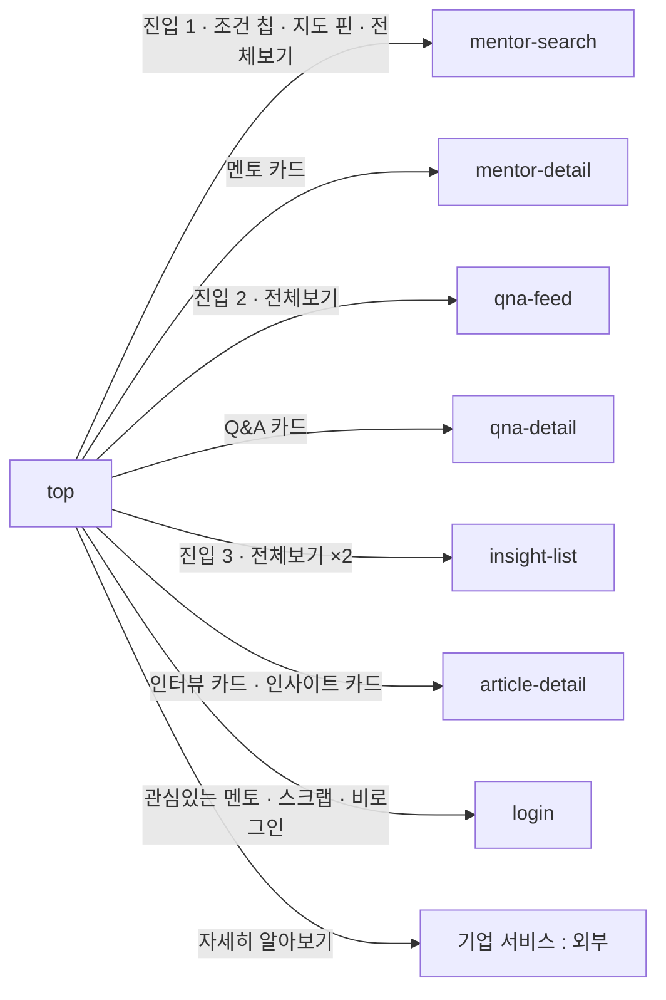

# top: TOP

- 상태: 확정 (§1~5 UX승인 2026-09-13 → §6~11 작성 완료)
- 화면 구분: 허브
- 템플릿: 미작성 (Claude Design 에서 4상태를 만들어 취임한다)

> 출처: Figma `zFWjJinW6NAtyMMzMujNl2` / `1135:81185` 「A - TOP」. **3폭 완비**(1280＋ `81187` / 767 `81705` / 390 `82180`). **사양 주석은 0건이다** — 판정 조건은 사람에게 물어 정했다. 읽은 날 2026-09-13.

---

# 1부 — UX 설계 의도 (§1~5)

> **이 5절을 먼저 승인받는다.** 승인 전에 §6 이하로 내려가지 않는다.

## 1. 화면의 사명

**「여기가 무엇을 해주는 곳인가」에 3초 안에 답하고, 네 갈래 중 하나로 보낸다.**

멘트리는 **해외에 이미 가 있는 사람**과 **가려는 사람**을 잇는다. 그 사실을 히어로 한 줄로 말하고, **멘토 · Q&A · 인사이트 · 기업 서비스** 중 자기 것을 고르게 한다.

**이 화면은 목적지가 아니다.** 여기서 끝나면 실패다.

## 2. 대상 사용자와 상황

- 대상 사용자: **비로그인 첫 방문자가 기본값이다.** 검색 엔진·SNS·광고에서 들어온다. 로그인 유저도 오지만 그쪽은 이미 갈 곳을 안다
- 상황: **아직 무엇을 원하는지 말로 못 하는 단계.** 「해외 취업」이라는 덩어리만 있고 질문이 안 정해졌다
- 이용 패턴: **한 번 보고 떠난다.** 재방문자는 TOP 을 거치지 않고 바로 그 화면으로 간다

**그래서 설명하지 않고 보여준다.** 멘토의 얼굴 · 실제 질문 · 실제 글을 그대로 세운다.

## 3. 액션 방침

- 주 액션: **네 갈래 중 하나를 고른다** — 멘토 찾기 · Q&A · 인사이트 · 기업 서비스
- 부 액션: 히어로의 진입 3개로 바로 들어가기 · 국가/직종 칩으로 좁혀서 멘토 찾기 · 카드 1장을 눌러 상세로
- **하지 않는 것**:

| 안 하는 것 | 왜 |
|---|---|
| **TOP 에서 거르지 않는다** | 국가·직종 칩을 눌러도 여기서 목록이 안 바뀐다. **`mentor-search` 로 보낸다** — TOP 은 고르는 곳이 아니라 **보내는 곳**이다 |
| **로그인을 요구하지 않는다** | 첫 접점이다. 벽을 세우면 유입이 끊긴다(`P-01`) |
| **읽을 것을 다 싣지 않는다** | 섹션마다 3~4장이다. **전부는 그 목록 화면에서 본다** |
| **역할로 화면을 가르지 않는다** | 로그인해도 본문이 안 바뀐다. 헤더만 바뀐다 |
| **스크롤을 늘려 다 담지 않는다** | 블록 8개로 끝낸다. 「일단 넣자」를 받지 않는다 |

## 4. 구성과 하이어라키

**위에서 아래로 「누구를 만나나 → 무엇을 묻나 → 무엇을 읽나 → 누가 있나 → 기업이면」이다.**

| 순 | 블록 | 무엇을 답하나 |
|---|---|---|
| 1 | **히어로** | **여기가 무엇을 해주는 곳인가.** 카피 ＋ 멘토 수 ＋ 진입 3개 ＋ 지구본 |
| 2 | **멘토의 이야기** | **어떤 사람들인가.** 인터뷰 |
| 3 | **주목받는 Q&A** | **무엇을 물어도 되나.** 실제 질문 |
| 4 | **필독 인사이트** | **무엇을 알 수 있나.** 실제 글 |
| 5 | **멘토 둘러보기** | **내 쪽 사람이 있나.** 국가·직종 칩 ＋ 멘토 카드 |
| 6 | **세계지도** | **얼마나 넓나.** 분포 ＋ 「멘토 찾기」 |
| 7 | **기업 서비스 CTA** | **회사로 왔으면 이쪽이다** |

**2~5 가 같은 형태다** — 섹션 제목 ＋ 「전체보기」 ＋ 가로 캐러셀. **네 갈래를 같은 무게로 보여주고 고르게 한다.**

**5 만 칩이 하나 더 붙는다.** 멘토는 「누구」가 아니라 「어느 국가의 어느 직종」으로 찾는 것이라, **좁히는 축을 미리 보여준다.**

**6 은 숫자를 그림으로 바꾼 것이다.** 히어로의 「141명」을 지도로 다시 말한다. **같은 사실을 두 번 말하는 이유는 첫 줄을 안 읽는 사람이 있기 때문이다.**

**AiBand 는 넣지 않는다**(2026-09-12). Phase 진단이 MVP 밖이라 진입 배너가 갈 곳이 없다. 와이어의 `1135:81284` 가 그것이다.

**반응형 3구간에서 1 만 구조가 바뀐다.**

| 폭 | 히어로 |
|---|---|
| **1280＋** | 카피와 지구본의 **좌우 2단** |
| **767 · 390** | **지구본이 뒤 배경으로 내려간다.** 카피·진입이 그 위에 세로로 선다 |

**767 은 2단이 아니다**(2026-09-14 와이어 실측). 앞판이 여기를 2단으로 적었던 것은 오독이다. 경계는 §6 의 **769/768** 이 정본이다.

2~7 은 세 폭에서 구조가 같고 **캐러셀의 보이는 장수와 여백만 바뀐다.** 값의 정본은 [guidelines/03-responsive.md](../../ds-export/project/guidelines/03-responsive.md) 다.

## 5. 적용 패턴 (P-nn)

| 패턴 | 이 화면에서의 적용 |
|---|---|
| **`P-04`** 목록의 상태를 URL 에 담고 뒤로가기로 되돌린다 | **여기서는 담을 것이 없다.** TOP 은 목록이 아니다. 대신 **칩을 누를 때 조건을 URL 에 실어 `mentor-search` 로 넘긴다** — 받는 쪽이 `P-04` 로 복원한다 |
| **`P-01`** 로그인의 벽을 액션마다 가른다 | **관심있는 멘토 등록만 걸린다.** 멘토 카드의 저장 토글이다. 읽기·찾기·기업 서비스는 안 막는다 |
| **`P-02`** 0건의 면에서 다음 행동을 낸다 | **블록이 0건이면 그 블록을 감춘다.** 히어로와 CTA 가 늘 있어 화면이 비지 않는다. 아래 **승격 후보 「블록마다 4상태」** |

### 승격 후보 — 블록마다 4상태를 갖는다

**번호는 올릴 때 받는다.** 처음에 `P-04` 로 적었으나 #31 · #32 에서 `P-04` 는 「목록의 상태를 URL 에」다(2026-09-28 정리). 지금 가장 큰 번호가 `P-05` 이니 올린다면 그 뒤다.

**허브 화면은 블록마다 다른 API 를 부른다.** 한 블록이 늦거나 실패해도 **나머지는 읽게 둔다.**

| 판정 조건 | 아크션 |
|---|---|
| 한 블록이 로딩 중이다 | **그 블록만 `Skeleton`.** 먼저 온 블록부터 세운다 |
| 한 블록이 0건이다 | **그 블록을 감춘다.** 빈 면을 남기지 않는다 |
| 한 블록이 실패했다 | **그 블록만 에러.** 화면 전체를 다시 부르지 않는다 |

**2화면째다.** `qna-feed` 가 §7 에 「**우측 위젯만 실패했다 → 본문을 막지 않는다**」를 이미 적었다. **`UX-PATTERNS.md` 로 승격시킨다**(헌장 원칙 7). 번호는 그때 받는다.

**컴포넌트 레벨의 규칙은 [DESIGN.md](../../DESIGN.md) 를 따르고 여기에 중복해서 쓰지 않는다.**

---

# 2부 — 구조 (§6~11)

## 6. 블록별 규칙 (구성 요소 포함)

**화면 위에서부터의 순서다.** 요소명은 [용어집](../../../docs/glossary/ubiquitous-language.md) English 열이다.

| 순 | 블록 | 요소 | 이 화면에서의 규칙 |
|---|---|---|---|
| — | 헤더 | `Header` | 이 화면 고유의 규칙 없음 |
| 1 | **히어로** | **화면이 직접 그린다** | 아래 「히어로」 |
| 2 | 멘토의 이야기 | `SectionHeader` ＋ `Carousel` ＋ **`InterviewCard`** | `snap-fit` · 1280＋ **3장** |
| 3 | 지금 주목받는 Q&A | `SectionHeader` ＋ `Carousel` ＋ **`QnaCard` `compact`** | `snap-fit` · 1280＋ **4장**. 아래 「Q&A 카드」 |
| 4 | 필독 멘트리 인사이트 | `SectionHeader` ＋ `Carousel` ＋ `ArticlePreview` | `snap-fit` · 1280＋ **4장** |
| 5 | 멘토 둘러보기 | `SectionHeader` ＋ **`FilterChip`** ＋ `Carousel` ＋ `MentorCard` | **`peek`** · 아래 「조건 칩」 |
| 6 | **세계지도** | **화면이 직접 그린다** ＋ `Button` | 아래 「세계지도」 |
| 7 | **기업 서비스 CTA** | **화면이 직접 그린다** | 아래 「CTA」 |
| — | 푸터 | `Footer` | 이 화면 고유의 규칙 없음 |
| — | **하단 탭바** | **`BottomTabBar`** | **Mobile(~768) 전용.** 아래 「하단 탭바」 |

**2~5 가 같은 골격이다** — `SectionHeader`(제목 ＋ green 강조 ＋ 「전체보기」 ＋ 화살표 2개) ＋ `Carousel`. **5 만 조건 칩 2줄이 사이에 낀다.**

**섹션 리듬은 `.section{padding:56px 0}` ＋ 컨테이너 `--container-max`/`--container-pad` 다.** 값의 정본은 [ds-export](../../ds-export/SOURCE.md) 다.

### 히어로

**부품이 아니다.** 카피 ＋ 진입 3개 ＋ 지구본을 화면이 조립한다.

| 요소 | 규칙 |
|---|---|
| 밴드 | **`--sage-50` ＋ `overflow:hidden`.** 지구본이 밴드 밖으로 나가므로 자른다 |
| 카피 | 「당신의 **해외 커리어**가 시작되는 곳」 — 강조는 `--primary` |
| 부제 | 「**141명**의 글로벌 멘토들이 여러분을 기다리고 있습니다」 — 숫자만 `--primary` |
| 진입 3개 | **28px 컬러 SVG ＋ 라벨.** 1:1 멘토링 신청 · 무엇이든 질문 · 필독 컨텐츠. **자산이 미정이라 와이어 화상을 쓴다**(`DS-05` · §11) |
| 지구본 | **원 중심이 화면 밖(오른쪽)이라 좌측 arc 만 보인다.** `template/` 에서는 **아무것도 안 그린 단색 원 하나**다(2026-09-14) — 대륙도 핀도 그리지 않는다 |

**히어로만 「연속 반응형」이다.** 3구간 미디어쿼리로 끊지 않고 `clamp()`·`vw` 로 이어서 변형한다.

| 판정 조건 | 아크션 |
|---|---|
| 769 이상이다 | 카피와 지구본의 **좌우 2단**. 지구본은 **우측 밖으로** 밀어 arc 만 남긴다 |
| **768 이하다** | **지구본이 뒤 배경으로 내려간다** — 우상단, 일부만. 카피·진입이 그 위에 세로로 선다 |
| 지구본의 크기가 바뀐다 | **히어로의 위 여백이 그 크기를 따라간다.** 고정값으로 두면 모바일에서 카피가 지구본에 겹친다 |

**실장의 지구본은 라이브러리로 간다**(§11). **`template/` 은 와이어의 화상으로 자리와 크기만 맞춘다.**

### Q&A 카드 — `qna-feed` 쪽에 맞춘다

**와이어의 TOP 카드는 조회수·도움돼요가 제목 위에 있다.** `qna-feed` 의 것은 아래에 있다.

| 판정 조건 | 아크션 |
|---|---|
| 두 화면의 Q&A 카드가 다르다 | **`qna-feed` 가 맞다**(2026-09-13). TOP 이 그쪽에 맞춘다 |

**`compact` 를 그대로 쓴다** — 해시태그 줄만 감춘 형태다(`DS-25`). **부품을 고치지 않는다.**

| 판정 조건 | 아크션 |
|---|---|
| 국가 배지를 뺀다 | **`country` 를 안 넘기면 빠진다.** 부품이 조건부로 낸다 |
| 스크랩을 뺀다 | **뺄 수 없다.** `QnaCard` 가 조회수·도움돼요·스크랩 3개를 **늘 낸다**(2026-09-13 실측). `showScrap` 같은 prop 은 없다 |
| 그러면 스크랩을 어떻게 하나 | **그대로 낸다.** `qna-feed` 와 같은 모습이 되므로 맞다. 비로그인이 누르면 로그인으로 보낸다(`P-01`) |

### 조건 칩 — **필터가 아니라 링크다**

「멘토 둘러보기」의 칩 2줄이다.

| 줄 | 내용 |
|---|---|
| **국가** | **주요국 ＋ 그 밖은 `Region` 으로 묶는다**(2026-09-13 합의). `FilterChip` `leading="flag"` |
| **직종** | `FilterChip`. 와이어 라벨이 「직무」인데 **「직종」으로 쓴다** — `JobTitle` 은 개인의 직책이고 이건 분류축이다 |

| 판정 조건 | 아크션 |
|---|---|
| 칩을 눌렀다 | **`mentor-search` 로 보낸다.** 그 조건을 URL 에 실어 넘긴다(`P-04`) |
| 여기서 목록이 바뀌나 | **안 바뀐다.** TOP 은 거르는 곳이 아니다(§3) |
| 칩이 켜진 채로 남나 | **안 남는다.** 화면을 떠난다 |

**`mentor-search` 의 `FilterSelect` 와 같은 것이 아니다.** 저쪽은 모달을 열어 고르고, 이쪽은 **한 번 눌러 떠난다.**

**`Region` 이 여기서 화면에 나온다.** 축이 아니라 **바로가기의 라벨**이다([용어집](../../../docs/glossary/ubiquitous-language.md)).

### 세계지도

**부품이 아니다.** 이 블록만 **`--sage-50` 톤**이고 **헤더가 중앙정렬**이라 `SectionHeader` 를 쓰지 않는다.

| 요소 | 규칙 |
|---|---|
| 제목 | 「세계 곳곳에서 활약하고 있는 **141명의 멘토**」 — 숫자만 `--primary` |
| 부제 | 「나라를 선택하면 해당 나라의 멘토 리스트 페이지로 이동합니다」 |
| 액션 | 「멘토 찾기 페이지 →」 `Button` `primary` `sm` |
| 지도 | 정적 이미지. **실장은 라이브러리로 간다**(§11) |
| 핀 | **클러스터다** — 그 나라 멘토의 아바타 2~3장이 겹치고 옆에 **남은 수 배지**가 붙는다 |

| 판정 조건 | 아크션 |
|---|---|
| 핀을 눌렀다 | **`mentor-search` 로 보낸다.** 그 국가를 걸어서 넘긴다. **조건 칩과 같은 규칙이다** |
| 「멘토 찾기 페이지」를 눌렀다 | 조건 없이 `mentor-search` 로 보낸다 |

### CTA — 부품으로 만들지 않는다

「해외 진출 기업을 위한 **비즈니스 서포트** 서비스」 ＋ mentree Biz 로고 ＋ 「자세히 알아보기 ↗」.

**`biz` 파랑을 쓴다.** 이 화면에서 `--primary` green 이 아닌 유일한 블록이다.

| 판정 조건 | 아크션 |
|---|---|
| 부품으로 올릴까 | **올리지 않는다**(`DS-08` 각하 2026-09-13). **TOP 에만 나온다** |
| 2번째 화면에 같은 것이 나왔다 | **그때 기표한다.** 지금 공통 규칙을 뽑을 근거가 없다 |
| **버튼이 몇 개인가** | **1개다**(2026-09-13). 「자세히 알아보기」뿐이다. **「문의하기」를 붙이지 않는다** — `ui_kits/mentree-top` 의 2개짜리가 틀렸다 |

### 하단 탭바

**Mobile 의 주 내비게이션이다.** 헤더의 햄버거와 둘 다 둔다 — 햄버거는 전체 메뉴이고 이쪽은 자주 가는 4곳이다.

| 판정 조건 | 아크션 |
|---|---|
| Mobile(~768)이다 | **`BottomTabBar` 를 깐다.** 부품이 Desktop(769+)에서 **스스로 숨는다** — 화면이 분기하지 않는다 |
| **어느 탭이 켜지나** | **없다.** `activeKey` 를 넘기지 않는다. **TOP 은 4탭 어디에도 속하지 않는다** |
| 비로그인이 「MY 멘트리」를 눌렀다 | **로그인으로 보낸다**(`P-01`). 부품의 `onAuth` 가 그 자리다 |
| 푸터와 겹치나 | **겹친다.** 고정 바이므로 **Mobile 에서 본문 아래에 탭바 높이(56 ＋ safe-area)만큼 여백을 준다** |

### 캐러셀 — 공통

| 판정 조건 | 아크션 |
|---|---|
| 멘토 둘러보기다 | **`mode="peek"`.** 마지막 카드를 일부러 걸쳐 「더 있음」을 보인다 |
| 그 밖 3개다 | **`mode="snap-fit"`.** 카드가 컨테이너 폭에 떨어진다 |
| 카드가 넘친다 | **잘리는 쪽에 페이드**(`DS-59`). **Desktop 전용이다** |
| **Mobile(~768)이다** | **페이드하지 않는다.** 가장자리 폭이 귀하다. 스와이프가 화살표의 일을 한다 |
| 끝에 닿았다 | **`SectionHeader` 의 그쪽 화살표를 끈다** |
| 화살표를 눌렀다 | **한 페이지**(지금 보이는 장수)만큼 옮긴다. 자유 스크롤의 1장 스냅과 다르다 |
| **멘토 둘러보기다** | **화살표를 달지 않는다**(2026-09-14). 와이어에 없다. 조건 칩 2줄이 이미 조작부라 화살표까지 얹으면 헤더가 무거워진다 |

**캐러셀은 표시 장수를 모른다.** `Carousel` 에 그런 prop 이 없고 「표시 개수는 컨테이너 폭에 맞춰 유동」이다. **폭을 카드가 갖거나 화면이 준다.**

| 부품 | 폭을 누가 정하나 |
|---|---|
| `MentorCard` · `ArticlePreview` | **카드가 갖는다**(296 / 288) |
| **`InterviewCard` · `QnaCard`** | **화면이 준다.** 안 주면 내용폭으로 쪼그라든다 |

| 블록 | 1280＋ | 767 | 390 |
|---|---|---|---|
| 인터뷰 (gap 24) | **395** | 2장＋걸침 | 1장＋걸침 |
| Q&A (gap 24) | **290** | 3장＋걸침 | 1장＋걸침 |

**트랙에 `align-items: stretch` 를 건다.** 발췌 유무로 카드 높이가 널뛴다.

**캐러셀 위의 여백은 원하는 값을 그대로 준다.** `Carousel` 은 그림자가 잘리지 않게 위아래 18 패딩 ＋ 같은 값의 음수 마진을 갖는데, **그 둘이 상쇄되므로 더하거나 빼지 않는다**(2026-09-14 실측).

## 7. 상태 목록

**블록마다 갖는다**(승격 후보 「블록마다 4상태」). 히어로와 CTA 는 데이터를 안 부르므로 **늘 있다.**

| 상태 | 표시 내용 | 비고 |
|---|---|---|
| 정상 | 위 §6 그대로 | |
| 로딩 | **블록마다 `Skeleton`** | 그 블록이 실을 장수와 같게 한다. **먼저 온 블록부터 세운다** |
| 빈 상태 | **그 블록을 감춘다** | `EmptyState` 를 쓰지 않는다. 아래 |
| 에러 | **그 블록만 에러** | 나머지는 읽게 둔다 |

**0건에 `EmptyState` 를 쓰지 않는다.** 「지금 주목받는 Q&A 가 없습니다」는 **사용자가 할 일이 없는 말**이다. 그 블록을 감추면 화면이 짧아질 뿐이고, **히어로와 CTA 가 늘 있어 화면이 비지 않는다.**

**`template/` 의 4파일은 대표 조합을 담는다.**

| 파일 | 무엇을 담나 |
|---|---|
| `normal` | 7블록 전부 정상 |
| `loading` | **인터뷰·Q&A 가 스켈레톤, 인사이트·멘토는 정상.** 블록마다 도착이 다른 것을 보인다 |
| `empty` | **Q&A 블록이 감춰진 화면.** 나머지는 정상 |
| `error` | **멘토 둘러보기만 에러.** 나머지는 정상 |

**에러 시의 거동·대체 플로우**:

- **한 블록이 실패했다** → 그 자리에 사유 한 줄 ＋ 재시도 `Button` `outline`. **화면 전체를 다시 부르지 않는다**
- **히어로의 멘토 수를 못 받았다** → **숫자만 감추고 문장은 세운다.** 히어로가 통째로 사라지면 화면이 무너진다
- **지도의 핀을 못 받았다** → **지도와 버튼은 세운다.** 핀만 없다
- **문구는 미정이다**(§11). 여기서는 **무엇을 내는가**만 정한다

## 8. 표시·활성 제어의 판정 조건과 아크션

| 판정 조건 | 아크션 |
|---|---|
| **비로그인이다** | **본문이 그대로다.** 헤더만 「회원가입/로그인」이다 |
| **로그인했다** | **본문이 안 바뀐다**(2026-09-13). 헤더가 통지 아이콘 ＋ 아바타로 바뀐다 |
| **비로그인이 멘토 카드의 관심있는 멘토를 눌렀다** | **로그인으로 보낸다**(`P-01`). 읽기·찾기는 막지 않는다 |
| 「전체보기」를 눌렀다 | 그 목록 화면으로 보낸다(§9) |
| **조건 칩·지도 핀을 눌렀다** | **`mentor-search` 로 보낸다.** 조건을 URL 에 실어 넘긴다(`P-04`) |
| 카드를 눌렀다 | 그 상세로 보낸다. **카드 전체가 링크다** |
| 한 블록이 0건이다 | **그 블록을 감춘다**(승격 후보 「블록마다 4상태」) |
| 한 블록이 실패했다 | **그 블록만 에러**(승격 후보 「블록마다 4상태」) |
| 캐러셀이 끝에 닿았다 | 그쪽 화살표를 끈다 |
| **Mobile(~768)이다** | **캐러셀 화살표를 감춘다**(스와이프). **페이드도 안 한다**. **`BottomTabBar` 가 뜨고 헤더 메뉴가 햄버거로 접힌다** — 둘 다 부품이 스스로 한다 |
| 멘토 카드가 캐러셀 안에 있다 | **`fluid` 를 넘기지 않는다** — 모바일에서도 296 고정이다(`DS-58`) |

## 9. 화면 전이

**전이도의 정본은 [transition-map.md](../../docs/transition-map.md) 다.** 여기에는 이 화면에서 나가는 것만 적는다.

- **「멘토의 이야기」의 전체보기는 `insight-list` 로 간다** — **멘토 인터뷰 카테고리**다(2026-09-13). 인터뷰 전용 목록 화면은 만들지 않는다
- **진입 3개의 목적지** — 1:1 멘토링 신청 → `mentor-search` · 무엇이든 질문 → `qna-feed` · 필독 컨텐츠 → `insight-list`
- **조건 칩·지도 핀은 조건을 걸어서** `mentor-search` 로 간다. 전체보기는 조건 없이 간다
- **기업 서비스는 이 리포 밖이다.** 목적지 미정(§11)

## 10. 의존 API

| API (용도) | 계약 |
|---|---|
| 히어로의 멘토 총수 | **계약 미정의** |
| 멘토 인터뷰 3건 | **계약 미정의.** 선정 규칙은 서버가 갖는다 |
| 주목받는 Q&A 4건 | **계약 미정의.** 선정 규칙은 서버가 갖는다 |
| 필독 인사이트 4건 | **계약 미정의** |
| 멘토 둘러보기 목록 | **계약 미정의** |
| 조건 칩의 선택지(`Country`·`Region`·`JobCategory`) | **계약 미정의.** 목록은 서버가 갖는다 |
| 세계지도의 국가별 멘토 분포 | **계약 미정의.** 국가 · 인원수 · 아바타 |
| 관심있는 멘토(멘토 카드) · 스크랩(Q&A 카드) 등록·해제 | **계약 미정의** |

**미정의인 채로 구현 인계하지 않는다.** 백엔드 담당과 합의한 뒤 채운다.

**블록마다 따로 부른다**(승격 후보 「블록마다 4상태」). 한 번에 묶어 받으면 한 블록이 늦을 때 화면 전체가 늦는다.

## 11. 미결 사항

| # | 무엇 | 왜 못 정하나 | 언제 걸리나 |
|---|---|---|---|
| 1 | **진입 아이콘 3개의 SVG** | **도안은 확정, 파일이 아직 없다**(2026-09-13). `template/` 은 와이어 화상으로 간다(`DS-05`) | 자산 수령 시 |
| 2 | **지구본의 실장** | **라이브러리로 간다**(2026-09-13). 어느 것을 쓸지는 엔지니어의 층이다. **뷰포트별 자리와 크기는 이 문서가 정했다**(§6) | 실장 착수 |
| 3 | **세계지도의 실장** | 같다. **뷰포트별 설정이 따로 없어 지금은 넘어간다**(2026-09-13) | 실장 착수 |
| 4 | **기업 서비스의 목적지** | 이 리포 밖이다. 외부 사이트인지 이 서비스 안인지 정해진 적이 없다 | 사업 확인 |
| 5 | **에러와 빈 상태의 문구** | UX 라이팅이며 **한/일 2개국어**다. 문구를 직접 쓰지 않고 키로 짠다 | UX 라이팅 착수 |
| 6 | **4개 캐러셀의 선정 규칙** | 「주목받는」·「필독」의 기준을 아무도 정한 적이 없다 | 백엔드 합의 |
| 7 | **섹션 제목 30 이 타입스케일 밖이다** | `SectionHeader` 가 스스로 적어둔 `DS-GAP` 이다. **h0/display 정리는 사례를 모아 한 번에 한다**(2026-09-13) | 타입스케일 착수 |
| 8 | **배너** | 와이어의 것이 shadcn 템플릿 더미다. **구현하지 않는다**(2026-09-13) | — |

---

## 실행 계획

- [x] §1~5 를 쓰고 UX승인을 받는다 (2026-09-13)
- [x] §6~11 을 쓴다
- [ ] 승격 후보 「블록마다 4상태」를 `UX-PATTERNS.md` 로 올리고 `qna-feed` §7 을 참조로 바꾼다(번호는 그때 받는다)
- [ ] `DS-08` `CtaSection` 을 각하한다 (TOP 1화면 전용)
- [x] 부족한 요소를 `DS-update-list.md` 에 기표한다 (`DS-58` 뒤처리 · `DS-07` · `DS-59` — 옛 `DS-30`〜`32`. DS 목록 「2026-09-28 — 두 벌이던 번호를 하나로 정리했다」)
- [x] 그 부품이 `ds-export/` 에 들어왔다 (2026-09-28 · #34 의 교체로 `DS-58` · `DS-07` · `DS-59` 완료)
- [ ] `template/` 4상태를 Claude Design 에서 만들어 취임한다
- [ ] 6품질축 감사와 표시 확인을 `UI-REVIEW.md` 에 남긴다
