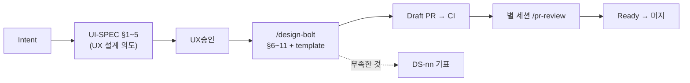

# 디자이너 워크플로 가이드 — mentree 화면을 이 리포에서 개발하는 방법

- 상태: 초판 (첫 디자인 Bolt의 회고로 조정하는 것을 전제로 한다)
- 관련: 리포의 규약은 루트 `CLAUDE.md`, 문서 작법의 심사 기준은 `design/DESIGN-CHARTER.md`

## 30초 요약

디자이너가 화면의 **정본(正)** 을 이 리포에서 소유한다. 구현은 Claude Code가 한다.

1. 만드는 것은 「코드」가 아니라 **UI-SPEC(마크다운) ＋ template(Claude Design 산출물)** 이다.
2. 「테스트 통과」 대신 **6품질축 감사 ＋ 4상태 망라 ＋ 표시 확인** 이 수용 조건이다.
3. 디자인 시스템에 부족한 것은 화면에서 만들지 않는다. **`DS-update-list.md` 에 기표**한다.

## 1. 전제

- git 조작(clone·브랜치·커밋·PR)이 가능할 것
- 작업 환경은 **VS Code ＋ Claude Code 확장**을 권장한다. 사인오프 때 PR diff를 GUI로 보기 위함이다
- template은 **Claude Design에서 만든다**. 취임 후의 미세 수정은 Claude Code로 해도 된다
- 화면 사양은 **마크다운으로 쓴다**. AI가 가공 없이 구현 입력으로 삼을 수 있는 형식으로 통일한다

## 2. 프로세스 전체



**별도 spec 파일을 두지 않는다.** UI-SPEC의 §1~5가 요건 그 자체다. 이것을 먼저 승인받는 것이 이 리포의 spec-first다.

## 3. 성과물

### 화면마다

| 성과물 | 위치 | 역할 |
|---|---|---|
| **UI-SPEC** | `design/screens/<id>/UI-SPEC.md` | 화면의 **정본**. 절 구성은 `design/screens/TEMPLATE-UI-SPEC.md` |
| **template** | `design/screens/<id>/template/` | 비주얼의 참조. Claude Design 산출물 |
| **SOURCE.md** | `design/screens/<id>/template/SOURCE.md` | template의 출처(링크·생성일·대응 UI-SPEC). **필수** |
| **UI-REVIEW** | `design/screens/<id>/UI-REVIEW.md` | 감사·표시 확인의 기록 |

### 화면을 넘는 공통층 (화면 수에 비례해 늘지 않는다)

| 문서 | 역할 |
|---|---|
| `design/DESIGN.md` | 요소 하나의 디자인 규칙 |
| `design/UX-PATTERNS.md` | 횡단 UX 패턴 (`P-nn`) |
| `design/DS-update-list.md` | 디자인 시스템 갱신 요구 (`DS-nn`) |
| `design/DESIGN-CHARTER.md` | 위 문서군의 **심사 기준**(별개의 축) |

## 4. template의 취급 — 참조이지 이식원이 아니다

> **`template/` 은 React 구현의 시각적 참조다. 코드 이식원이 아니다. CSS를 그대로 옮기지 않는다.**

- JS·인라인 이벤트를 제거하지 않는다. 인터랙션 의도가 보존되는 편이 참조 가치가 높다
- 4상태의 파일 분할을 강제하지 않는다. 요건은 「4상태를 확인할 수 있을 것」이다
- **React 구현이 끝나면 `template/` 은 동결한다.** 이후 살아있는 정본은 Storybook이 이어받는다

이 한 줄을 어기면 화면 프로토타입의 CSS가 그대로 들어와 **토큰 체계가 두 갈래로 갈라진다.** 이 리포에서 가장 지키기 어렵고 가장 중요한 규칙이다.

## 5. 수용 조건

Bolt를 닫기 전에 3가지를 모두 만족한다.

1. **6품질축 감사** — 레이아웃·컬러·타이포·인터랙션·접근성·반응형
2. **4상태 망라** — UI-SPEC에 정상·로딩·빈 상태·에러가 기재되어 있다
3. **표시 확인** — 375px / 768px / 1280px

### 접근성 — 집행층으로 가른다

기준선은 **WCAG 2.1 AA** 다 — 텍스트 대비 **4.5:1**, 비텍스트 대비 **3:1**. 다만 블로커는 기계가 잡는 것에 한정한다(헌장 원칙 5).

| 판정 조건 | 아크션 |
|---|---|
| axe 베이스라인이 늘었다(`pnpm test:a11y` 실패) | **블로커.** 해소할 때까지 닫지 않는다 |
| 대비·포커스·타겟 사이즈의 미달 | **`DS-nn` 기표.** 토큰·컴포넌트 층에서 한 번 정하면 전 화면에 먹는다 |
| 사람이 판정하는 항목의 미달 | `UI-REVIEW.md` 에 기록하고 넘긴다. 닫는 것을 막지 않는다 |

**대비·포커스·타겟 사이즈를 화면에서 고치지 않는 것이 핵심이다.** 화면마다 고치면 같은 판단을 화면 수만큼 반복하게 된다.

## 6. 디자인 시스템과의 왕복

```
요구 → 반영 → 확인 → 사인오프 → 완료
```

| 상태 | 누가 | 무엇을 |
|---|---|---|
| **요구** | 디자이너 | `DS-update-list.md` 에 `DS-nn` 을 1행 기표한다 |
| **반영** | Claude Code | 구현하고 **Storybook에 올린다**. 반영PR을 기입한다 |
| **확인** | 디자이너 | 로컬에서 `pnpm storybook` 을 띄워 대조한다 |
| **사인오프** | 디자이너 | 상태 갱신 PR에 **Approve**. 지적은 Request changes |
| **완료** | — | 같은 PR에 사인오프 난과 상태＝완료를 추기하고 머지한다 |

**「반영」의 판정은 Storybook 등재 시점이다.** 앱에 반영되었는지는 보지 않는다. 구현 빌드가 다른 리포로 가도 이 상태 기계가 깨지지 않게 하기 위함이다.

## 7. 역할

| 역할 | 담당 |
|---|---|
| 요구·사인오프 | 디자이너(지수). 판단이 갈리면 Hyeok을 넣는다 |
| 구현 | Claude Code |
| 검토 | **별 세션의** Claude (`/pr-review`) |
| 백엔드 | 엔지니어(별 리포) |

⚠️ **구현과 검토를 같은 세션에서 하지 않는다.** 구현자가 Claude 하나이므로 세션 분리가 유일한 견제 장치다.

## 8. 인계 규칙

- **판정 조건**: UI-SPEC이 확정이고 template PR이 머지되었다 → **아크션**: 구현에 착수할 수 있다
- **판정 조건**: 구현 중에 디자인 변경이 필요하다고 판명되었다 → **아크션**: 구현 쪽에서 멋대로 바꾸지 않는다. UI-SPEC을 먼저 고친다(**UI-SPEC이 항상 정본**)
- **판정 조건**: 화면이 필요로 하는 API가 미정의다 → **아크션**: 정지하고 백엔드 담당과 합의한다. 디자이너가 단독으로 API 사양을 발명하지 않는다

---

> 출처: DataSpace-v2 `docs/guidelines/designer-workflow.md`.
> 주요 차분: ① 별도 spec 층 폐지(UI-SPEC §1~5로 대체) ② template의 JS·CSS 제약 폐지 ③ a11y 블로커를 기계 검출로 한정 ④ 사인오프 1명 원칙 ⑤ 구현 주체를 Claude Code로.
